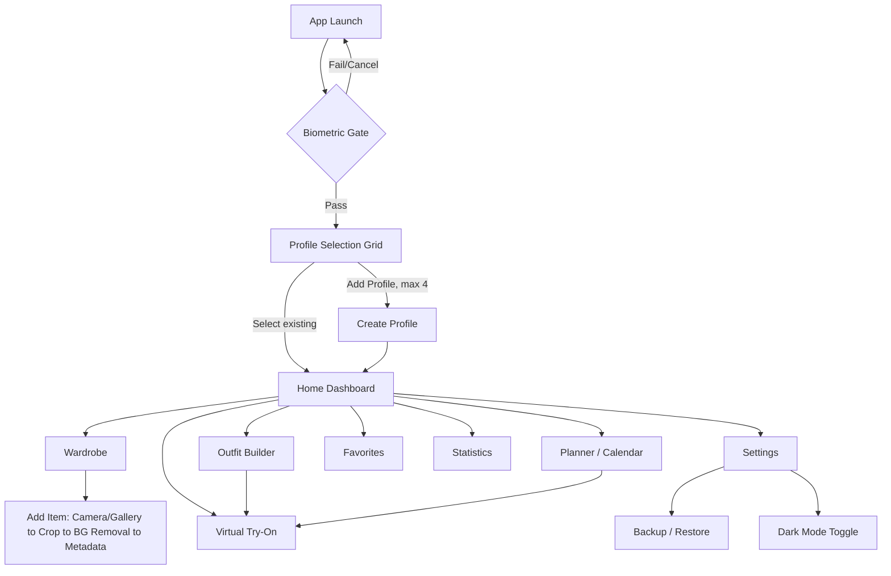
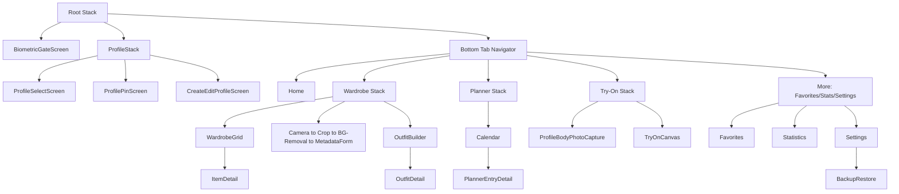
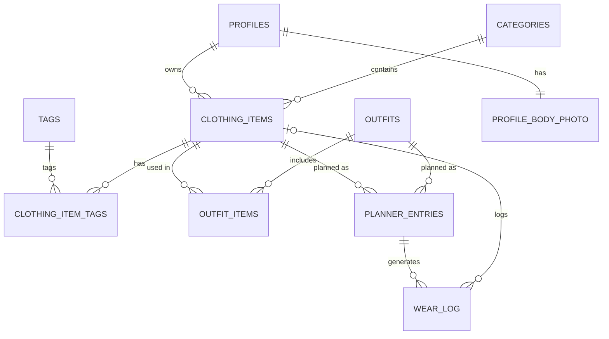
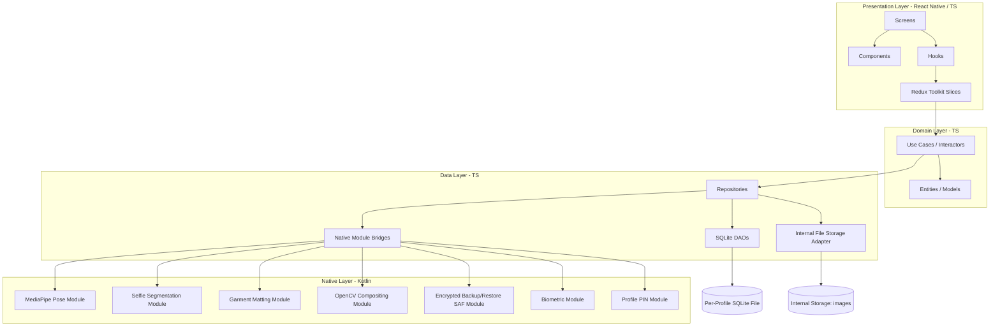

# WardrobeAI — Software Specification (spec.md)

**Version:** 1.2.0-draft
**Status:** DRAFT — pending review and freeze
**Last updated:** 2026-07-10

**Changelog (1.0.0 → 1.1.0):** Architecture/QA review pass. Fixed `wear_log` cascade behavior, `planner_entries` CHECK constraint, and category-delete UX gap. Added per-profile PIN (FR-4a/4b), default backup encryption (moved up from Future Roadmap), outfit-delete confirmation, un-mark-worn semantics, NFR-3 warm-run scoping, three new test-plan items, and switched native modules from Java to Kotlin. See inline changes below.

**Changelog (1.1.0 → 1.2.0):** Pre-freeze cleanup pass. Removed the `price` field/feature entirely (including the cost-per-wear roadmap item). Made `season` a fixed enum via CHECK constraint. Made wardrobe search behavior explicit in FR-10 (case-insensitive, partial-match, name/brand/tag, composable with filters). Finalized backup encryption to Google Tink with authenticated encryption and passphrase-derived keys (no more "or equivalent" wording). Finalized storage tech decisions: MMKV for key-value storage, op-sqlite for SQLite access — no more open "to be confirmed" choices. Added a new §18a Architecture Rules section. Standardized on "Profile Body Photo" terminology throughout.

---

## 1. Product Vision

WardrobeAI is an offline-first Android application that lets a person digitize their physical wardrobe, organize it, plan outfits, and preview how clothing looks on them via on-device 2D virtual try-on — with zero backend, zero account, and zero data ever leaving the device. Up to four people can share one installation through fully isolated local profiles (e.g. a household), each with their own wardrobe, photos, planner, and stats.

The product bet: wardrobe apps today either require a cloud account and upload personal photos to a server, or don't offer try-on at all. WardrobeAI proves a privacy-first, fully local alternative is viable on modern Android hardware using MediaPipe + TensorFlow Lite for on-device computer vision.

## 2. Goals

- Let a user catalog their wardrobe with photos, categories, and rich metadata in under 30 seconds per item.
- Provide a 2D virtual try-on that composites a full outfit (top + bottom + shoes, etc.) onto the user's own Profile Body Photo, entirely offline.
- Support outfit planning against a calendar and surface simple wear statistics.
- Guarantee no data leaves the device: no network calls, no analytics, no accounts.
- Support up to 4 isolated local profiles on one install.
- Ship a Material Design 3, dark-mode-capable, accessible UI.

## 3. Non-Goals

- Not a 3D avatar or body-scanning app.
- Not a social/sharing platform (no export-to-social, no community outfit feed).
- Not a shopping or e-commerce integration (no retailer catalogs, no purchase links).
- Not cross-device sync. Data does not leave the device that created it, except via explicit manual backup/restore files the user moves themselves.
- Not a fashion-recommendation AI (no "what should I wear" generative suggestions in v1).
- Not iOS. Android only for v1.

## 4. User Personas

**Priya, 27 — Wardrobe minimizer.** Wants to see everything she owns in one place, track what she actually wears, and stop buying duplicates. Cares about the statistics and unworn-items view.

**Family household (shared device).** Up to 4 family members share one tablet/phone; each wants their wardrobe kept private from the others. Cares about profile isolation and the biometric gate — including from other people who can also unlock the shared device (see FR-4a).

**Devraj, 34 — Planner.** Lays outfits out the night before using the calendar/planner and likes seeing a try-on preview before committing.

## 5. Functional Requirements

**Profiles**
- FR-1: App supports up to 4 local profiles, each with a name and avatar/color.
- FR-2: Profile data (wardrobe, outfits, planner, favorites, stats, Profile Body Photo) is fully isolated per profile at the database and file-storage level.
- FR-3: User can create, edit (rename/re-avatar), and delete a profile. Deleting a profile permanently deletes all its data and images after a confirmation step.
- FR-4: On launch, user is shown a profile-selection grid after passing the device-level biometric/lock gate (see Security Strategy).
- FR-4a: User can optionally set a per-profile PIN (4+ digits) as a secondary gate. If set, selecting that profile prompts for the PIN before granting access to its data. This is in addition to, not a replacement for, the device-level biometric gate — it closes the gap where anyone who can unlock the shared device (e.g. via their own enrolled fingerprint) could otherwise browse straight into another household member's profile.
- FR-4b: If a user forgets their profile PIN, they can reset it from the Profile Selection screen by re-passing the device biometric gate (already required to reach that screen). Re-verifying biometrics is treated as sufficient proof of device-owner identity, so the old PIN is not required to set a new one. There is no other recovery path (no backend account), so this is the only reset mechanism.

**Wardrobe**
- FR-5: User can add a clothing item via camera capture or gallery import.
- FR-6: User can crop the captured/imported image before saving.
- FR-7: User can run background removal on a clothing item photo to produce a clean-cutout thumbnail; original and cutout are both retained.
- FR-8: User can assign a category to each item; categories are user-customizable (rename, add, delete, reorder), seeded with sensible defaults (Tops, Bottoms, Dresses, Outerwear, Shoes, Accessories). Deleting a category that still has items assigned to it is blocked, with an explanatory message directing the user to reassign or remove those items first (enforced at the database layer via `ON DELETE RESTRICT`, and pre-checked in the UI so the user never hits a raw DB error).
- FR-9: Each item stores: name, category, brand, color, size, season, tags (multi-select), primary image path, cutout image path, date added, favorite flag, and derived wear count.
- FR-10: User can search wardrobe items by name, brand, or tag. Search is case-insensitive and matches on partial substrings anywhere within the field (not just prefixes), across all three fields (name, brand, tags). Search results compose with the existing filters — category, season, color, and favorite status — applied together (AND), not as a separate mode; a user can search "denim" and filter to Bottoms/Winter/favorited in a single query.
- FR-11: User can edit or delete an existing item (deletion removes its image files; its historical wear-log entries are preserved — see Database Design).

**Outfit Builder**
- FR-12: User can compose an outfit from existing wardrobe items (flat-lay style grouping), spanning multiple categories (e.g., one top + one bottom + one pair of shoes + optional accessories).
- FR-13: User can name, save, edit, and delete outfits. Deleting an outfit that has any associated planner entries (past or future) requires an explicit confirmation step warning the user those planner entries will be removed; the outfit's own wear history is unaffected (see Database Design).
- FR-14: A saved outfit can be sent directly into Virtual Try-On as a single action (all its items composited at once).

**Planner**
- FR-15: User can assign a saved outfit, or an individual item, to a specific calendar date — never both on the same entry (see `planner_entries` CHECK constraint in Database Design).
- FR-16: Calendar view shows month/day states indicating planned outfits.
- FR-17: A planner entry can be marked worn (past/today) which logs a wear event feeding Statistics; future entries are "planned" until their date passes. Un-marking a previously-worn entry back to "planned" deletes the corresponding `wear_log` row(s) so Statistics stay consistent with the entry's current status.
- FR-18: User can edit or remove a planner entry.

**Favorites**
- FR-19: User can favorite/unfavorite any wardrobe item or outfit from its detail view or list view.
- FR-20: A dedicated Favorites view lists favorited items and outfits.

**Statistics**
- FR-21: App computes and displays: wear count per item, most-worn items, least-worn items, category breakdown (item count and wear count by category), and never-worn ("unworn") items.
- FR-22: Statistics are derived read-only views computed from the wear log; no separate stats table is persisted redundantly.

**Virtual Try-On**
- FR-23: User captures a Profile Body Photo, one per profile (retakeable, replacing the previous one; retaking invalidates and recomputes the cached pose-landmark data).
- FR-24: App detects body landmarks (MediaPipe Pose) and segments the person from the background (MediaPipe Selfie Segmentation).
- FR-25: User selects a single item or a full saved outfit; each garment layer is overlaid on the Profile Body Photo, anchored to relevant pose landmarks per category (e.g., tops anchor to shoulders/hips, bottoms to hips/knees, shoes to ankles).
- FR-26: User can manually reposition, scale, and rotate each garment layer after the automatic placement.
- FR-27: User can save or discard the final composited preview image.

**Settings / Backup**
- FR-28: User can toggle Dark Mode (System / Light / Dark).
- FR-29: User can export a full local backup (database + all images) for the current profile or all profiles as a single portable archive.
- FR-29a: Exported backup archives are encrypted by default (passphrase set by the user at export time, required again at restore time). This applies to every export, not just profiles with a Profile Body Photo — wardrobe photos and metadata are personal data too. There is no passphrase-recovery mechanism; forgetting it makes that backup permanently unusable (see Risk Analysis).
- FR-30: User can restore from a previously exported backup archive, with a confirmation and integrity check before overwriting. Restoring an encrypted archive requires the correct passphrase; an incorrect passphrase aborts cleanly before any data is read or written.

## 6. Non-Functional Requirements

- NFR-1: 100% offline. No network permission usage for any core feature (see Constraints).
- NFR-2: Cold start under 2 seconds on target hardware (see Device Target).
- NFR-3: Virtual try-on compositing (pose + segmentation + overlay) completes in under 3 seconds end-to-end on target hardware, measured on warm runs (CV models already loaded into memory).
- NFR-3a: The very first Try-On session after install (or after app data is cleared) incurs an additional one-time model-load cost, which is budgeted and measured separately from NFR-3, not folded into it. A concrete first-run ceiling is set after the Phase 4 native-bridge spike (see Risk Analysis).
- NFR-4: No blocking of the UI thread during image processing; all CV/AI work runs off the JS thread in native modules.
- NFR-5: App remains fully usable with zero prior network connectivity, from first install onward.
- NFR-6: Data isolation between profiles must be enforced at the storage layer, not just the UI layer.
- NFR-7: WCAG-aligned accessibility: minimum touch target 48dp, TalkBack-compatible labels, color-contrast-compliant themes in both light and dark mode.
- NFR-8: APK/AAB size kept as lean as practical given bundled TFLite/MediaPipe models; models loaded lazily, not all at startup. (No hard size ceiling set yet — revisit once Phase 4 confirms actual model sizes.)
- NFR-9: Backup archives are encrypted at rest using authenticated encryption with a passphrase-derived key (see Backup & Restore Strategy, Dependency Plan); the passphrase itself is never stored by the app.

## 7. Constraints

- No backend of any kind. No REST API, GraphQL, Firebase, Supabase, or any managed cloud service.
- No authentication server, no login, no user accounts.
- No analytics or telemetry SDKs of any kind (including crash reporters that phone home — see Logging Strategy for the local-only alternative).
- No online AI inference; all MediaPipe/TFLite/OpenCV inference runs on-device.
- No advertisements.
- Android only, target hardware defined below.

## 8. Device & Performance Target

Per project decision: **flagship-focused** — `minSdkVersion 31` (Android 12), `targetSdkVersion 36` (Android 16), `compileSdkVersion` latest stable at build time.

This is a deliberate trade-off: MediaPipe Pose + Selfie Segmentation + a TFLite garment/matting model running concurrently on-device is CPU/GPU intensive. Targeting mid-2021+ hardware (API 31+) lets the app assume GPU delegate availability and NNAPI/GPU acceleration paths in TFLite are reliably present, keeping try-on latency acceptable. Broader device support (API 24+) was considered and rejected for v1 because it would force a CPU-only fallback path with materially worse try-on performance and doubled QA surface; it's listed in the Future Roadmap as a possible v2 expansion once the CV pipeline is proven.

Per current Google Play policy (July 2026): new app submissions require targeting Android 15 (API 35) now, and **API 36 (Android 16) starting August 31, 2026** — so the project should build against API 36 from the start to avoid a forced re-submission shortly after launch. [Source: Android Developers — Meet Google Play's target API level requirement](https://developer.android.com/google/play/requirements/target-sdk)

## 9. User Stories

- As a user, I want to select my own profile from a lock screen so my wardrobe stays private from other people using the device.
- As a household member, I want to set a PIN on my profile so my sibling can't open it even if they've already unlocked the shared phone with their own fingerprint.
- As a user, I want to photograph a piece of clothing and have its background automatically removed so my wardrobe grid looks clean and consistent.
- As a user, I want to build an outfit from items I already own so I can plan what to wear without re-photographing anything.
- As a user, I want to see a saved outfit composited onto my Profile Body Photo so I can judge how it looks before wearing it.
- As a user, I want to assign outfits to calendar days so I don't repeat the same outfit too often.
- As a user, I want to see which items I never wear so I can decide what to donate or sell.
- As a user, I want to back up my entire wardrobe to a file I control, so I don't lose my data if I switch phones — and I want that file encrypted, since it contains a photo of my body.
- As a user, I want everything to work with airplane mode on, so I trust the app isn't sending my photos anywhere.

## 10. Use Cases

**UC-01 — Create and unlock a profile.** User installs app → passes device biometric gate → sees empty profile grid → taps "Add Profile" → enters name/avatar → optionally sets a profile PIN (FR-4a) → profile created and selected → lands on empty wardrobe Home. On subsequent launches, selecting a PIN-protected profile prompts for that PIN; a forgotten PIN can be reset by re-passing the device biometric gate (FR-4b).

**UC-02 — Add a wardrobe item with background removal.** From Wardrobe screen, user taps "+" → chooses Camera or Gallery → captures/selects image → crop screen → confirms crop → background-removal pipeline runs (MediaPipe segmentation) producing a cutout thumbnail → user reviews cutout, retries or accepts → fills metadata form (name, category, brand, color, size, season, tags) → saves → item appears in Wardrobe grid.

**UC-03 — Build an outfit and try it on.** From Outfit Builder, user picks one item per relevant category → names and saves the outfit → taps "Try On" → if no Profile Body Photo exists yet, prompted to capture one → pose detection + segmentation run on the Profile Body Photo → garment layers auto-placed per landmark anchors → user nudges/scales two layers → saves the final preview image → preview accessible later from the outfit's detail view.

**UC-04 — Plan and log a worn outfit.** User opens Planner, taps a future date, assigns a saved outfit → on that date arriving, user opens the entry and marks it "Worn" → a wear-log row is created for every item in that outfit → Statistics update (wear counts, unworn list) on next view. If the user later un-marks the entry back to "planned," the corresponding wear-log rows are deleted and Statistics update accordingly.

**UC-05 — Backup and restore.** In Settings, user taps "Export Backup" → sets a passphrase → app bundles the SQLite DB and all image files for the selected profile(s) into a single encrypted archive → Android share sheet / Storage Access Framework lets the user save it anywhere (SD card, USB drive, cloud-drive folder via SAF — the app itself never uploads it). Later, on a new device, user taps "Restore Backup" → picks the archive via SAF → enters the passphrase → app validates archive integrity and schema version → imports DB rows and image files → profiles reappear as they were. An incorrect passphrase aborts immediately with no partial writes.

## 11. Application Flow (high-level)



(Profiles with an optional PIN set per FR-4a insert an additional PIN-entry step between `C` and `E`/`D`; a forgotten PIN loops back through `B` to reset it, per FR-4b.)

## 12. Navigation Flow

React Navigation, native-stack for root/profile flows, bottom-tab for the main authenticated area, nested stacks per feature.



## 13. Screen List

1. Biometric Gate
2. Profile Selection
3. Profile PIN Entry / Setup
4. Create / Edit Profile
5. Home Dashboard
6. Wardrobe Grid (with inline Search/Filter panel)
7. Item Capture (Camera)
8. Item Crop
9. Background Removal Review
10. Item Metadata Form (add/edit)
11. Item Detail
12. Category Management
13. Outfit Builder
14. Outfit Detail
15. Planner Calendar
16. Planner Entry Detail
17. Profile Body Photo Capture
18. Virtual Try-On Canvas
19. Favorites
20. Statistics Dashboard
21. Settings
22. Backup / Restore

## 14. Screen Specifications

| Screen | Purpose | Key elements | Entry points |
|---|---|---|---|
| Biometric Gate | Gate app access at device level | BiometricPrompt (fingerprint/face/PIN fallback) | App launch, resume from background (configurable timeout) |
| Profile Selection | Choose active profile | Up to 4 profile cards, "Add Profile" (disabled at 4), long-press to edit/delete | Post biometric gate |
| Profile PIN Entry / Setup | Secondary gate for PIN-protected profiles | PIN pad, "Forgot PIN" link (routes back through Biometric Gate per FR-4b), PIN setup during profile creation | Profile Selection (existing profile), Create/Edit Profile (setup) |
| Create/Edit Profile | Name + avatar/color | Text input, avatar picker, optional PIN toggle + entry, delete (edit mode only, with confirm) | Profile Selection |
| Home Dashboard | Quick actions + recent activity | Today's planned outfit, quick-add item, quick try-on shortcut | Bottom tab |
| Wardrobe Grid | Browse/search/filter items | Grid of cutout thumbnails, search bar (case-insensitive, partial-match across name/brand/tags), filter chips (category/color/season/favorite, composable with search) | Bottom tab |
| Item Capture | Take a clothing photo | Vision Camera view, shutter, gallery-import fallback | Wardrobe "+" |
| Item Crop | Crop captured/imported image | Crop overlay, aspect presets | After capture/import |
| Background Removal Review | Preview auto cutout | Before/after toggle, retry button | After crop |
| Item Metadata Form | Enter item details | Name, category picker, brand, color, size, season picker, tags | After BG removal accept, or Item Detail edit |
| Item Detail | View/edit a single item | Cutout image, metadata, favorite toggle, wear count, edit/delete | Wardrobe Grid, Outfit Builder |
| Category Management | CRUD categories | List with reorder/rename/delete (delete blocked with message if items still assigned), add-new | Wardrobe overflow menu |
| Outfit Builder | Compose an outfit | Category slots (top/bottom/shoes/accessory...), item picker per slot | Bottom tab |
| Outfit Detail | View/edit a saved outfit | Flat-lay preview, "Try On" button, edit/delete (with planner-impact confirmation if applicable), favorite toggle | Outfit Builder, Planner |
| Planner Calendar | Month/day view of plans | Calendar grid, day indicators, tap to open/create entry | Bottom tab |
| Planner Entry Detail | View/edit a day's plan | Assigned outfit/item, mark-worn toggle, notes, remove | Planner Calendar |
| Profile Body Photo Capture | Capture the Profile Body Photo | Full-body camera guide overlay, retake | Try-On tab (first use), Settings |
| Virtual Try-On Canvas | Composite garments on the Profile Body Photo | Profile Body Photo, draggable/scalable garment layers, save/discard | Bottom tab, Outfit Detail "Try On" |
| Favorites | List favorited items/outfits | Tabs: Items / Outfits | More menu |
| Statistics Dashboard | Wear analytics | Wear count list, most/least worn, category breakdown chart, unworn list | More menu |
| Settings | App preferences | Dark mode, biometric timeout, about, backup/restore entry | More menu |
| Backup/Restore | Export/import data | Export button (choose profile scope, set passphrase), restore button (file picker, passphrase entry), last-backup timestamp | Settings |

## 15. Database Design

SQLite, one physical database file per profile (`wardrobe_<profileId>.db`) stored in app-internal storage — this is the primary enforcement mechanism for FR-2/NFR-6 profile data isolation (a bug in a WHERE clause can't leak profile B's rows into profile A's UI, because profile A's connection literally cannot see profile B's file). A tiny shared `app_meta.db` (or an MMKV entry) holds the profile registry (id, name, avatar, created_at, and now `pin_hash`/`pin_salt`, nullable — populated only when a profile opts into FR-4a) and global settings.

Images are never stored as BLOBs in SQLite — only relative file paths are stored, per the project's storage rule. Actual files live under the app's internal `files/profiles/<profileId>/...` directory.

**Per-profile schema:**

```sql
CREATE TABLE categories (
  id INTEGER PRIMARY KEY AUTOINCREMENT,
  name TEXT NOT NULL,
  sort_order INTEGER NOT NULL DEFAULT 0,
  is_default INTEGER NOT NULL DEFAULT 0,
  created_at TEXT NOT NULL
);

CREATE TABLE clothing_items (
  id INTEGER PRIMARY KEY AUTOINCREMENT,
  category_id INTEGER NOT NULL REFERENCES categories(id) ON DELETE RESTRICT,
  name TEXT NOT NULL,
  brand TEXT,
  color TEXT,
  size TEXT,
  season TEXT NOT NULL CHECK (
    season IN (
      'Spring',
      'Summer',
      'Autumn',
      'Winter',
      'All Seasons'
    )
  ),
  image_path TEXT NOT NULL,        -- original cropped photo
  cutout_image_path TEXT,          -- background-removed version
  is_favorite INTEGER NOT NULL DEFAULT 0,
  created_at TEXT NOT NULL,
  updated_at TEXT NOT NULL
);
-- ON DELETE RESTRICT is intentional (FR-8): deleting a category with items
-- still assigned to it must fail loudly. The UI pre-checks item count and
-- blocks the delete action with an explanatory message before ever issuing
-- the DELETE, so this constraint should only ever fire as a defense-in-depth
-- backstop, never as the user's first signal.

CREATE TABLE tags (
  id INTEGER PRIMARY KEY AUTOINCREMENT,
  name TEXT NOT NULL UNIQUE
);

CREATE TABLE clothing_item_tags (   -- many-to-many
  clothing_item_id INTEGER NOT NULL REFERENCES clothing_items(id) ON DELETE CASCADE,
  tag_id INTEGER NOT NULL REFERENCES tags(id) ON DELETE CASCADE,
  PRIMARY KEY (clothing_item_id, tag_id)
);

CREATE TABLE outfits (
  id INTEGER PRIMARY KEY AUTOINCREMENT,
  name TEXT NOT NULL,
  is_favorite INTEGER NOT NULL DEFAULT 0,
  preview_image_path TEXT,   -- last saved try-on composite, optional
  created_at TEXT NOT NULL,
  updated_at TEXT NOT NULL
);

CREATE TABLE outfit_items (          -- many-to-many, an outfit is a set of items
  outfit_id INTEGER NOT NULL REFERENCES outfits(id) ON DELETE CASCADE,
  clothing_item_id INTEGER NOT NULL REFERENCES clothing_items(id) ON DELETE CASCADE,
  layer_order INTEGER NOT NULL DEFAULT 0,  -- z-index hint for try-on compositing
  PRIMARY KEY (outfit_id, clothing_item_id)
);
-- Deleting an outfit cascades here by design, but the app-layer must show the
-- FR-13 confirmation (which planner entries will be removed) before issuing
-- the DELETE — the schema enforces referential integrity, not UX safety.

CREATE TABLE planner_entries (
  id INTEGER PRIMARY KEY AUTOINCREMENT,
  planned_date TEXT NOT NULL,          -- ISO date
  outfit_id INTEGER REFERENCES outfits(id) ON DELETE CASCADE,
  clothing_item_id INTEGER REFERENCES clothing_items(id) ON DELETE CASCADE,
  status TEXT NOT NULL DEFAULT 'planned',  -- planned | worn | skipped
  notes TEXT,
  created_at TEXT NOT NULL,
  updated_at TEXT NOT NULL,
  CHECK (
    (outfit_id IS NOT NULL AND clothing_item_id IS NULL) OR
    (outfit_id IS NULL AND clothing_item_id IS NOT NULL)
  )  -- exactly one of the two, never both, never neither (fixed in v1.1 — see FR-15)
);

CREATE TABLE wear_log (              -- append-only; source of truth for Statistics
  id INTEGER PRIMARY KEY AUTOINCREMENT,
  clothing_item_id INTEGER REFERENCES clothing_items(id) ON DELETE SET NULL,  -- nullable as of v1.1
  item_name_snapshot TEXT,           -- populated when clothing_item_id is nulled out, so
                                      -- historical stats can still label the entry after
                                      -- the source item is deleted (FR-11)
  planner_entry_id INTEGER REFERENCES planner_entries(id) ON DELETE SET NULL,
  worn_date TEXT NOT NULL,
  created_at TEXT NOT NULL
);
-- v1.1 fix: was previously ON DELETE CASCADE, which silently erased an item's
-- entire wear history the moment the item itself was deleted, corrupting
-- Statistics (most/least-worn). Now SET NULL + a name snapshot so historical
-- wear data survives item deletion, matching the same survive-the-source-
-- deletion pattern already used for planner_entry_id.
-- Un-marking a planner entry from "worn" back to "planned" (FR-17) deletes the
-- wear_log row(s) created by that entry, rather than leaving an orphaned
-- historical record that no longer reflects reality.

CREATE TABLE body_photo (            -- the Profile Body Photo; single row per profile, replaceable
  id INTEGER PRIMARY KEY CHECK (id = 1),
  image_path TEXT NOT NULL,
  pose_landmarks_json TEXT,          -- cached MediaPipe Pose output, recomputed on retake
  captured_at TEXT NOT NULL
);

CREATE TABLE settings (
  key TEXT PRIMARY KEY,
  value TEXT NOT NULL
);
```

Design notes:
- **Favorites** is implemented as an `is_favorite` flag on `clothing_items` and `outfits` rather than a separate join table — a favorite is a 1:1 boolean property of an item/outfit, not a relationship with its own attributes, so a dedicated table would add a join for no benefit. The Favorites *screen* is simply a filtered query (`WHERE is_favorite = 1`) across both tables.
- **Statistics** is not a stored table at all — it's a set of read-only aggregate queries over `wear_log` and `clothing_items` (wear count = `COUNT(*) GROUP BY clothing_item_id`; unworn = items with zero matching rows; category breakdown = join through `categories`). This avoids storing derived data that can drift out of sync. Rows where `clothing_item_id IS NULL` (item since deleted) are still counted toward historical totals using `item_name_snapshot`, but excluded from any "current wardrobe" view.
- `wear_log` is append-only in the sense that it isn't derived/recomputed, but it is not immutable: rows are deleted when a planner entry is un-marked from "worn" (FR-17), and `clothing_item_id` is nulled (not the row deleted) when the source item is removed (FR-11). It's decoupled from `planner_entries` (nullable FK, `ON DELETE SET NULL`) so wear history survives even if the originating planner entry is later deleted.
- `planner_entries.outfit_id`/`clothing_item_id` are mutually exclusive by CHECK constraint (v1.1 fix) — a planner entry is either a full outfit or a single standalone item, never both, matching FR-15.
- All image-bearing tables store paths only, never binary data, per the project's storage constraint.

## 16. Entity Relationship Diagram



(`PROFILES` lives in the shared registry store; every other entity lives inside that profile's own SQLite file, so the "owns" relationship is physical file isolation, not a foreign key. `CLOTHING_ITEMS` to `WEAR_LOG` is drawn zero-or-one (`o|`) rather than exactly-one, reflecting the nullable FK introduced in v1.1. `PROFILE_BODY_PHOTO` in this diagram maps to the `body_photo` table in the schema above — the entity is named for the concept it represents, per the terminology standardized in v1.2.)

## 17. Project Directory / Folder Structure

```
wardrobe-ai/
  android/                          # Native Android project
    app/src/main/kotlin/com/wardrobeai/
      nativemodules/
        pose/                       # MediaPipe Pose bridge module
        segmentation/               # MediaPipe Selfie Segmentation bridge module
        matting/                    # Clothing cutout (garment segmentation) module
        imageprocessing/            # OpenCV-backed warping/compositing module
        backup/                     # Encrypted zip export/import (SAF) module
        biometric/                  # AndroidX Biometric bridge module
        profilepin/                 # Profile PIN hashing/verification module
      MainApplication.kt
      MainActivity.kt
  src/
    app/                            # App shell: navigation root, providers, theming
      navigation/
      theme/                        # MD3 tokens, light/dark themes
      store/                        # Redux store setup, redux-persist config
    features/
      profiles/
        data/                       # repositories, DAOs
        domain/                     # entities, use-cases
        presentation/               # screens, components, hooks, redux slice
      wardrobe/
        data/ domain/ presentation/
      categories/
      outfits/
      planner/
      favorites/
      statistics/
      tryOn/
      backup/
      settings/
    shared/
      components/                   # cross-feature reusable UI (buttons, cards, etc.)
      hooks/
      database/                     # SQLite connection manager, migrations
      utils/
      types/
      constants/
      assets/
  __tests__/
    unit/
    integration/
    e2e/
  docs/
    spec.md
    architecture/
    adr/                            # Architecture Decision Records
  .github/workflows/                # CI (build, lint, test)
```

Each `features/<x>/` module is self-contained (data/domain/presentation), enforcing Clean Architecture layering and preventing cross-feature import sprawl; cross-cutting concerns live in `shared/`.

## 18. Architecture Diagram



Strict one-way dependency: Presentation depends on Domain; Domain is pure TypeScript with no RN/Android imports; Data implements Domain's repository interfaces and is the only layer allowed to touch native bridges, SQLite, or the filesystem.

## 18a. Architecture Rules

The Architecture Diagram (§18) shows the intended shape; these are the explicit boundary rules that keep it that way as the codebase grows and contributors change. A PR that violates one of these should fail review on that basis alone, independent of whether the feature otherwise works.

- Presentation may only communicate with the Domain layer — never Data, never Native Modules, never SQLite, directly.
- Presentation never accesses SQLite directly.
- Presentation never calls Native Modules directly.
- Domain contains no React Native or Android dependencies — it is pure TypeScript, importable and testable outside of any app runtime.
- Repository *interfaces* belong to the Domain layer (Domain defines what it needs, in its own vocabulary).
- Repository *implementations* belong only to the Data layer (Data satisfies Domain's interfaces using SQLite, file storage, and native bridges).
- Native Modules are only accessed through the Data layer, via the `NativeBridge` interface — never called directly from Domain or Presentation.
- Native Modules never depend on Redux or UI components — they are plain Kotlin with no awareness of the JS-side state management or rendering.
- SQLite is the single source of truth for persisted domain data. Nothing else is allowed to hold a conflicting or independently-authoritative copy.
- Redux is an in-memory cache only — it is rehydrated from SQLite on profile load and never treated as durable storage in its own right (see §19).
- Images are stored only in internal file storage, never inside SQLite as BLOBs (see §15, §20).
- Cross-feature access must occur only through a feature's public `presentation` exports or a shared `domain` interface — one feature's `data`/`domain` internals are never reached into directly by another (see §17, enforced via ESLint import boundary rules per §39).

## 19. State Management Strategy

- **Redux Toolkit** for global app state: active profile, wardrobe/outfit/planner collections (normalized via `createEntityAdapter`), theme mode, settings.
- **Redux Persist** persists only non-sensitive, non-redundant UI state (theme, last-selected tab, filter preferences) to MMKV — persisted state is deliberately kept a thin cache; SQLite remains the source of truth for wardrobe data, re-hydrated into Redux on profile load rather than persisted redundantly through redux-persist, to avoid the two stores drifting out of sync.
- **RTK Query is not used** (no network layer to justify it); repository calls are dispatched as async thunks that call into the Data layer.
- Local component state (`useState`) for ephemeral UI (form drafts, crop coordinates, in-progress try-on layer transforms before "Save").
- Try-On canvas transform state (drag/scale/rotate per layer) is intentionally kept out of Redux — it's high-frequency gesture state, handled via Reanimated shared values for 60fps and only committed to Redux/SQLite on explicit Save.

## 20. Storage Strategy

- **SQLite**: structured data, one DB file per profile (see Database Design). Accessed through a DAO layer via **op-sqlite**; migrations versioned and applied on app start.
- **Internal file storage**: all images (`files/profiles/<profileId>/wardrobe/`, `.../bodyPhoto/`, `.../outfitPreviews/`), never in public/shared storage, never in SQLite as BLOBs.
- **MMKV**: lightweight global preferences (active profile id, theme mode, onboarding-complete flag) — chosen over AsyncStorage for its synchronous, faster key/value access, which matters for hot-path reads like the active profile id checked on every relevant screen mount.
- No external/public storage is used for live app data — SAF is used only transiently, at the moment the user explicitly exports/imports a backup file.

## 21. AI Module Architecture

Four distinct on-device pipelines (three CV/ML models plus one geometric compositing step), each a dedicated native module (Kotlin) wrapping either MediaPipe Android SDK tasks or a raw TFLite interpreter, bridged to JS via TurboModules:

1. **Pose detection** — MediaPipe Pose (Android SDK, `BlazePose` model bundle) run against the Profile Body Photo. Output: normalized landmark set (shoulders, elbows, wrists, hips, knees, ankles, etc.), cached in `body_photo.pose_landmarks_json` so it's computed once per photo, not per try-on session.

2. **Person segmentation** — MediaPipe Selfie Segmentation, run against the Profile Body Photo to isolate the person from background for cleaner compositing edges.

3. **Garment matting (clothing cutout)** — used both for wardrobe item background removal (FR-7) and is architecturally distinct from #2: Selfie Segmentation is trained specifically on people and is not reliable on arbitrary clothing-on-a-hanger or flat-lay photos. This pipeline uses a general-purpose salient-object segmentation TFLite model (e.g., a MODNet/U^2-Net-class lightweight matting model, bundled as a `.tflite` asset) rather than MediaPipe's person-specific graph. **This is flagged as an open technical risk** — see Risk Analysis — model selection and on-device latency/quality need a Phase 4 spike before being locked in.

4. **Compositing** — OpenCV (Android, via JNI) performs the actual garment placement: each garment's cutout image is affine/perspective-warped and positioned using anchor points derived from the relevant pose landmarks for its category (tops → shoulder/hip line, bottoms → hip/knee line, shoes → ankle points), then alpha-blended onto the segmented Profile Body Photo. The result is handed back to JS as a composited bitmap for the Try-On Canvas, where user drag/scale/rotate gestures apply further transforms before the final save. Unlike #1–#3, this step is deterministic geometry/image-processing, not a trained model.

All models ship bundled in the APK/AAB (as TFLite `.tflite` / MediaPipe `.task` asset files) — nothing is downloaded post-install, satisfying the fully-offline constraint.

## 22. Native Module Architecture

- Implemented as Android **TurboModules (Kotlin)** under `android/app/src/main/kotlin/com/wardrobeai/nativemodules/`, one module per capability (pose, segmentation, matting, compositing, backup, biometric, profile PIN), each exposing a small async-method surface (e.g. `detectPose(imagePath): Promise<Landmarks>`).
- Heavy inference runs on Kotlin Coroutines dispatched to a background dispatcher (`Dispatchers.Default`/`Dispatchers.IO`) inside each native module (never the UI thread or the RN JS thread), returning results via Promises to keep the JS side simple `await`-based code.
- Native modules are the *only* place MediaPipe/TFLite/OpenCV APIs are touched; the Data layer's repositories call them through a thin `NativeBridge` TypeScript interface, keeping the JS side unaware of native implementation detail (swappable/testable behind the interface).
- Native module unit tests live alongside the Kotlin source (JUnit + Espresso for instrumentation-dependent pieces).

## 23. Error Handling Strategy

- All native module calls are wrapped in try/catch on both sides; native failures reject the Promise with a typed error code (e.g. `POSE_NO_BODY_DETECTED`, `SEGMENTATION_FAILED`, `CV_OUT_OF_MEMORY`, `BACKUP_CORRUPT_ARCHIVE`, `BACKUP_BAD_PASSPHRASE`) mapped to user-facing copy in the Presentation layer.
- Domain-layer use cases return a `Result<T, AppError>`-style type (no throwing across layer boundaries) so the UI always has an explicit success/failure branch to render.
- Recoverable failures (e.g., "no body detected in photo") surface an inline retry affordance; non-recoverable failures (e.g., "corrupt backup archive") surface a blocking dialog with a clear next step.
- A global React error boundary catches unexpected render-time exceptions per screen (not app-wide) so one broken screen doesn't crash the whole app.
- No crash data is ever transmitted — see Logging Strategy for the local-only crash log approach.

## 24. Logging Strategy

- Structured local-only logger (thin wrapper around `console` in dev, writing rotated log files to internal storage in release builds) — no third-party crash/analytics SDK, per the no-telemetry constraint.
- Log levels: DEBUG (dev builds only), INFO, WARN, ERROR.
- On an unhandled native crash, Android's own crash dump is retained locally (standard OS behavior) but nothing is auto-uploaded; a Settings screen affordance lets the user manually export the log file (via SAF) if they choose to share it for support purposes — entirely opt-in, entirely manual.
- Logs never contain image bytes or file paths that could be considered sensitive beyond what's needed to reproduce a bug; PII-equivalent data (profile names) is redacted in production log output.

## 25. Backup & Restore Strategy

- **Export**: bundles the selected profile's SQLite DB file plus its entire `files/profiles/<profileId>/` image directory into a single zip archive with an embedded manifest (`manifest.json`: app version, schema version, profile name, export timestamp, checksum). The archive is encrypted by default using authenticated encryption with a passphrase-derived key, implemented via Google Tink (see NFR-9, Dependency Plan); the passphrase is set at export time and never stored by the app. User picks the destination via Storage Access Framework or the Android share sheet — the app writes the file; it does not manage where it ends up.
- **Restore**: user selects an archive via SAF → enters the passphrase → app validates the passphrase before reading contents, then validates the manifest (schema version compatibility, checksum) → shows a preview (profile name, item count, export date) → on confirm, imports DB rows via a transactional migration path and copies image files into the target profile's directory → on any validation failure (wrong passphrase, corrupt archive, incompatible schema), the import aborts with no partial writes (all-or-nothing transaction).
- Restoring into an existing profile requires explicit confirmation since it overwrites that profile's current data; restoring "as a new profile" is offered when a free profile slot (<4) exists.
- Backups are portable between devices — the user can move the archive file however they like (USB, personal cloud-drive folder they manage themselves, SD card); the app itself never uploads it anywhere. Because the archive is encrypted, storing it in a third-party cloud-drive folder does not expose its contents to that provider.
- There is no passphrase recovery. The export screen states this explicitly before the user sets a passphrase.

## 26. Security Strategy

- **App access**: single device-level biometric gate (AndroidX `BiometricPrompt`, with device PIN/pattern as the OS-provided fallback) required on cold start and after a configurable background timeout. Layered on top of that, each profile can optionally set its own PIN (FR-4a) as a second, profile-scoped gate — added in v1.1 specifically to close the household-sharing gap where any person who can unlock the shared device (e.g. via their own enrolled fingerprint) could otherwise browse into another family member's profile with no further barrier. The device biometric gate remains the single mandatory boundary; the profile PIN is an opt-in second layer, not a replacement.
- **Data at rest**: app-internal storage is sandboxed by Android per-app by default; additionally, `settings` values considered sensitive (biometric timeout preference, profile `pin_hash`/`pin_salt`) are stored via `EncryptedSharedPreferences`/Android Keystore-backed storage rather than plain MMKV. PINs are salted and hashed, never stored in plaintext.
- **No network permission** is requested in the manifest at all for the core app — this is both a privacy guarantee and a verifiable App permissions claim for the Play Store listing.
- **Backup files**: exported archives are encrypted by default in v1 (see Backup & Restore Strategy, NFR-9) using a user-supplied passphrase — this was pulled forward from an earlier draft's Future Roadmap placement, given Profile Body Photos and wardrobe images are the app's most sensitive assets and the app's core value proposition is privacy.
- **Dependency hygiene**: no ad SDKs, no analytics SDKs, dependency list kept to what's declared in this spec; `npm audit` / Gradle dependency checks run in CI.

## 27. Performance Strategy

- Lazy-load MediaPipe/TFLite models on first use of their respective feature (pose model loads when Try-On is opened, not at app boot) to keep cold start under the NFR-2 budget.
- First-run model-load time (NFR-3a) is measured and reported separately from steady-state try-on latency (NFR-3), so one-time cold-start cost isn't hidden inside the compositing budget.
- Image lists (Wardrobe grid, Outfit Builder pickers) use FlashList/virtualized lists with `React Native Fast Image` for caching and lazy decoding.
- All captured/imported images are downsampled to a sane max resolution (e.g. 1600px longest edge) and compressed before persisting, balancing thumbnail quality against storage footprint and decode time.
- Redux selectors memoized (`reselect`/RTK's built-in memoized selectors); list item components wrapped in `React.memo` with stable callbacks (`useCallback`) to avoid unnecessary re-renders.
- Native CV work always off the JS/UI thread (see Native Module Architecture); progress/loading states shown for any operation over ~150ms.
- SQLite queries indexed on frequently filtered columns (`clothing_items.category_id`, `wear_log.clothing_item_id`, `planner_entries.planned_date`).

## 28. Accessibility Strategy

- Material Design 3 components used as the baseline, which carries MD3's built-in accessibility affordances (contrast ratios, state layers, touch targets).
- Minimum 48dp touch targets on all interactive elements.
- All icons/images carry `accessibilityLabel`s; screens tested with TalkBack.
- Both portrait and landscape orientations supported with responsive layouts (per project decision) — critical for the camera/crop/try-on screens, which need explicit layout handling for both orientations rather than a locked orientation.
- Dark mode and light mode both meet WCAG AA contrast minimums.
- English-only at launch (per project decision), but all user-facing strings are externalized into a single strings resource file from day one rather than inlined — trivial-cost future-proofing for localization even though only one locale ships in v1.

## 29. Testing Strategy

| Layer | Tooling | Scope |
|---|---|---|
| Unit tests | Jest | Domain use-cases, reducers/selectors, utility functions, DAO query builders |
| Component tests | React Native Testing Library | Individual screens/components in isolation, including error/loading states |
| Integration tests | Jest + in-memory/temp SQLite | Repository-to-DAO-to-DB round trips, backup/restore round trip, **profile-isolation checks (NFR-6)**, **cross-schema-version restore (older manifest `schema_version` restored into a newer app build, not just same-version round trips)** |
| Native module tests | JUnit + Espresso (Android instrumentation) | Pose/segmentation/matting/compositing modules against fixture images with known expected landmark/output ranges, **plus an OOM/resource-exhaustion path exercised on a low-end-of-flagship reference device (asserts `CV_OUT_OF_MEMORY` is surfaced cleanly, not a crash)** |
| UI/E2E tests | Detox | Critical user flows end-to-end: create profile to add item to build outfit to try on to plan to statistics update |
| Performance tests | Android Studio Profiler + custom timing harness | Cold start time, try-on pipeline latency (warm, per NFR-3), first-run model-load time (per NFR-3a), memory footprint during CV inference |

Three items added in the v1.1 review pass, called out above in bold: an explicit **profile-isolation** integration test (asserting no query or file path can cross profile boundaries — previously only implied by the architecture, not verified by a test), a **cross-schema-version backup/restore** test (the same-version round trip alone doesn't catch forward/backward migration bugs that will happen in the field), and a dedicated **OOM/resource-exhaustion** path for the CV pipelines.

CI runs unit/component/integration tests and lint on every PR; Detox/instrumentation suites run on a nightly/pre-release schedule against an emulator matrix matching the API 31+ target range.

**React Native Testing Library is the required standard for every component-level test** — querying by role/text/label as a user would, not inspecting internals. Raw `react-test-renderer` (with no RNTL queries) is acceptable only for the most trivial smoke-render check, never as a substitute for RNTL on anything with user-facing behavior to assert. **Known gap:** `__tests__/App.test.tsx` (Phase 0) predates this being made explicit and currently uses bare `react-test-renderer`; it should be migrated once RNTL is installed rather than treated as the pattern to copy.

## 30. Deployment Strategy

- Build artifact: Android App Bundle (`.aab`), Play App Signing enabled.
- Distribution: Google Play Store (production track), with an internal testing track used for pre-release QA builds.
- `targetSdkVersion 36` maintained proactively (see Device & Performance Target) to stay ahead of Play's rolling requirement rather than scrambling near the deadline.
- Play Console **Data Safety** form declared as "No data collected or shared" — true by construction given the no-network/no-telemetry constraints; this is a differentiator worth stating in the store listing.
- Signing keys and keystore managed outside the repo (CI secret store), never committed.

## 31. Future Roadmap

- Broader device support (API 24+) with a CPU-only CV fallback path once the flagship path is proven.
- Additional locales beyond English.
- "What should I wear today" suggestion engine (still fully on-device, e.g. simple rule-based rotation logic rather than generative AI) — deliberately deferred out of v1 as a non-goal.
- Tablet-optimized multi-pane layouts (list + detail side-by-side).

(Password-protected backup export was originally listed here in v1.0; moved up into v1 scope as FR-29a/NFR-9 during the v1.1 review, given how sensitive Profile Body Photo backups are. The `price` field and its planned cost-per-wear stat were removed entirely in v1.2 — the product no longer tracks price.)

## 32. Risk Analysis

| Risk | Impact | Mitigation |
|---|---|---|
| No mature RN wrapper for MediaPipe Pose/Selfie Segmentation exists; requires bespoke native module work | High — core feature, schedule risk | Budget a dedicated Phase 4 spike to prototype the native bridge before committing to the full Try-On feature timeline |
| Garment matting model choice (clothing cutout) unvalidated | Medium — affects wardrobe UX quality | Spike 2-3 candidate lightweight matting TFLite models against sample clothing photos before locking in Phase 4 architecture |
| Flagship-only device target narrows addressable users | Medium — product/business risk, not technical | Documented as deliberate trade-off; broader support is a scoped v2 roadmap item |
| Play Store target API requirement moves again before launch | Low-Medium — compliance risk | Track `targetSdkVersion` against Play's published schedule each release cycle |
| On-device compositing quality (garment warp realism) may not meet user expectations vs. real AR try-on | Medium — perceived quality risk | Set expectations in-app copy as "preview," ship manual reposition/scale/rotate (FR-26) as the quality safety valve |
| Both-orientation support adds layout QA surface across every camera/crop/try-on screen | Low-Medium | Scope orientation handling explicitly per screen in Phase 4 screen specs, test matrix includes both orientations |
| Forgotten per-profile PIN could lock a user out of their own data | Medium — UX/support risk | Recovery flow re-uses the device biometric gate (already the trust anchor) to reset a profile PIN without data loss (FR-4b); no backend account recovery exists or is needed |
| User forgets a backup archive's passphrase | Medium — support risk, but inherent to true zero-knowledge encryption | No recovery is possible by design; the export screen must warn prominently, before the passphrase is set, that a forgotten passphrase makes that backup permanently unusable |

## 33. Assumptions

- Planner does not send local push notifications/reminders in v1 — it's a manual calendar the user checks; this keeps the permission surface minimal (no `POST_NOTIFICATIONS`/alarm scheduling complexity) and is aligned with the offline/minimal-footprint philosophy. Revisit in Future Roadmap if desired.
- One canonical Profile Body Photo per profile is sufficient for v1 (no per-season/multiple Profile Body Photo library).
- Default category seed list (Tops, Bottoms, Dresses, Outerwear, Shoes, Accessories) is a reasonable starting point subject to change before freeze.
- "Statistics" wear tracking is driven entirely through the Planner's "mark worn" action (FR-17) — there's no separate quick "log a wear" shortcut outside the planner in v1.
- Profile PINs (FR-4a) are a convenience/deterrent layer for household sharing, not a cryptographic security boundary on their own — they gate the UI, not the SQLite file's encryption (the DB file itself is protected by Android's app sandbox, same as before v1.1).

## 34. Open Questions

- Exact garment matting model to bundle (see Risk Analysis) — needs a Phase 4 spike, not blocking spec freeze.
- Should "skipped" planner entries (an outfit was planned but not worn) be visually distinguished in Statistics, or simply excluded from wear counts? Default assumption: excluded.
- Profile PIN complexity/lockout policy (4-digit vs. alphanumeric, throttling or lockout after repeated failed attempts) — non-blocking, Phase 4 detail, added during v1.1 review.

## 35. Glossary

- **Profile**: an isolated local user identity within the app (max 4), each with its own database file and image directory, optionally protected by its own PIN.
- **Wardrobe item**: a single digitized piece of clothing/accessory with metadata and an image.
- **Outfit**: a named collection of wardrobe items intended to be worn together.
- **Cutout**: a background-removed version of a photo (Profile Body Photo or clothing item).
- **Profile Body Photo**: the single full-body reference photo captured per profile (FR-23), used as the base for Virtual Try-On compositing.
- **Try-On**: the composited preview of an outfit/item overlaid onto the user's Profile Body Photo.
- **Wear log**: append-only-in-spirit record of when an item was actually worn, the data source for Statistics; rows can be deleted on un-mark-worn and have their item reference nulled (with a name snapshot retained) on item deletion.
- **SAF**: Android Storage Access Framework, used for user-directed file export/import.

## 36. Milestones & Development Timeline

Estimate for a small team (1-2 engineers), sequential per the 16-phase development plan; adjust once team size/velocity is known.

| Phase | Scope | Estimate |
|---|---|---|
| 1-2 | Environment setup, project init | 1 week |
| 3 | Architecture finalization (this doc to code skeleton) | 1 week |
| 4 | Database layer + migrations | 1 week |
| 5 | Navigation shell | 0.5 week |
| 6 | Profile module (incl. per-profile PIN) | 1 week |
| 7 | Wardrobe module (CRUD, search/filter) | 2 weeks |
| 8 | Camera + crop | 1 week |
| 9 | Background removal pipeline (native spike + integration) | 2-3 weeks |
| 10 | Outfit Builder | 1 week |
| 11 | Planner | 1.5 weeks |
| 12 | Statistics | 0.5 week |
| 13 | Virtual Try-On (pose + segmentation + compositing + gestures) | 3-4 weeks |
| 14 | Testing hardening | 1.5 weeks |
| 15 | Performance optimization | 1 week |
| 16 | Release prep (incl. backup encryption UX) | 0.5 week |

Total: roughly 18.5-20.5 weeks, dominated by the two native CV pipelines (Phases 9 and 13), which carry the most schedule uncertainty. Per-profile PIN (FR-4a/4b) and default backup encryption (FR-29a/NFR-9) add modest scope to Phases 6 and 16 respectively, not yet separately re-baselined — revisit at Phase 3 kickoff once the Kotlin native-module setup cost is known.

## 37. Acceptance Criteria

- All Functional Requirements (FR-1 through FR-30, including v1.1 additions FR-4a, FR-4b, and FR-29a) implemented and demonstrable end-to-end on a target device.
- No network permission present in the final manifest; verified by manual APK inspection.
- Cold start, try-on latency (warm, NFR-3), first-run model load (NFR-3a), and memory NFRs met on at least one reference device (API 31+).
- Full test suite (unit/component/integration/native/E2E) green in CI, including the v1.1 profile-isolation, cross-schema-version restore, and OOM tests.
- Backup exported on Device A restores correctly on Device B with identical data, using the same passphrase; an incorrect passphrase is verified to fail cleanly with no partial writes.
- Deleting a profile leaves zero residual files/DB rows for that profile.
- Deleting a wardrobe item preserves its historical `wear_log` rows (FK set to `NULL`, not cascade-deleted) — verified by an automated test.
- Accessibility pass: TalkBack can navigate every screen; both orientations render correctly on every screen.

## 38. Definition of Done

A feature is "done" when: code merged to `develop` behind passing CI (lint + tests), matches this spec's relevant FR/screen spec, has unit/component test coverage for its logic, has been manually verified on a physical device in both light/dark mode and both orientations, and has no TODO/placeholder code paths.

## 39. Coding Standards

- **TypeScript**: `strict: true`, no implicit `any`, ESLint + Prettier enforced pre-commit (Husky) and in CI; functional components only, hooks-based, no class components.
- **Kotlin**: idiomatic modern Kotlin for all native modules, Coroutines + structured concurrency for async native work (no raw threads outside a managed `CoroutineScope`), KDoc on all public native module methods, `Result`/sealed-class error types preferred over exceptions crossing the JS bridge boundary.
- Feature-based folder structure (see §17) enforced via ESLint import boundary rules (no reaching into another feature's `data`/`domain` internals — only its public `presentation` exports or a shared `domain` interface).
- No commented-out code, no placeholder/stub implementations merged to `develop`.
- All public functions/components documented with a one-line purpose comment minimum.

## 40. Dependency Plan

| Concern | Library |
|---|---|
| Navigation | React Navigation (native-stack + bottom-tabs) |
| State | Redux Toolkit, Redux Persist |
| UI kit | React Native Paper (MD3) |
| Camera | React Native Vision Camera |
| Image loading | React Native Fast Image |
| Image cropping/import | React Native Image Crop Picker |
| SQLite | op-sqlite |
| Gestures/animation | React Native Reanimated, React Native Gesture Handler |
| Layout primitives | React Native Safe Area Context, React Native Screens |
| Icons | React Native Vector Icons |
| Key-value storage | MMKV |
| Computer vision (native) | MediaPipe Android SDK (Pose, Selfie Segmentation), TensorFlow Lite (garment matting), OpenCV Android |
| Async/concurrency (native) | Kotlin Coroutines |
| Biometric | AndroidX Biometric |
| Backup encryption | Google Tink (Android) — authenticated encryption with a passphrase-derived key |

## 41. Git Strategy

**Branches**: `main` (release-only, always deployable/tagged), `develop` (integration branch), `feature/<ticket>-<short-desc>`, `release/<version>`, `hotfix/<version>-<short-desc>`.

**Flow**: feature branches cut from `develop`, PR back into `develop` with required passing CI + 1 review; `release/*` cut from `develop` when a milestone is feature-complete for hardening/RC builds; merged to both `main` (tagged) and back to `develop` on release; `hotfix/*` cut from `main` for urgent production fixes, merged to both `main` and `develop`.

**Commit convention**: Conventional Commits — `feat:`, `fix:`, `chore:`, `refactor:`, `test:`, `docs:`, `perf:`, scoped where useful, e.g. `feat(wardrobe): add background removal review screen`.

## 42. Versioning Strategy

Semantic Versioning (`MAJOR.MINOR.PATCH`) for the app itself, tracked in both `package.json` and `android/app/build.gradle` (`versionName`/`versionCode`, the latter monotonically incremented every release regardless of semver bump). Database schema versioned independently (`schema_version` in the manifest and a `PRAGMA user_version` in SQLite) to drive migrations, decoupled from app version.

## 43. Release Checklist

- All Acceptance Criteria (§37) met.
- Full test suite green; manual smoke test on at least one physical device.
- `versionCode`/`versionName` bumped; CHANGELOG updated.
- `targetSdkVersion` confirmed current against Play's latest published requirement.
- Data Safety form reviewed/confirmed accurate ("no data collected").
- Signed AAB built via CI, uploaded to Play Console internal testing track first.
- Backup/restore round trip re-verified on the release build specifically (not just dev builds), including the passphrase-encryption path.
- Release notes written; tagged on `main`; merged back to `develop`.

---

*This document is a DRAFT pending your review. Items in §32 (Risks) and §34 (Open Questions) are the only pieces intentionally left unresolved — everything else reflects the decisions made during Discovery and the v1.1 architecture/QA review pass. Flag anything you want changed before we freeze it and move to Phase 4 (Architecture).*
