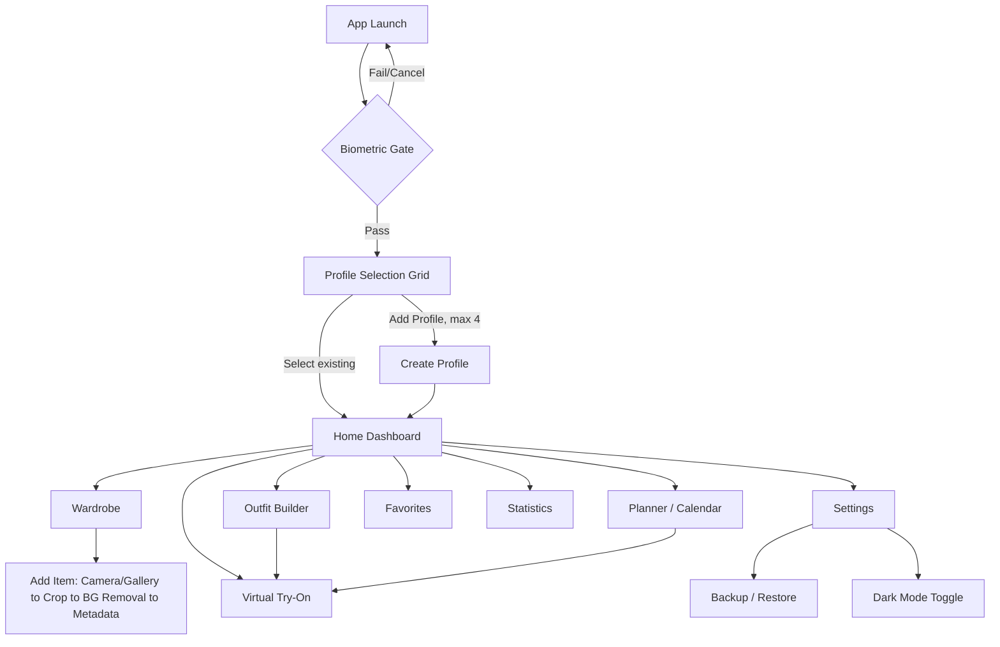
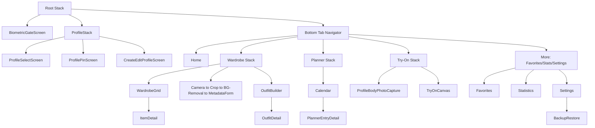
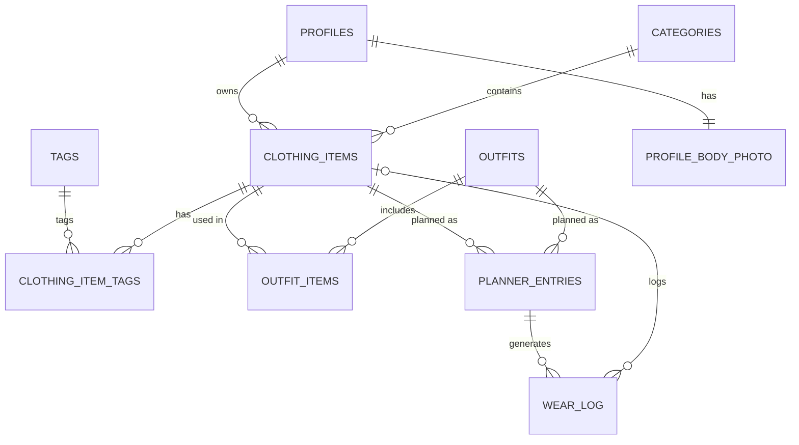
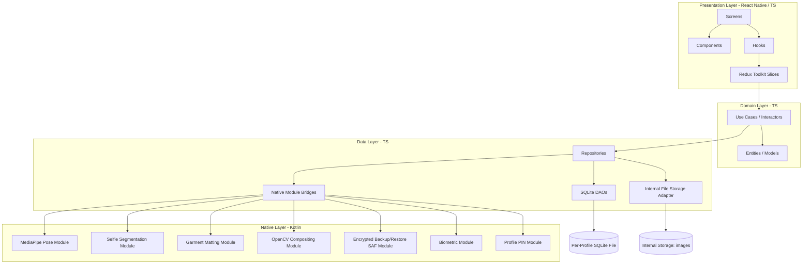

# WardrobeAI — Software Specification (spec.md)

**Version:** 1.4.0-draft
**Status:** DRAFT — pending review and freeze
**Last updated:** 2026-07-13

**Changelog (1.3.1 → 1.4.0):** Implementation-level UX/UI pass. The document was ~95% complete at the requirements/architecture/brand level (§28a) but lacked the production-grade visual specification a design and engineering team need to build without further design documentation. Added twenty new sections (§44–§63): Design Token Specification, Component Library Specification, Iconography Specification, Logo Construction Guide, App Icon Package Specification, Illustration System, Microinteraction Specification, Haptic Feedback Specification, Sound Specification, Responsive Layout Specification, Screen-by-Screen Visual Specification, Camera UX Specification, Image Processing UX, Try-On Canvas Design Specification, Theme Implementation Guide, Figma Project Organization, Asset Pipeline, Design QA Checklist, Design Handoff Checklist, and an Appendix of consolidated token/asset/component tables. Nothing in §1–§43 was altered beyond this changelog entry; every new section extends, cross-references, and reuses the terminology, tokens, and decisions already frozen in §28a and elsewhere rather than restating or revising them.

**Changelog (1.0.0 → 1.1.0):** Architecture/QA review pass. Fixed `wear_log` cascade behavior, `planner_entries` CHECK constraint, and category-delete UX gap. Added per-profile PIN (FR-4a/4b), default backup encryption (moved up from Future Roadmap), outfit-delete confirmation, un-mark-worn semantics, NFR-3 warm-run scoping, three new test-plan items, and switched native modules from Java to Kotlin. See inline changes below.

**Changelog (1.1.0 → 1.2.0):** Pre-freeze cleanup pass. Removed the `price` field/feature entirely (including the cost-per-wear roadmap item). Made `season` a fixed enum via CHECK constraint. Made wardrobe search behavior explicit in FR-10 (case-insensitive, partial-match, name/brand/tag, composable with filters). Finalized backup encryption to Google Tink with authenticated encryption and passphrase-derived keys (no more "or equivalent" wording). Finalized storage tech decisions: MMKV for key-value storage, op-sqlite for SQLite access — no more open "to be confirmed" choices. Added a new §18a Architecture Rules section. Standardized on "Profile Body Photo" terminology throughout.

**Changelog (1.2.0 → 1.3.0):** UX pass. Added new §28a UX Design System, covering brand identity/tone, logo and adaptive app icon spec, MD3 light/dark color tokens (seed colors plus semantic status colors), typography, a base + custom iconography system, illustration/empty-state guidelines, and motion principles — all deliberately gender-neutral for the app's 20–40, mixed-gender target audience. Updated Dependency Plan (§40) with the typography and custom-icon libraries this introduces.

**Changelog (1.3.0 → 1.3.1):** Senior UX review pass on §28a, plus a document-integrity fix. Restored §32–§43 (Risk Analysis through Release Checklist), which were accidentally deleted by a truncated edit during the 1.3.0 draft — no content in those sections changed from the last frozen version. UX review fixes: added missing on-color pairs for the semantic status table and corrected a sub-AA contrast pairing for the "Skipped" status (§28a.3); defined the selected-state variant for the custom Try-On tab icon (§28a.5); added the Outfit-Builder-with-an-empty-wardrobe illustration gap (§28a.6); added a reduced-motion accommodation tied to the system animator setting (§28a.7); and added a new §28a.9 covering loading-state treatment for the two multi-second CV waits (background removal, try-on compositing) and a disabled-state token, neither of which had a defined visual treatment despite disabled/loading UI already existing elsewhere in this spec.

---

## 1. Product Vision

WardrobeAI is an offline-first Android application that lets a person digitize their physical wardrobe, organize it, plan outfits, and preview how clothing looks on them via on-device 2D virtual try-on — with zero backend, zero account, and zero data ever leaving the device. Up to four people can share one installation through fully isolated local profiles (e.g. a household), each with their own wardrobe, photos, planner, and stats.

The product bet: wardrobe apps today either require a cloud account and upload personal photos to a server, or don't offer try-on at all. WardrobeAI proves a privacy-first, fully local alternative is viable on modern Android hardware using MediaPipe + TensorFlow Lite for on-device computer vision.

## 2. Goals

- Let a user catalog their wardrobe with photos, categories, and rich metadata in under 30 seconds per item.
- Provide a 2D virtual try-on that composites a full outfit (top + bottom + shoes, etc.) onto the user's own Profile Body Photo, entirely offline.
- Support outfit planning against a calendar and surface simple wear statistics.
- Guarantee no data leaves the device: no network calls, no analytics, no accounts.
- Support up to 4 isolated local profiles on one install.
- Ship a Material Design 3, dark-mode-capable, accessible UI.

## 3. Non-Goals

- Not a 3D avatar or body-scanning app.
- Not a social/sharing platform (no export-to-social, no community outfit feed).
- Not a shopping or e-commerce integration (no retailer catalogs, no purchase links).
- Not cross-device sync. Data does not leave the device that created it, except via explicit manual backup/restore files the user moves themselves.
- Not a fashion-recommendation AI (no "what should I wear" generative suggestions in v1).
- Not iOS. Android only for v1.

## 4. User Personas

**Priya, 27 — Wardrobe minimizer.** Wants to see everything she owns in one place, track what she actually wears, and stop buying duplicates. Cares about the statistics and unworn-items view.

**Family household (shared device).** Up to 4 family members share one tablet/phone; each wants their wardrobe kept private from the others. Cares about profile isolation and the biometric gate — including from other people who can also unlock the shared device (see FR-4a).

**Devraj, 34 — Planner.** Lays outfits out the night before using the calendar/planner and likes seeing a try-on preview before committing.

## 5. Functional Requirements

**Profiles**
- FR-1: App supports up to 4 local profiles, each with a name and avatar/color.
- FR-2: Profile data (wardrobe, outfits, planner, favorites, stats, Profile Body Photo) is fully isolated per profile at the database and file-storage level.
- FR-3: User can create, edit (rename/re-avatar), and delete a profile. Deleting a profile permanently deletes all its data and images after a confirmation step.
- FR-4: On launch, user is shown a profile-selection grid after passing the device-level biometric/lock gate (see Security Strategy).
- FR-4a: User can optionally set a per-profile PIN (4+ digits) as a secondary gate. If set, selecting that profile prompts for the PIN before granting access to its data. This is in addition to, not a replacement for, the device-level biometric gate — it closes the gap where anyone who can unlock the shared device (e.g. via their own enrolled fingerprint) could otherwise browse straight into another household member's profile.
- FR-4b: If a user forgets their profile PIN, they can reset it from the Profile Selection screen by re-passing the device biometric gate (already required to reach that screen). Re-verifying biometrics is treated as sufficient proof of device-owner identity, so the old PIN is not required to set a new one. There is no other recovery path (no backend account), so this is the only reset mechanism.

**Wardrobe**
- FR-5: User can add a clothing item via camera capture or gallery import.
- FR-6: User can crop the captured/imported image before saving.
- FR-7: User can run background removal on a clothing item photo to produce a clean-cutout thumbnail; original and cutout are both retained.
- FR-8: User can assign a category to each item; categories are user-customizable (rename, add, delete, reorder), seeded with sensible defaults (Tops, Bottoms, Dresses, Outerwear, Shoes, Accessories). Deleting a category that still has items assigned to it is blocked, with an explanatory message directing the user to reassign or remove those items first (enforced at the database layer via `ON DELETE RESTRICT`, and pre-checked in the UI so the user never hits a raw DB error).
- FR-9: Each item stores: name, category, brand, color, size, season, tags (multi-select), primary image path, cutout image path, date added, favorite flag, and derived wear count.
- FR-10: User can search wardrobe items by name, brand, or tag. Search is case-insensitive and matches on partial substrings anywhere within the field (not just prefixes), across all three fields (name, brand, tags). Search results compose with the existing filters — category, season, color, and favorite status — applied together (AND), not as a separate mode; a user can search "denim" and filter to Bottoms/Winter/favorited in a single query.
- FR-11: User can edit or delete an existing item (deletion removes its image files; its historical wear-log entries are preserved — see Database Design).

**Outfit Builder**
- FR-12: User can compose an outfit from existing wardrobe items (flat-lay style grouping), spanning multiple categories (e.g., one top + one bottom + one pair of shoes + optional accessories).
- FR-13: User can name, save, edit, and delete outfits. Deleting an outfit that has any associated planner entries (past or future) requires an explicit confirmation step warning the user those planner entries will be removed; the outfit's own wear history is unaffected (see Database Design).
- FR-14: A saved outfit can be sent directly into Virtual Try-On as a single action (all its items composited at once).

**Planner**
- FR-15: User can assign a saved outfit, or an individual item, to a specific calendar date — never both on the same entry (see `planner_entries` CHECK constraint in Database Design).
- FR-16: Calendar view shows month/day states indicating planned outfits.
- FR-17: A planner entry can be marked worn (past/today) which logs a wear event feeding Statistics; future entries are "planned" until their date passes. Un-marking a previously-worn entry back to "planned" deletes the corresponding `wear_log` row(s) so Statistics stay consistent with the entry's current status.
- FR-18: User can edit or remove a planner entry.

**Favorites**
- FR-19: User can favorite/unfavorite any wardrobe item or outfit from its detail view or list view.
- FR-20: A dedicated Favorites view lists favorited items and outfits.

**Statistics**
- FR-21: App computes and displays: wear count per item, most-worn items, least-worn items, category breakdown (item count and wear count by category), and never-worn ("unworn") items.
- FR-22: Statistics are derived read-only views computed from the wear log; no separate stats table is persisted redundantly.

**Virtual Try-On**
- FR-23: User captures a Profile Body Photo, one per profile (retakeable, replacing the previous one; retaking invalidates and recomputes the cached pose-landmark data).
- FR-24: App detects body landmarks (MediaPipe Pose) and segments the person from the background (MediaPipe Selfie Segmentation).
- FR-25: User selects a single item or a full saved outfit; each garment layer is overlaid on the Profile Body Photo, anchored to relevant pose landmarks per category (e.g., tops anchor to shoulders/hips, bottoms to hips/knees, shoes to ankles).
- FR-26: User can manually reposition, scale, and rotate each garment layer after the automatic placement.
- FR-27: User can save or discard the final composited preview image.

**Settings / Backup**
- FR-28: User can toggle Dark Mode (System / Light / Dark).
- FR-29: User can export a full local backup (database + all images) for the current profile or all profiles as a single portable archive.
- FR-29a: Exported backup archives are encrypted by default (passphrase set by the user at export time, required again at restore time). This applies to every export, not just profiles with a Profile Body Photo — wardrobe photos and metadata are personal data too. There is no passphrase-recovery mechanism; forgetting it makes that backup permanently unusable (see Risk Analysis).
- FR-30: User can restore from a previously exported backup archive, with a confirmation and integrity check before overwriting. Restoring an encrypted archive requires the correct passphrase; an incorrect passphrase aborts cleanly before any data is read or written.

## 6. Non-Functional Requirements

- NFR-1: 100% offline. No network permission usage for any core feature (see Constraints).
- NFR-2: Cold start under 2 seconds on target hardware (see Device Target).
- NFR-3: Virtual try-on compositing (pose + segmentation + overlay) completes in under 3 seconds end-to-end on target hardware, measured on warm runs (CV models already loaded into memory).
- NFR-3a: The very first Try-On session after install (or after app data is cleared) incurs an additional one-time model-load cost, which is budgeted and measured separately from NFR-3, not folded into it. A concrete first-run ceiling is set after the Phase 4 native-bridge spike (see Risk Analysis).
- NFR-4: No blocking of the UI thread during image processing; all CV/AI work runs off the JS thread in native modules.
- NFR-5: App remains fully usable with zero prior network connectivity, from first install onward.
- NFR-6: Data isolation between profiles must be enforced at the storage layer, not just the UI layer.
- NFR-7: WCAG-aligned accessibility: minimum touch target 48dp, TalkBack-compatible labels, color-contrast-compliant themes in both light and dark mode.
- NFR-8: APK/AAB size kept as lean as practical given bundled TFLite/MediaPipe models; models loaded lazily, not all at startup. (No hard size ceiling set yet — revisit once Phase 4 confirms actual model sizes.)
- NFR-9: Backup archives are encrypted at rest using authenticated encryption with a passphrase-derived key (see Backup & Restore Strategy, Dependency Plan); the passphrase itself is never stored by the app.

## 7. Constraints

- No backend of any kind. No REST API, GraphQL, Firebase, Supabase, or any managed cloud service.
- No authentication server, no login, no user accounts.
- No analytics or telemetry SDKs of any kind (including crash reporters that phone home — see Logging Strategy for the local-only alternative).
- No online AI inference; all MediaPipe/TFLite/OpenCV inference runs on-device.
- No advertisements.
- Android only, target hardware defined below.

## 8. Device & Performance Target

Per project decision: **flagship-focused** — `minSdkVersion 31` (Android 12), `targetSdkVersion 36` (Android 16), `compileSdkVersion` latest stable at build time.

This is a deliberate trade-off: MediaPipe Pose + Selfie Segmentation + a TFLite garment/matting model running concurrently on-device is CPU/GPU intensive. Targeting mid-2021+ hardware (API 31+) lets the app assume GPU delegate availability and NNAPI/GPU acceleration paths in TFLite are reliably present, keeping try-on latency acceptable. Broader device support (API 24+) was considered and rejected for v1 because it would force a CPU-only fallback path with materially worse try-on performance and doubled QA surface; it's listed in the Future Roadmap as a possible v2 expansion once the CV pipeline is proven.

Per current Google Play policy (July 2026): new app submissions require targeting Android 15 (API 35) now, and **API 36 (Android 16) starting August 31, 2026** — so the project should build against API 36 from the start to avoid a forced re-submission shortly after launch. [Source: Android Developers — Meet Google Play's target API level requirement](https://developer.android.com/google/play/requirements/target-sdk)

## 9. User Stories

- As a user, I want to select my own profile from a lock screen so my wardrobe stays private from other people using the device.
- As a household member, I want to set a PIN on my profile so my sibling can't open it even if they've already unlocked the shared phone with their own fingerprint.
- As a user, I want to photograph a piece of clothing and have its background automatically removed so my wardrobe grid looks clean and consistent.
- As a user, I want to build an outfit from items I already own so I can plan what to wear without re-photographing anything.
- As a user, I want to see a saved outfit composited onto my Profile Body Photo so I can judge how it looks before wearing it.
- As a user, I want to assign outfits to calendar days so I don't repeat the same outfit too often.
- As a user, I want to see which items I never wear so I can decide what to donate or sell.
- As a user, I want to back up my entire wardrobe to a file I control, so I don't lose my data if I switch phones — and I want that file encrypted, since it contains a photo of my body.
- As a user, I want everything to work with airplane mode on, so I trust the app isn't sending my photos anywhere.

## 10. Use Cases

**UC-01 — Create and unlock a profile.** User installs app → passes device biometric gate → sees empty profile grid → taps "Add Profile" → enters name/avatar → optionally sets a profile PIN (FR-4a) → profile created and selected → lands on empty wardrobe Home. On subsequent launches, selecting a PIN-protected profile prompts for that PIN; a forgotten PIN can be reset by re-passing the device biometric gate (FR-4b).

**UC-02 — Add a wardrobe item with background removal.** From Wardrobe screen, user taps "+" → chooses Camera or Gallery → captures/selects image → crop screen → confirms crop → background-removal pipeline runs (MediaPipe segmentation) producing a cutout thumbnail → user reviews cutout, retries or accepts → fills metadata form (name, category, brand, color, size, season, tags) → saves → item appears in Wardrobe grid.

**UC-03 — Build an outfit and try it on.** From Outfit Builder, user picks one item per relevant category → names and saves the outfit → taps "Try On" → if no Profile Body Photo exists yet, prompted to capture one → pose detection + segmentation run on the Profile Body Photo → garment layers auto-placed per landmark anchors → user nudges/scales two layers → saves the final preview image → preview accessible later from the outfit's detail view.

**UC-04 — Plan and log a worn outfit.** User opens Planner, taps a future date, assigns a saved outfit → on that date arriving, user opens the entry and marks it "Worn" → a wear-log row is created for every item in that outfit → Statistics update (wear counts, unworn list) on next view. If the user later un-marks the entry back to "planned," the corresponding wear-log rows are deleted and Statistics update accordingly.

**UC-05 — Backup and restore.** In Settings, user taps "Export Backup" → sets a passphrase → app bundles the SQLite DB and all image files for the selected profile(s) into a single encrypted archive → Android share sheet / Storage Access Framework lets the user save it anywhere (SD card, USB drive, cloud-drive folder via SAF — the app itself never uploads it). Later, on a new device, user taps "Restore Backup" → picks the archive via SAF → enters the passphrase → app validates archive integrity and schema version → imports DB rows and image files → profiles reappear as they were. An incorrect passphrase aborts immediately with no partial writes.

## 11. Application Flow (high-level)



(Profiles with an optional PIN set per FR-4a insert an additional PIN-entry step between `C` and `E`/`D`; a forgotten PIN loops back through `B` to reset it, per FR-4b.)

## 12. Navigation Flow

React Navigation, native-stack for root/profile flows, bottom-tab for the main authenticated area, nested stacks per feature.



## 13. Screen List

1. Biometric Gate
2. Profile Selection
3. Profile PIN Entry / Setup
4. Create / Edit Profile
5. Home Dashboard
6. Wardrobe Grid (with inline Search/Filter panel)
7. Item Capture (Camera)
8. Item Crop
9. Background Removal Review
10. Item Metadata Form (add/edit)
11. Item Detail
12. Category Management
13. Outfit Builder
14. Outfit Detail
15. Planner Calendar
16. Planner Entry Detail
17. Profile Body Photo Capture
18. Virtual Try-On Canvas
19. Favorites
20. Statistics Dashboard
21. Settings
22. Backup / Restore

## 14. Screen Specifications

| Screen | Purpose | Key elements | Entry points |
|---|---|---|---|
| Biometric Gate | Gate app access at device level | BiometricPrompt (fingerprint/face/PIN fallback) | App launch, resume from background (configurable timeout) |
| Profile Selection | Choose active profile | Up to 4 profile cards, "Add Profile" (disabled at 4), long-press to edit/delete | Post biometric gate |
| Profile PIN Entry / Setup | Secondary gate for PIN-protected profiles | PIN pad, "Forgot PIN" link (routes back through Biometric Gate per FR-4b), PIN setup during profile creation | Profile Selection (existing profile), Create/Edit Profile (setup) |
| Create/Edit Profile | Name + avatar/color | Text input, avatar picker, optional PIN toggle + entry, delete (edit mode only, with confirm) | Profile Selection |
| Home Dashboard | Quick actions + recent activity | Today's planned outfit, quick-add item, quick try-on shortcut | Bottom tab |
| Wardrobe Grid | Browse/search/filter items | Grid of cutout thumbnails, search bar (case-insensitive, partial-match across name/brand/tags), filter chips (category/color/season/favorite, composable with search) | Bottom tab |
| Item Capture | Take a clothing photo | Vision Camera view, shutter, gallery-import fallback | Wardrobe "+" |
| Item Crop | Crop captured/imported image | Crop overlay, aspect presets | After capture/import |
| Background Removal Review | Preview auto cutout | Before/after toggle, retry button | After crop |
| Item Metadata Form | Enter item details | Name, category picker, brand, color, size, season picker, tags | After BG removal accept, or Item Detail edit |
| Item Detail | View/edit a single item | Cutout image, metadata, favorite toggle, wear count, edit/delete | Wardrobe Grid, Outfit Builder |
| Category Management | CRUD categories | List with reorder/rename/delete (delete blocked with message if items still assigned), add-new | Wardrobe overflow menu |
| Outfit Builder | Compose an outfit | Category slots (top/bottom/shoes/accessory...), item picker per slot | Bottom tab |
| Outfit Detail | View/edit a saved outfit | Flat-lay preview, "Try On" button, edit/delete (with planner-impact confirmation if applicable), favorite toggle | Outfit Builder, Planner |
| Planner Calendar | Month/day view of plans | Calendar grid, day indicators, tap to open/create entry | Bottom tab |
| Planner Entry Detail | View/edit a day's plan | Assigned outfit/item, mark-worn toggle, notes, remove | Planner Calendar |
| Profile Body Photo Capture | Capture the Profile Body Photo | Full-body camera guide overlay, retake | Try-On tab (first use), Settings |
| Virtual Try-On Canvas | Composite garments on the Profile Body Photo | Profile Body Photo, draggable/scalable garment layers, save/discard | Bottom tab, Outfit Detail "Try On" |
| Favorites | List favorited items/outfits | Tabs: Items / Outfits | More menu |
| Statistics Dashboard | Wear analytics | Wear count list, most/least worn, category breakdown chart, unworn list | More menu |
| Settings | App preferences | Dark mode, biometric timeout, about, backup/restore entry | More menu |
| Backup/Restore | Export/import data | Export button (choose profile scope, set passphrase), restore button (file picker, passphrase entry), last-backup timestamp | Settings |

## 15. Database Design

SQLite, one physical database file per profile (`wardrobe_<profileId>.db`) stored in app-internal storage — this is the primary enforcement mechanism for FR-2/NFR-6 profile data isolation (a bug in a WHERE clause can't leak profile B's rows into profile A's UI, because profile A's connection literally cannot see profile B's file). A tiny shared `app_meta.db` (or an MMKV entry) holds the profile registry (id, name, avatar, created_at, and now `pin_hash`/`pin_salt`, nullable — populated only when a profile opts into FR-4a) and global settings.

Images are never stored as BLOBs in SQLite — only relative file paths are stored, per the project's storage rule. Actual files live under the app's internal `files/profiles/<profileId>/...` directory.

**Per-profile schema:**

```sql
CREATE TABLE categories (
  id INTEGER PRIMARY KEY AUTOINCREMENT,
  name TEXT NOT NULL,
  sort_order INTEGER NOT NULL DEFAULT 0,
  is_default INTEGER NOT NULL DEFAULT 0,
  created_at TEXT NOT NULL
);

CREATE TABLE clothing_items (
  id INTEGER PRIMARY KEY AUTOINCREMENT,
  category_id INTEGER NOT NULL REFERENCES categories(id) ON DELETE RESTRICT,
  name TEXT NOT NULL,
  brand TEXT,
  color TEXT,
  size TEXT,
  season TEXT NOT NULL CHECK (
    season IN (
      'Spring',
      'Summer',
      'Autumn',
      'Winter',
      'All Seasons'
    )
  ),
  image_path TEXT NOT NULL,        -- original cropped photo
  cutout_image_path TEXT,          -- background-removed version
  is_favorite INTEGER NOT NULL DEFAULT 0,
  created_at TEXT NOT NULL,
  updated_at TEXT NOT NULL
);
-- ON DELETE RESTRICT is intentional (FR-8): deleting a category with items
-- still assigned to it must fail loudly. The UI pre-checks item count and
-- blocks the delete action with an explanatory message before ever issuing
-- the DELETE, so this constraint should only ever fire as a defense-in-depth
-- backstop, never as the user's first signal.

CREATE TABLE tags (
  id INTEGER PRIMARY KEY AUTOINCREMENT,
  name TEXT NOT NULL UNIQUE
);

CREATE TABLE clothing_item_tags (   -- many-to-many
  clothing_item_id INTEGER NOT NULL REFERENCES clothing_items(id) ON DELETE CASCADE,
  tag_id INTEGER NOT NULL REFERENCES tags(id) ON DELETE CASCADE,
  PRIMARY KEY (clothing_item_id, tag_id)
);

CREATE TABLE outfits (
  id INTEGER PRIMARY KEY AUTOINCREMENT,
  name TEXT NOT NULL,
  is_favorite INTEGER NOT NULL DEFAULT 0,
  preview_image_path TEXT,   -- last saved try-on composite, optional
  created_at TEXT NOT NULL,
  updated_at TEXT NOT NULL
);

CREATE TABLE outfit_items (          -- many-to-many, an outfit is a set of items
  outfit_id INTEGER NOT NULL REFERENCES outfits(id) ON DELETE CASCADE,
  clothing_item_id INTEGER NOT NULL REFERENCES clothing_items(id) ON DELETE CASCADE,
  layer_order INTEGER NOT NULL DEFAULT 0,  -- z-index hint for try-on compositing
  PRIMARY KEY (outfit_id, clothing_item_id)
);
-- Deleting an outfit cascades here by design, but the app-layer must show the
-- FR-13 confirmation (which planner entries will be removed) before issuing
-- the DELETE — the schema enforces referential integrity, not UX safety.

CREATE TABLE planner_entries (
  id INTEGER PRIMARY KEY AUTOINCREMENT,
  planned_date TEXT NOT NULL,          -- ISO date
  outfit_id INTEGER REFERENCES outfits(id) ON DELETE CASCADE,
  clothing_item_id INTEGER REFERENCES clothing_items(id) ON DELETE CASCADE,
  status TEXT NOT NULL DEFAULT 'planned',  -- planned | worn | skipped
  notes TEXT,
  created_at TEXT NOT NULL,
  updated_at TEXT NOT NULL,
  CHECK (
    (outfit_id IS NOT NULL AND clothing_item_id IS NULL) OR
    (outfit_id IS NULL AND clothing_item_id IS NOT NULL)
  )  -- exactly one of the two, never both, never neither (fixed in v1.1 — see FR-15)
);

CREATE TABLE wear_log (              -- append-only; source of truth for Statistics
  id INTEGER PRIMARY KEY AUTOINCREMENT,
  clothing_item_id INTEGER REFERENCES clothing_items(id) ON DELETE SET NULL,  -- nullable as of v1.1
  item_name_snapshot TEXT,           -- populated when clothing_item_id is nulled out, so
                                      -- historical stats can still label the entry after
                                      -- the source item is deleted (FR-11)
  planner_entry_id INTEGER REFERENCES planner_entries(id) ON DELETE SET NULL,
  worn_date TEXT NOT NULL,
  created_at TEXT NOT NULL
);
-- v1.1 fix: was previously ON DELETE CASCADE, which silently erased an item's
-- entire wear history the moment the item itself was deleted, corrupting
-- Statistics (most/least-worn). Now SET NULL + a name snapshot so historical
-- wear data survives item deletion, matching the same survive-the-source-
-- deletion pattern already used for planner_entry_id.
-- Un-marking a planner entry from "worn" back to "planned" (FR-17) deletes the
-- wear_log row(s) created by that entry, rather than leaving an orphaned
-- historical record that no longer reflects reality.

CREATE TABLE body_photo (            -- the Profile Body Photo; single row per profile, replaceable
  id INTEGER PRIMARY KEY CHECK (id = 1),
  image_path TEXT NOT NULL,
  pose_landmarks_json TEXT,          -- cached MediaPipe Pose output, recomputed on retake
  captured_at TEXT NOT NULL
);

CREATE TABLE settings (
  key TEXT PRIMARY KEY,
  value TEXT NOT NULL
);
```

Design notes:
- **Favorites** is implemented as an `is_favorite` flag on `clothing_items` and `outfits` rather than a separate join table — a favorite is a 1:1 boolean property of an item/outfit, not a relationship with its own attributes, so a dedicated table would add a join for no benefit. The Favorites *screen* is simply a filtered query (`WHERE is_favorite = 1`) across both tables.
- **Statistics** is not a stored table at all — it's a set of read-only aggregate queries over `wear_log` and `clothing_items` (wear count = `COUNT(*) GROUP BY clothing_item_id`; unworn = items with zero matching rows; category breakdown = join through `categories`). This avoids storing derived data that can drift out of sync. Rows where `clothing_item_id IS NULL` (item since deleted) are still counted toward historical totals using `item_name_snapshot`, but excluded from any "current wardrobe" view.
- `wear_log` is append-only in the sense that it isn't derived/recomputed, but it is not immutable: rows are deleted when a planner entry is un-marked from "worn" (FR-17), and `clothing_item_id` is nulled (not the row deleted) when the source item is removed (FR-11). It's decoupled from `planner_entries` (nullable FK, `ON DELETE SET NULL`) so wear history survives even if the originating planner entry is later deleted.
- `planner_entries.outfit_id`/`clothing_item_id` are mutually exclusive by CHECK constraint (v1.1 fix) — a planner entry is either a full outfit or a single standalone item, never both, matching FR-15.
- All image-bearing tables store paths only, never binary data, per the project's storage constraint.

## 16. Entity Relationship Diagram



(`PROFILES` lives in the shared registry store; every other entity lives inside that profile's own SQLite file, so the "owns" relationship is physical file isolation, not a foreign key. `CLOTHING_ITEMS` to `WEAR_LOG` is drawn zero-or-one (`o|`) rather than exactly-one, reflecting the nullable FK introduced in v1.1. `PROFILE_BODY_PHOTO` in this diagram maps to the `body_photo` table in the schema above — the entity is named for the concept it represents, per the terminology standardized in v1.2.)

## 17. Project Directory / Folder Structure

```
wardrobe-ai/
  android/                          # Native Android project
    app/src/main/kotlin/com/wardrobeai/
      nativemodules/
        pose/                       # MediaPipe Pose bridge module
        segmentation/               # MediaPipe Selfie Segmentation bridge module
        matting/                    # Clothing cutout (garment segmentation) module
        imageprocessing/            # OpenCV-backed warping/compositing module
        backup/                     # Encrypted zip export/import (SAF) module
        biometric/                  # AndroidX Biometric bridge module
        profilepin/                 # Profile PIN hashing/verification module
      MainApplication.kt
      MainActivity.kt
  src/
    app/                            # App shell: navigation root, providers, theming
      navigation/
      theme/                        # MD3 tokens, light/dark themes
      store/                        # Redux store setup, redux-persist config
    features/
      profiles/
        data/                       # repositories, DAOs
        domain/                     # entities, use-cases
        presentation/               # screens, components, hooks, redux slice
      wardrobe/
        data/ domain/ presentation/
      categories/
      outfits/
      planner/
      favorites/
      statistics/
      tryOn/
      backup/
      settings/
    shared/
      components/                   # cross-feature reusable UI (buttons, cards, etc.)
      hooks/
      database/                     # SQLite connection manager, migrations
      utils/
      types/
      constants/
      assets/
  __tests__/
    unit/
    integration/
    e2e/
  docs/
    spec.md
    architecture/
    adr/                            # Architecture Decision Records
  .github/workflows/                # CI (build, lint, test)
```

Each `features/<x>/` module is self-contained (data/domain/presentation), enforcing Clean Architecture layering and preventing cross-feature import sprawl; cross-cutting concerns live in `shared/`.

## 18. Architecture Diagram



Strict one-way dependency: Presentation depends on Domain; Domain is pure TypeScript with no RN/Android imports; Data implements Domain's repository interfaces and is the only layer allowed to touch native bridges, SQLite, or the filesystem.

## 18a. Architecture Rules

The Architecture Diagram (§18) shows the intended shape; these are the explicit boundary rules that keep it that way as the codebase grows and contributors change. A PR that violates one of these should fail review on that basis alone, independent of whether the feature otherwise works.

- Presentation may only communicate with the Domain layer — never Data, never Native Modules, never SQLite, directly.
- Presentation never accesses SQLite directly.
- Presentation never calls Native Modules directly.
- Domain contains no React Native or Android dependencies — it is pure TypeScript, importable and testable outside of any app runtime.
- Repository *interfaces* belong to the Domain layer (Domain defines what it needs, in its own vocabulary).
- Repository *implementations* belong only to the Data layer (Data satisfies Domain's interfaces using SQLite, file storage, and native bridges).
- Native Modules are only accessed through the Data layer, via the `NativeBridge` interface — never called directly from Domain or Presentation.
- Native Modules never depend on Redux or UI components — they are plain Kotlin with no awareness of the JS-side state management or rendering.
- SQLite is the single source of truth for persisted domain data. Nothing else is allowed to hold a conflicting or independently-authoritative copy.
- Redux is an in-memory cache only — it is rehydrated from SQLite on profile load and never treated as durable storage in its own right (see §19).
- Images are stored only in internal file storage, never inside SQLite as BLOBs (see §15, §20).
- Cross-feature access must occur only through a feature's public `presentation` exports or a shared `domain` interface — one feature's `data`/`domain` internals are never reached into directly by another (see §17, enforced via ESLint import boundary rules per §39).

## 19. State Management Strategy

- **Redux Toolkit** for global app state: active profile, wardrobe/outfit/planner collections (normalized via `createEntityAdapter`), theme mode, settings.
- **Redux Persist** persists only non-sensitive, non-redundant UI state (theme, last-selected tab, filter preferences) to MMKV — persisted state is deliberately kept a thin cache; SQLite remains the source of truth for wardrobe data, re-hydrated into Redux on profile load rather than persisted redundantly through redux-persist, to avoid the two stores drifting out of sync.
- **RTK Query is not used** (no network layer to justify it); repository calls are dispatched as async thunks that call into the Data layer.
- Local component state (`useState`) for ephemeral UI (form drafts, crop coordinates, in-progress try-on layer transforms before "Save").
- Try-On canvas transform state (drag/scale/rotate per layer) is intentionally kept out of Redux — it's high-frequency gesture state, handled via Reanimated shared values for 60fps and only committed to Redux/SQLite on explicit Save.

## 20. Storage Strategy

- **SQLite**: structured data, one DB file per profile (see Database Design). Accessed through a DAO layer via **op-sqlite**; migrations versioned and applied on app start.
- **Internal file storage**: all images (`files/profiles/<profileId>/wardrobe/`, `.../bodyPhoto/`, `.../outfitPreviews/`), never in public/shared storage, never in SQLite as BLOBs.
- **MMKV**: lightweight global preferences (active profile id, theme mode, onboarding-complete flag) — chosen over AsyncStorage for its synchronous, faster key/value access, which matters for hot-path reads like the active profile id checked on every relevant screen mount.
- No external/public storage is used for live app data — SAF is used only transiently, at the moment the user explicitly exports/imports a backup file.

## 21. AI Module Architecture

Four distinct on-device pipelines (three CV/ML models plus one geometric compositing step), each a dedicated native module (Kotlin) wrapping either MediaPipe Android SDK tasks or a raw TFLite interpreter, bridged to JS via TurboModules:

1. **Pose detection** — MediaPipe Pose (Android SDK, `BlazePose` model bundle) run against the Profile Body Photo. Output: normalized landmark set (shoulders, elbows, wrists, hips, knees, ankles, etc.), cached in `body_photo.pose_landmarks_json` so it's computed once per photo, not per try-on session.

2. **Person segmentation** — MediaPipe Selfie Segmentation, run against the Profile Body Photo to isolate the person from background for cleaner compositing edges.

3. **Garment matting (clothing cutout)** — used both for wardrobe item background removal (FR-7) and is architecturally distinct from #2: Selfie Segmentation is trained specifically on people and is not reliable on arbitrary clothing-on-a-hanger or flat-lay photos. This pipeline uses a general-purpose salient-object segmentation TFLite model (e.g., a MODNet/U^2-Net-class lightweight matting model, bundled as a `.tflite` asset) rather than MediaPipe's person-specific graph. **This is flagged as an open technical risk** — see Risk Analysis — model selection and on-device latency/quality need a Phase 4 spike before being locked in.

4. **Compositing** — OpenCV (Android, via JNI) performs the actual garment placement: each garment's cutout image is affine/perspective-warped and positioned using anchor points derived from the relevant pose landmarks for its category (tops → shoulder/hip line, bottoms → hip/knee line, shoes → ankle points), then alpha-blended onto the segmented Profile Body Photo. The result is handed back to JS as a composited bitmap for the Try-On Canvas, where user drag/scale/rotate gestures apply further transforms before the final save. Unlike #1–#3, this step is deterministic geometry/image-processing, not a trained model.

All models ship bundled in the APK/AAB (as TFLite `.tflite` / MediaPipe `.task` asset files) — nothing is downloaded post-install, satisfying the fully-offline constraint.

## 22. Native Module Architecture

- Implemented as Android **TurboModules (Kotlin)** under `android/app/src/main/kotlin/com/wardrobeai/nativemodules/`, one module per capability (pose, segmentation, matting, compositing, backup, biometric, profile PIN), each exposing a small async-method surface (e.g. `detectPose(imagePath): Promise<Landmarks>`).
- Heavy inference runs on Kotlin Coroutines dispatched to a background dispatcher (`Dispatchers.Default`/`Dispatchers.IO`) inside each native module (never the UI thread or the RN JS thread), returning results via Promises to keep the JS side simple `await`-based code.
- Native modules are the *only* place MediaPipe/TFLite/OpenCV APIs are touched; the Data layer's repositories call them through a thin `NativeBridge` TypeScript interface, keeping the JS side unaware of native implementation detail (swappable/testable behind the interface).
- Native module unit tests live alongside the Kotlin source (JUnit + Espresso for instrumentation-dependent pieces).

## 23. Error Handling Strategy

- All native module calls are wrapped in try/catch on both sides; native failures reject the Promise with a typed error code (e.g. `POSE_NO_BODY_DETECTED`, `SEGMENTATION_FAILED`, `CV_OUT_OF_MEMORY`, `BACKUP_CORRUPT_ARCHIVE`, `BACKUP_BAD_PASSPHRASE`) mapped to user-facing copy in the Presentation layer.
- Domain-layer use cases return a `Result<T, AppError>`-style type (no throwing across layer boundaries) so the UI always has an explicit success/failure branch to render.
- Recoverable failures (e.g., "no body detected in photo") surface an inline retry affordance; non-recoverable failures (e.g., "corrupt backup archive") surface a blocking dialog with a clear next step.
- A global React error boundary catches unexpected render-time exceptions per screen (not app-wide) so one broken screen doesn't crash the whole app.
- No crash data is ever transmitted — see Logging Strategy for the local-only crash log approach.

## 24. Logging Strategy

- Structured local-only logger (thin wrapper around `console` in dev, writing rotated log files to internal storage in release builds) — no third-party crash/analytics SDK, per the no-telemetry constraint.
- Log levels: DEBUG (dev builds only), INFO, WARN, ERROR.
- On an unhandled native crash, Android's own crash dump is retained locally (standard OS behavior) but nothing is auto-uploaded; a Settings screen affordance lets the user manually export the log file (via SAF) if they choose to share it for support purposes — entirely opt-in, entirely manual.
- Logs never contain image bytes or file paths that could be considered sensitive beyond what's needed to reproduce a bug; PII-equivalent data (profile names) is redacted in production log output.

## 25. Backup & Restore Strategy

- **Export**: bundles the selected profile's SQLite DB file plus its entire `files/profiles/<profileId>/` image directory into a single zip archive with an embedded manifest (`manifest.json`: app version, schema version, profile name, export timestamp, checksum). The archive is encrypted by default using authenticated encryption with a passphrase-derived key, implemented via Google Tink (see NFR-9, Dependency Plan); the passphrase is set at export time and never stored by the app. User picks the destination via Storage Access Framework or the Android share sheet — the app writes the file; it does not manage where it ends up.
- **Restore**: user selects an archive via SAF → enters the passphrase → app validates the passphrase before reading contents, then validates the manifest (schema version compatibility, checksum) → shows a preview (profile name, item count, export date) → on confirm, imports DB rows via a transactional migration path and copies image files into the target profile's directory → on any validation failure (wrong passphrase, corrupt archive, incompatible schema), the import aborts with no partial writes (all-or-nothing transaction).
- Restoring into an existing profile requires explicit confirmation since it overwrites that profile's current data; restoring "as a new profile" is offered when a free profile slot (<4) exists.
- Backups are portable between devices — the user can move the archive file however they like (USB, personal cloud-drive folder they manage themselves, SD card); the app itself never uploads it anywhere. Because the archive is encrypted, storing it in a third-party cloud-drive folder does not expose its contents to that provider.
- There is no passphrase recovery. The export screen states this explicitly before the user sets a passphrase.

## 26. Security Strategy

- **App access**: single device-level biometric gate (AndroidX `BiometricPrompt`, with device PIN/pattern as the OS-provided fallback) required on cold start and after a configurable background timeout. Layered on top of that, each profile can optionally set its own PIN (FR-4a) as a second, profile-scoped gate — added in v1.1 specifically to close the household-sharing gap where any person who can unlock the shared device (e.g. via their own enrolled fingerprint) could otherwise browse into another family member's profile with no further barrier. The device biometric gate remains the single mandatory boundary; the profile PIN is an opt-in second layer, not a replacement.
- **Data at rest**: app-internal storage is sandboxed by Android per-app by default; additionally, `settings` values considered sensitive (biometric timeout preference, profile `pin_hash`/`pin_salt`) are stored via `EncryptedSharedPreferences`/Android Keystore-backed storage rather than plain MMKV. PINs are salted and hashed, never stored in plaintext.
- **No network permission** is requested in the manifest at all for the core app — this is both a privacy guarantee and a verifiable App permissions claim for the Play Store listing.
- **Backup files**: exported archives are encrypted by default in v1 (see Backup & Restore Strategy, NFR-9) using a user-supplied passphrase — this was pulled forward from an earlier draft's Future Roadmap placement, given Profile Body Photos and wardrobe images are the app's most sensitive assets and the app's core value proposition is privacy.
- **Dependency hygiene**: no ad SDKs, no analytics SDKs, dependency list kept to what's declared in this spec; `npm audit` / Gradle dependency checks run in CI.

## 27. Performance Strategy

- Lazy-load MediaPipe/TFLite models on first use of their respective feature (pose model loads when Try-On is opened, not at app boot) to keep cold start under the NFR-2 budget.
- First-run model-load time (NFR-3a) is measured and reported separately from steady-state try-on latency (NFR-3), so one-time cold-start cost isn't hidden inside the compositing budget.
- Image lists (Wardrobe grid, Outfit Builder pickers) use FlashList/virtualized lists with `React Native Fast Image` for caching and lazy decoding.
- All captured/imported images are downsampled to a sane max resolution (e.g. 1600px longest edge) and compressed before persisting, balancing thumbnail quality against storage footprint and decode time.
- Redux selectors memoized (`reselect`/RTK's built-in memoized selectors); list item components wrapped in `React.memo` with stable callbacks (`useCallback`) to avoid unnecessary re-renders.
- Native CV work always off the JS/UI thread (see Native Module Architecture); progress/loading states shown for any operation over ~150ms.
- SQLite queries indexed on frequently filtered columns (`clothing_items.category_id`, `wear_log.clothing_item_id`, `planner_entries.planned_date`).

## 28. Accessibility Strategy

- Material Design 3 components used as the baseline, which carries MD3's built-in accessibility affordances (contrast ratios, state layers, touch targets).
- Minimum 48dp touch targets on all interactive elements.
- All icons/images carry `accessibilityLabel`s; screens tested with TalkBack.
- Both portrait and landscape orientations supported with responsive layouts (per project decision) — critical for the camera/crop/try-on screens, which need explicit layout handling for both orientations rather than a locked orientation.
- Dark mode and light mode both meet WCAG AA contrast minimums.
- English-only at launch (per project decision), but all user-facing strings are externalized into a single strings resource file from day one rather than inlined — trivial-cost future-proofing for localization even though only one locale ships in v1.

## 28a. UX Design System — Brand Identity, Themes & Iconography

This section makes the "Material Design 3, dark-mode-capable, accessible UI" commitment in §2 and the accessibility rules in §28 concrete enough to hand to an implementer: a real logo/icon spec, real MD3 color tokens, a typeface, and an icon system — rather than leaving the visual language as an unstated assumption.

**Target demographic note:** the app's primary audience is men and women, roughly 20–40 (§4 already reflects this — Priya and Devraj are deliberately one woman, one man, plus a mixed-gender household persona). Every choice below is made to read as neutral to that whole range: no pink/blue gender-coding, no gendered iconography or illustration, and wardrobe category art (dresses, suits, sarees, streetwear, etc.) is treated as equally first-class rather than defaulting to one style of wardrobe.

### 28a.1 Brand Identity & Tone

- **Personality**: confident, minimal, quietly technical — closer to a well-made physical object (a good hanger, a tailor's tape) than a typical "closet app." The privacy story (zero backend, FR-29a encryption, NFR-1) is a feature, not a disclaimer, so the tone is reassuring rather than legalistic.
- **Voice**: encouraging and non-judgmental, especially anywhere Statistics (§21/FR-21) surfaces unworn items — the app is helping someone notice, not shaming them. Example: "Haven't worn this in 90 days" rather than "You're wasting money on clothes you don't wear."
- **Gender neutrality is a tone rule, not just a palette rule**: microcopy avoids "his/her wardrobe" phrasing (already correctly generic in this spec) and category/tag suggestions are not pre-populated with gendered defaults.

### 28a.2 Logo & App Icon

- **Mark**: an abstract logomark of two overlapping garment-hanger silhouettes whose negative space forms a soft, rounded "W" — drawn as a single continuous 2dp stroke so it can double as both the wordmark's lockup icon and the adaptive app icon foreground. Deliberately geometric and object-based (a hanger, not a figure) so it carries no body-shape or gender signal.
- **Wordmark**: "wardrobe" set in lowercase Inter (see §28a.4), with "AI" as a small caps badge in the Tertiary accent color immediately after it — signals the on-device AI capability without a robot/circuit-board cliché.
- **Lockup rules**: icon-only mark for the app icon, favicon, and splash screen; icon + wordmark lockup for the Settings "About" screen and any future marketing/store-listing assets. Minimum clear space around the mark = the height of the mark itself; never recolor the mark to anything outside the Primary/On-Primary pair.
- **Android adaptive icon** (`android/app/src/main/res/mipmap-anydpi-v26/`): background layer = a flat Primary-color fill (or a subtle two-stop Primary→Primary-Container gradient); foreground layer = the logomark centered in the 66dp safe zone of the 108dp adaptive icon canvas. A **monochrome themed-icon layer** (`res/drawable`, Android 13+ themed icons) is also shipped so the icon correctly tints to the user's Material You system palette on API 33+ devices — free to support since the project's `minSdkVersion 31`/`targetSdkVersion 36` (§8) already assumes recent Android.
- **Splash screen**: icon-only mark, centered, on a flat Surface-color background matching whichever theme (light/dark) the system is currently in — no splash illustration, so first paint is instant and doesn't fight the "app respects your time/privacy" tone.

### 28a.3 Color System

Seed colors below are the three inputs a Material Theme Builder (or equivalent MD3 token generator) run should use to produce the full 0–100 tonal palettes and derived on-*/*-container roles; the table gives the concrete light/dark values for the roles actually used in this app's screens (§13/§14), so an implementer isn't blocked waiting on the full generation step.

| Role (seed) | Hex | Rationale |
|---|---|---|
| Primary seed | `#4F46E5` (indigo/violet) | Brand color — primary buttons, FAB, selected tab, focused input. Reads as confident/technical, not gendered. |
| Secondary seed | `#5C5B77` (muted indigo-gray) | Lower-emphasis UI — filter chips, secondary buttons, unselected segmented controls. |
| Tertiary seed | `#A6440A` (warm terracotta/rust) | Accent used *only* for the favorite-heart fill and stat callouts — warm without being pink/rose-coded. |

| Role | Light | Dark |
|---|---|---|
| Primary / On Primary | `#4F46E5` / `#FFFFFF` | `#C6C1FF` / `#1F1370` |
| Primary Container / On Primary Container | `#E4E1FF` / `#140666` | `#372DAA` / `#E4E1FF` |
| Secondary / On Secondary | `#5C5B77` / `#FFFFFF` | `#C5C4E8` / `#2D2D46` |
| Secondary Container / On Secondary Container | `#E1E0F9` / `#191836` | `#434260` / `#E1E0F9` |
| Tertiary / On Tertiary (favorite-heart fill) | `#A6440A` / `#FFFFFF` | `#FFB599` / `#5D1900` |
| Tertiary Container / On Tertiary Container | `#FFDBCB` / `#390D00` | `#832800` / `#FFDBCB` |
| Error / On Error (MD3 baseline) | `#B3261E` / `#FFFFFF` | `#F2B8B5` / `#601410` |
| Background / Surface | `#FFFBFF` | `#1B1B1F` |
| On Surface | `#1B1B1F` | `#E5E1E9` |
| Surface Variant / On Surface Variant | `#E4E1EC` / `#47464F` | `#47464F` / `#C8C5D0` |
| Outline | `#78767F` | `#928F99` |

**Semantic status colors** (Planner §14/FR-17, Statistics §14/FR-21) are kept deliberately separate from the Tertiary brand accent, since "worn" is a functional/positive signal, not a brand moment. Each status gets an explicit "on-" pair (fill + the color used on top of it), matching the pattern already used for the MD3 roles above — the 1.3.0 draft only specified the fill color and left the paired content color implicit, which isn't enough for an implementer to build a badge component from:

| Status | Fill (Light / Dark) | On-Fill text/icon (Light / Dark) | Used for |
|---|---|---|---|
| Worn / Success | `#2E7D5B` / `#8FD9B4` | `#FFFFFF` / `#0B3823` | "Worn" planner badge (filled), positive stat highlights |
| Planned | Secondary Container | On Secondary Container | Future planner entries |
| Skipped | `#5C5B77` (Secondary, de-emphasized text/icon only — no fill) | Same color, no separate on-color needed | Skipped planner entries — intentionally muted, not red/error-colored |

**Skipped status correction:** the 1.3.0 draft specified plain `Outline` (`#78767F` light) for the Skipped label. Measured against the `#FFFBFF` light Surface it sits on, that pairing is ~4.4:1 — it clears the 3:1 bar for icons/large text but falls just short of the 4.5:1 bar this same section claims for body text, and the Skipped label is body-size text, not an icon. Swapped to the Secondary token (`#5C5B77` light / `#C5C4E8` dark), which is deliberately muted like Outline but is already verified elsewhere in this table at body-text contrast, so it satisfies the "intentionally de-emphasized" intent without failing its own stated bar.

All pairs above meet WCAG AA contrast (≥4.5:1 for body text, ≥3:1 for large text/icons) per NFR-7/§28; both theme objects are exported from `src/app/theme/light.ts` and `dark.ts` (§17) as `MD3LightTheme`/`MD3DarkTheme` overrides for React Native Paper.

### 28a.4 Typography

- **Typeface**: Inter (variable font) for all UI text — a neutral geometric-humanist sans with no gendered or regional connotation, excellent legibility at small sizes (wardrobe grid labels, stat tables), and a tabular-figures variant used specifically on the Statistics dashboard so wear-count columns align.
- Bundled as static font assets (`src/shared/assets/fonts/`) rather than a remote/Google-Fonts fetch, keeping first paint offline-safe and consistent with NFR-1/NFR-5.
- Practical scale mapped to MD3 roles (full 15-step MD3 type scale applies; these are the roles actually authored per screen):

| MD3 role | Weight/size | Used for |
|---|---|---|
| Headline Small | Inter SemiBold / 24sp | Screen titles (Wardrobe, Planner, Statistics) |
| Title Medium | Inter SemiBold / 16sp | Card/list-item headers (item name, outfit name) |
| Body Medium | Inter Regular / 14sp | Metadata, descriptions, form field values |
| Label Large | Inter Medium / 14sp | Buttons, chips, tab labels |
| Display Small | Inter Bold / 36sp, tabular figures | Empty-state / celebratory numbers (e.g. "12 items never worn") |

### 28a.5 Iconography

- **Base set**: Material Symbols (Rounded style, variable weight), 24dp grid, 2dp stroke at default optical size — matches the MD3/React Native Paper baseline already in the Dependency Plan (§40) and gives free coverage of generic actions (search, filter, edit, delete, settings, calendar).
- **Selection state pattern**: Outlined icon for unselected/idle state, Filled variant of the same symbol for selected/active state — the standard MD3 bottom-navigation and chip pattern, applied consistently across the bottom tab bar (§12) and filter chips (FR-10).
- **Custom icon subset** — needed because Material Symbols has no wardrobe-specific vocabulary; drawn in the same 24dp/2dp-stroke rounded style so they sit invisibly alongside the base set (delivered as SVGs via `react-native-svg`, not a second icon font):

| Concept | Approach |
|---|---|
| Background-removal / cutout (FR-7) | Custom: a garment silhouette with a dashed cutout outline around it |
| Virtual Try-On (FR-14/FR-25) | Custom: a person silhouette with a stacked garment-layer icon overlaid. Used on the bottom tab bar (§12), so it needs both states from the Selection state pattern above: an outlined idle variant and a filled/solid variant for the selected tab — the 1.3.0 draft only specified one drawing, which would have made the Try-On tab the one inconsistent icon in the bar (every Material Symbol tab icon already gets both states for free). Both variants ship as a pair of SVGs, same as any other two-state icon in this table. |
| Mark worn / planner entry | Standard Material Symbol (`event_available`) — no custom icon needed |
| Wear count | No flame/streak icon — deliberately avoided; a flame implies gamified "streaks," which misrepresents a wardrobe-tracking stat and could read as pressuring the user to wear things more. Shown as a plain numeric badge on the item thumbnail instead |
| Favorite | Standard Material Symbol (`favorite`), outlined idle / filled in Tertiary color when active |
| Profile PIN / lock (FR-4a) | Standard Material Symbols (`lock`, `pin`) — no custom icon needed |
| Backup / Restore (FR-29/FR-30) | Custom: a crossed-out cloud paired with a small shield, reinforcing the "never leaves the device, but still protected" message specifically on the Backup/Restore screen header |

### 28a.6 Illustration & Empty States

- **Style**: single-weight line illustrations (same 2dp stroke as the icon system), faceless/abstracted human figures with a visibly varied range of body shapes where a figure is shown at all (e.g. the Profile Body Photo capture guide overlay, §14) — no facial features, no gendered silhouette cues, so every user sees themselves as plausibly represented.
- Screens needing a dedicated illustration: empty Wardrobe grid ("Add your first item"), empty Planner ("Plan your first outfit"), empty Favorites, the all-caught-up/no-unworn-items state in Statistics (framed as a positive milestone, not just an empty list), and the Profile Body Photo capture guide overlay itself.
- **Outfit Builder with zero wardrobe items** ("Add a few wardrobe items before building your first outfit," with a direct link to Wardrobe's add-item flow) — added in the 1.3.1 review: nothing in the bottom-tab flow (§12) stops a first-run user from opening Outfit Builder before adding any items, since Wardrobe and Outfit Builder are sibling tabs, not a forced sequence. Without this state, a new user's first tap into Outfit Builder shows empty category slots with no explanation, a dead end the other empty states in this list were already designed to avoid.

### 28a.7 Motion & Microinteractions

- Standard MD3 durations/easing for state changes: 100–200ms for toggles (favorite, chip select), ~300ms standard-easing for screen transitions.
- Try-On layer drag/scale/rotate (FR-26, §19) already uses Reanimated spring physics rather than fixed-duration easing, for responsive 60fps gesture feedback — this section just confirms the same spring-based approach extends to the favorite-heart "bounce" on toggle.
- Marking a planner entry "Worn" (FR-17) gets a brief checkmark scale-in + a single haptic tick — deliberately restrained rather than a confetti burst, since the 20–40 target audience skews toward the brand feeling capable/quietly polished rather than gamified.
- **Reduced motion:** every animation in this section (spring-based drag/scale/rotate excepted, since that's a direct 1:1 gesture response rather than a decorative transition) must check the system's reduced-motion preference — RN's `AccessibilityInfo.isReduceMotionEnabled()`/`AccessibilityInfo.addEventListener('reduceMotionChanged', …)`, which reflects Android's "Remove animations" accessibility setting — and substitute an instant or near-instant (≤50ms) state change when it's on. This was missing from the 1.3.0 draft despite NFR-7/§28 already committing this project to WCAG-aligned accessibility; motion preference is as much a part of that commitment as contrast and touch targets, and costs nothing extra to support since Reanimated (§40) already sits under every animation this spec defines.

### 28a.8 Component Theming Notes

- `src/app/theme/light.ts` and `dark.ts` (§17, §19) export `MD3LightTheme`/`MD3DarkTheme`-shaped objects built from the tokens in §28a.3, passed into React Native Paper's `PaperProvider theme={...}` at the app root, with `configureFonts` pointed at the Inter type scale in §28a.4.
- Adaptive icon and monochrome themed-icon assets live under `android/app/src/main/res/mipmap-anydpi-v26/` and `res/drawable` (§17) alongside the other native Android assets.
- Custom SVG icons (§28a.5) live in `src/shared/assets/icons/` as a peer to the font assets, imported through a small typed icon-name map rather than referenced by raw file path, so a future icon swap touches one file.

### 28a.9 Loading & Disabled States

Added in the 1.3.1 review: §27 (Performance Strategy) already requires a loading state for any operation over ~150ms, and this spec independently calls out two CV waits that can take up to 3 seconds (background removal, NFR-3's try-on compositing budget) plus several disabled controls (Add Profile at 4, category delete blocked while items are assigned, outfit category slots before an item is picked) — but the 1.3.0 draft never defined what either actually looks like, leaving both to be improvised per screen.

- **Loading treatment**: a Primary-colored indeterminate spinner (React Native Paper `ActivityIndicator`) for waits with no meaningful partial content to show (Background Removal Review while the matting model runs, Try-On Canvas while pose/segmentation/compositing run) — a skeleton placeholder isn't used here because these screens don't reveal layout progressively, they reveal one finished image. Skeleton/shimmer placeholders (built on Reanimated, already in the Dependency Plan — no new library) are reserved for list-shaped content instead: the Wardrobe grid and Outfit Builder item pickers on first data load from SQLite.
- **Disabled state token**: standard MD3 disabled treatment — 38% opacity applied to disabled content (label/icon) and 12% opacity to disabled container fill, computed against the same On-Surface/Surface tokens in §28a.3 rather than a separate hardcoded gray, so disabled controls stay correct across light/dark automatically. Applies to: the "Add Profile" action at 4/4 profiles (§14), the category-delete action when items are still assigned (FR-8), and an Outfit Builder category slot before its item picker has a valid selection.

## 29. Testing Strategy

| Layer | Tooling | Scope |
|---|---|---|
| Unit tests | Jest | Domain use-cases, reducers/selectors, utility functions, DAO query builders |
| Component tests | React Native Testing Library | Individual screens/components in isolation, including error/loading states |
| Integration tests | Jest + in-memory/temp SQLite | Repository-to-DAO-to-DB round trips, backup/restore round trip, **profile-isolation checks (NFR-6)**, **cross-schema-version restore (older manifest `schema_version` restored into a newer app build, not just same-version round trips)** |
| Native module tests | JUnit + Espresso (Android instrumentation) | Pose/segmentation/matting/compositing modules against fixture images with known expected landmark/output ranges, **plus an OOM/resource-exhaustion path exercised on a low-end-of-flagship reference device (asserts `CV_OUT_OF_MEMORY` is surfaced cleanly, not a crash)** |
| UI/E2E tests | Detox | Critical user flows end-to-end: create profile to add item to build outfit to try on to plan to statistics update |
| Performance tests | Android Studio Profiler + custom timing harness | Cold start time, try-on pipeline latency (warm, per NFR-3), first-run model-load time (per NFR-3a), memory footprint during CV inference |

Three items added in the v1.1 review pass, called out above in bold: an explicit **profile-isolation** integration test (asserting no query or file path can cross profile boundaries — previously only implied by the architecture, not verified by a test), a **cross-schema-version backup/restore** test (the same-version round trip alone doesn't catch forward/backward migration bugs that will happen in the field), and a dedicated **OOM/resource-exhaustion** path for the CV pipelines.

CI runs unit/component/integration tests and lint on every PR; Detox/instrumentation suites run on a nightly/pre-release schedule against an emulator matrix matching the API 31+ target range.

**React Native Testing Library is the required standard for every component-level test** — querying by role/text/label as a user would, not inspecting internals. Raw `react-test-renderer` (with no RNTL queries) is acceptable only for the most trivial smoke-render check, never as a substitute for RNTL on anything with user-facing behavior to assert. **Known gap:** `__tests__/App.test.tsx` (Phase 0) predates this being made explicit and currently uses bare `react-test-renderer`; it should be migrated once RNTL is installed rather than treated as the pattern to copy.

## 30. Deployment Strategy

- Build artifact: Android App Bundle (`.aab`), Play App Signing enabled.
- Distribution: Google Play Store (production track), with an internal testing track used for pre-release QA builds.
- `targetSdkVersion 36` maintained proactively (see Device & Performance Target) to stay ahead of Play's rolling requirement rather than scrambling near the deadline.
- Play Console **Data Safety** form declared as "No data collected or shared" — true by construction given the no-network/no-telemetry constraints; this is a differentiator worth stating in the store listing.
- Signing keys and keystore managed outside the repo (CI secret store), never committed.

## 31. Future Roadmap

- Broader device support (API 24+) with a CPU-only CV fallback path once the flagship path is proven.
- Additional locales beyond English.
- "What should I wear today" suggestion engine (still fully on-device, e.g. simple rule-based rotation logic rather than generative AI) — deliberately deferred out of v1 as a non-goal.
- Tablet-optimized multi-pane layouts (list + detail side-by-side).

(Password-protected backup export was originally listed here in v1.0; moved up into v1 scope as FR-29a/NFR-9 during the v1.1 review, given how sensitive Profile Body Photo backups are. The `price` field and its planned cost-per-wear stat were removed entirely in v1.2 — the product no longer tracks price.)

## 32. Risk Analysis

| Risk | Impact | Mitigation |
|---|---|---|
| No mature RN wrapper for MediaPipe Pose/Selfie Segmentation exists; requires bespoke native module work | High — core feature, schedule risk | Budget a dedicated Phase 4 spike to prototype the native bridge before committing to the full Try-On feature timeline |
| Garment matting model choice (clothing cutout) unvalidated | Medium — affects wardrobe UX quality | Spike 2-3 candidate lightweight matting TFLite models against sample clothing photos before locking in Phase 4 architecture |
| Flagship-only device target narrows addressable users | Medium — product/business risk, not technical | Documented as deliberate trade-off; broader support is a scoped v2 roadmap item |
| Play Store target API requirement moves again before launch | Low-Medium — compliance risk | Track `targetSdkVersion` against Play's published schedule each release cycle |
| On-device compositing quality (garment warp realism) may not meet user expectations vs. real AR try-on | Medium — perceived quality risk | Set expectations in-app copy as "preview," ship manual reposition/scale/rotate (FR-26) as the quality safety valve |
| Both-orientation support adds layout QA surface across every camera/crop/try-on screen | Low-Medium | Scope orientation handling explicitly per screen in Phase 4 screen specs, test matrix includes both orientations |
| Forgotten per-profile PIN could lock a user out of their own data | Medium — UX/support risk | Recovery flow re-uses the device biometric gate (already the trust anchor) to reset a profile PIN without data loss (FR-4b); no backend account recovery exists or is needed |
| User forgets a backup archive's passphrase | Medium — support risk, but inherent to true zero-knowledge encryption | No recovery is possible by design; the export screen must warn prominently, before the passphrase is set, that a forgotten passphrase makes that backup permanently unusable |

## 33. Assumptions

- Planner does not send local push notifications/reminders in v1 — it's a manual calendar the user checks; this keeps the permission surface minimal (no `POST_NOTIFICATIONS`/alarm scheduling complexity) and is aligned with the offline/minimal-footprint philosophy. Revisit in Future Roadmap if desired.
- One canonical Profile Body Photo per profile is sufficient for v1 (no per-season/multiple Profile Body Photo library).
- Default category seed list (Tops, Bottoms, Dresses, Outerwear, Shoes, Accessories) is a reasonable starting point subject to change before freeze.
- "Statistics" wear tracking is driven entirely through the Planner's "mark worn" action (FR-17) — there's no separate quick "log a wear" shortcut outside the planner in v1.
- Profile PINs (FR-4a) are a convenience/deterrent layer for household sharing, not a cryptographic security boundary on their own — they gate the UI, not the SQLite file's encryption (the DB file itself is protected by Android's app sandbox, same as before v1.1).

## 34. Open Questions

- Exact garment matting model to bundle (see Risk Analysis) — needs a Phase 4 spike, not blocking spec freeze.
- Should "skipped" planner entries (an outfit was planned but not worn) be visually distinguished in Statistics, or simply excluded from wear counts? Default assumption: excluded.
- Profile PIN complexity/lockout policy (4-digit vs. alphanumeric, throttling or lockout after repeated failed attempts) — non-blocking, Phase 4 detail, added during v1.1 review.

## 35. Glossary

- **Profile**: an isolated local user identity within the app (max 4), each with its own database file and image directory, optionally protected by its own PIN.
- **Wardrobe item**: a single digitized piece of clothing/accessory with metadata and an image.
- **Outfit**: a named collection of wardrobe items intended to be worn together.
- **Cutout**: a background-removed version of a photo (Profile Body Photo or clothing item).
- **Profile Body Photo**: the single full-body reference photo captured per profile (FR-23), used as the base for Virtual Try-On compositing.
- **Try-On**: the composited preview of an outfit/item overlaid onto the user's Profile Body Photo.
- **Wear log**: append-only-in-spirit record of when an item was actually worn, the data source for Statistics; rows can be deleted on un-mark-worn and have their item reference nulled (with a name snapshot retained) on item deletion.
- **SAF**: Android Storage Access Framework, used for user-directed file export/import.

## 36. Milestones & Development Timeline

Estimate for a small team (1-2 engineers), sequential per the 16-phase development plan; adjust once team size/velocity is known.

| Phase | Scope | Estimate |
|---|---|---|
| 1-2 | Environment setup, project init | 1 week |
| 3 | Architecture finalization (this doc to code skeleton) | 1 week |
| 4 | Database layer + migrations | 1 week |
| 5 | Navigation shell | 0.5 week |
| 6 | Profile module (incl. per-profile PIN) | 1 week |
| 7 | Wardrobe module (CRUD, search/filter) | 2 weeks |
| 8 | Camera + crop | 1 week |
| 9 | Background removal pipeline (native spike + integration) | 2-3 weeks |
| 10 | Outfit Builder | 1 week |
| 11 | Planner | 1.5 weeks |
| 12 | Statistics | 0.5 week |
| 13 | Virtual Try-On (pose + segmentation + compositing + gestures) | 3-4 weeks |
| 14 | Testing hardening | 1.5 weeks |
| 15 | Performance optimization | 1 week |
| 16 | Release prep (incl. backup encryption UX) | 0.5 week |

Total: roughly 18.5-20.5 weeks, dominated by the two native CV pipelines (Phases 9 and 13), which carry the most schedule uncertainty. Per-profile PIN (FR-4a/4b) and default backup encryption (FR-29a/NFR-9) add modest scope to Phases 6 and 16 respectively, not yet separately re-baselined — revisit at Phase 3 kickoff once the Kotlin native-module setup cost is known.

## 37. Acceptance Criteria

- All Functional Requirements (FR-1 through FR-30, including v1.1 additions FR-4a, FR-4b, and FR-29a) implemented and demonstrable end-to-end on a target device.
- No network permission present in the final manifest; verified by manual APK inspection.
- Cold start, try-on latency (warm, NFR-3), first-run model load (NFR-3a), and memory NFRs met on at least one reference device (API 31+).
- Full test suite (unit/component/integration/native/E2E) green in CI, including the v1.1 profile-isolation, cross-schema-version restore, and OOM tests.
- Backup exported on Device A restores correctly on Device B with identical data, using the same passphrase; an incorrect passphrase is verified to fail cleanly with no partial writes.
- Deleting a profile leaves zero residual files/DB rows for that profile.
- Deleting a wardrobe item preserves its historical `wear_log` rows (FK set to `NULL`, not cascade-deleted) — verified by an automated test.
- Accessibility pass: TalkBack can navigate every screen; both orientations render correctly on every screen.

## 38. Definition of Done

A feature is "done" when: code merged to `develop` behind passing CI (lint + tests), matches this spec's relevant FR/screen spec, has unit/component test coverage for its logic, has been manually verified on a physical device in both light/dark mode and both orientations, and has no TODO/placeholder code paths.

## 39. Coding Standards

- **TypeScript**: `strict: true`, no implicit `any`, ESLint + Prettier enforced pre-commit (Husky) and in CI; functional components only, hooks-based, no class components.
- **Kotlin**: idiomatic modern Kotlin for all native modules, Coroutines + structured concurrency for async native work (no raw threads outside a managed `CoroutineScope`), KDoc on all public native module methods, `Result`/sealed-class error types preferred over exceptions crossing the JS bridge boundary.
- Feature-based folder structure (see §17) enforced via ESLint import boundary rules (no reaching into another feature's `data`/`domain` internals — only its public `presentation` exports or a shared `domain` interface).
- No commented-out code, no placeholder/stub implementations merged to `develop`.
- All public functions/components documented with a one-line purpose comment minimum.

## 40. Dependency Plan

| Concern | Library |
|---|---|
| Navigation | React Navigation (native-stack + bottom-tabs) |
| State | Redux Toolkit, Redux Persist |
| UI kit | React Native Paper (MD3) |
| Camera | React Native Vision Camera |
| Image loading | React Native Fast Image |
| Image cropping/import | React Native Image Crop Picker |
| SQLite | op-sqlite |
| Gestures/animation | React Native Reanimated, React Native Gesture Handler |
| Layout primitives | React Native Safe Area Context, React Native Screens |
| Icons | React Native Vector Icons (Material Symbols base set, §28a.5), React Native SVG (custom wardrobe-specific icon subset, §28a.5) |
| Typography | Bundled Inter variable font static assets (§28a.4) — no remote font fetch |
| Key-value storage | MMKV |
| Computer vision (native) | MediaPipe Android SDK (Pose, Selfie Segmentation), TensorFlow Lite (garment matting), OpenCV Android |
| Async/concurrency (native) | Kotlin Coroutines |
| Biometric | AndroidX Biometric |
| Backup encryption | Google Tink (Android) — authenticated encryption with a passphrase-derived key |

## 41. Git Strategy

**Branches**: `main` (release-only, always deployable/tagged), `develop` (integration branch), `feature/<ticket>-<short-desc>`, `release/<version>`, `hotfix/<version>-<short-desc>`.

**Flow**: feature branches cut from `develop`, PR back into `develop` with required passing CI + 1 review; `release/*` cut from `develop` when a milestone is feature-complete for hardening/RC builds; merged to both `main` (tagged) and back to `develop` on release; `hotfix/*` cut from `main` for urgent production fixes, merged to both `main` and `develop`.

**Commit convention**: Conventional Commits — `feat:`, `fix:`, `chore:`, `refactor:`, `test:`, `docs:`, `perf:`, scoped where useful, e.g. `feat(wardrobe): add background removal review screen`.

## 42. Versioning Strategy

Semantic Versioning (`MAJOR.MINOR.PATCH`) for the app itself, tracked in both `package.json` and `android/app/build.gradle` (`versionName`/`versionCode`, the latter monotonically incremented every release regardless of semver bump). Database schema versioned independently (`schema_version` in the manifest and a `PRAGMA user_version` in SQLite) to drive migrations, decoupled from app version.

## 43. Release Checklist

- All Acceptance Criteria (§37) met.
- Full test suite green; manual smoke test on at least one physical device.
- `versionCode`/`versionName` bumped; CHANGELOG updated.
- `targetSdkVersion` confirmed current against Play's latest published requirement.
- Data Safety form reviewed/confirmed accurate ("no data collected").
- Signed AAB built via CI, uploaded to Play Console internal testing track first.
- Backup/restore round trip re-verified on the release build specifically (not just dev builds), including the passphrase-encryption path.
- Release notes written; tagged on `main`; merged back to `develop`.

## 44. Design Token Specification

§28a establishes the color, typography, and iconography *decisions*; this section makes every remaining visual constant a named, reusable token rather than a per-screen judgment call, so no two screens implement "a bit of padding" differently. All tokens below live in `src/app/theme/tokens.ts` (§17) and are consumed by both the React Native Paper theme objects (§28a.8) and raw `StyleSheet`/Reanimated values where Paper's theme doesn't reach (custom cards, the Try-On canvas, custom icons).

### 44.1 Spacing Scale

4dp base unit, matching MD3's grid and keeping every value a whole multiple of the 48dp touch-target grid (NFR-7):

| Token | Value | Typical use |
|---|---|---|
| `space-2xs` | 2dp | Icon-to-badge micro gaps, stroke-adjacent offsets |
| `space-xs` | 4dp | Icon-to-label gap inside a chip |
| `space-sm` | 8dp | Wardrobe grid gutter (§44.11), tight icon/label pairs |
| `space-md` | 12dp | Card image-to-text gap, list-item vertical padding |
| `space-base` | 16dp | Screen margin, card internal padding, default component gap |
| `space-lg` | 24dp | Section-to-section gap, button horizontal padding |
| `space-xl` | 32dp | Empty-state illustration-to-copy gap |
| `space-2xl` | 48dp | Empty-state top offset, major section breaks |
| `space-3xl` | 64dp | Onboarding/celebratory screen top offset |

### 44.2 Border Radius Scale

Maps 1:1 to the MD3 shape scale; nothing outside this list is used anywhere in the app.

| Token | Value | Applied to |
|---|---|---|
| `radius-none` | 0dp | Full-bleed images (item photo before crop), edge-to-edge list dividers |
| `radius-xs` | 4dp | Text field top corners (MD3 filled field, bottom corners square) |
| `radius-sm` | 8dp | Chips' inner content image (e.g. tag-chip swatch), snackbar |
| `radius-md` | 12dp | Cards (Wardrobe/Outfit/Category/Statistic cards), list-item containers |
| `radius-lg` | 16dp | Menus/dropdowns, tooltips |
| `radius-xl` | 28dp | Dialogs, bottom sheet top corners, FAB (large variant) |
| `radius-full` | 999dp (pill) | Buttons, chips, badges, PIN dots, avatar |

### 44.3 Elevation Tokens

MD3 tonal elevation, expressed as Android `elevation` dp (drives the system shadow) paired with the tonal-primary surface-overlay percentage used in dark theme (light theme relies on shadow only, per MD3 guidance that light-surface tonal overlays read as muddy):

| Token | Elevation (dp) | Dark-theme surface-tint overlay | Components |
|---|---|---|---|
| `elevation-0` | 0dp | 0% | Resting cards, list items, backgrounds |
| `elevation-1` | 1dp | 5% | Bottom sheet, filled text field surface |
| `elevation-2` | 3dp | 8% | Menu/dropdown, scrolled Top App Bar |
| `elevation-3` | 6dp | 11% | FAB (resting), dialog, snackbar |
| `elevation-4` | 8dp | 12% | FAB (pressed/dragged) |
| `elevation-5` | 12dp | 14% | Modal/full-screen overlay content (Loading Overlay) |

### 44.4 Shadow & State-Layer Opacity Tokens

Android renders the physical shadow from the `elevation-*` dp value automatically (View/RN `elevation` + Paper's `Surface`); these tokens instead cover the *interaction* overlays MD3 layers on top of a surface, expressed as On-Surface (or On-Primary, for filled surfaces) opacity:

| Token | Opacity | Trigger |
|---|---|---|
| `state-hover` | 8% | N/A on touch-only Android targets; kept for parity if a foldable/desktop-mode cursor is ever detected |
| `state-focus` | 12% | Keyboard/TalkBack focus ring fill |
| `state-pressed` | 12% | Ripple/press feedback on any interactive surface |
| `state-dragged` | 16% | Try-On garment layer while actively being dragged (§57) |
| `scrim` | 32% | Dialog/bottom-sheet/modal backdrop over page content |
| `disabled-content` | 38% | Disabled label/icon (§28a.9) |
| `disabled-container` | 12% | Disabled container fill (§28a.9) |

### 44.5 Stroke Widths

| Token | Value | Applied to |
|---|---|---|
| `stroke-hairline` | 1dp | Dividers, outlined button/card/chip/text-field borders (idle) |
| `stroke-focus` | 2dp | Outlined text field border (focused state), focus ring |
| `stroke-icon` | 2dp | All Material Symbols and custom SVG icon strokes (§28a.5, matches the logomark's 2dp stroke, §47) |

### 44.6 Opacity Tokens (Non-Interaction)

| Token | Opacity | Use |
|---|---|---|
| `opacity-cutout-checker` | 6% (On-Surface, tiled) | Transparency checkerboard behind cutout thumbnails (§45.2) so a genuinely transparent PNG edge is distinguishable from a white background |
| `opacity-image-loading` | 12% (Surface Variant placeholder tint) | FastImage placeholder fill before decode |
| `opacity-illustration-bg` | 100% flat (no wash) | Empty-state illustrations sit on flat Surface, never a tinted panel, per §28a.6's minimal/quiet tone |

### 44.7 Icon Sizes

| Token | Value | Use |
|---|---|---|
| `icon-inline` | 16dp | Icons embedded inside body text or a numeric badge (§28a.5 wear-count badge) |
| `icon-default` | 24dp | Standard MD3 icon grid — nav bar, buttons, list-item leading/trailing icons, all base and custom icons (§28a.5) |
| `icon-medium` | 32dp | Empty-state inline accent icons, Settings row leading icons |
| `icon-large` | 48dp | Dialog header icon (Confirmation/Error/Success Dialog, §45.9) |
| `icon-illustration` | 96dp+ | Bounding box for the line illustrations themselves (§49), not a true "icon" but tracked here as the top of the icon-to-illustration size continuum |

### 44.8 Avatar Sizes

| Token | Value | Use |
|---|---|---|
| `avatar-sm` | 32dp | Compact contexts (About screen row, if profile name is echoed) |
| `avatar-md` | 40dp | Default list/header profile chip |
| `avatar-lg` | 64dp | Profile Selection grid card (§14, §54.2) |
| `avatar-xl` | 96dp | Create/Edit Profile screen live preview (§54.4) |

### 44.9 Button, FAB & Chip Heights

| Token | Value | Notes |
|---|---|---|
| `height-button` | 40dp visual / 48dp touch target | Filled/Outlined/Text/Tonal buttons; the extra 8dp is transparent hit-slop padding, not a larger visual button, satisfying NFR-7 without inflating density |
| `height-icon-button` | 40dp visual / 48dp touch target | Same hit-slop pattern as above |
| `height-fab-small` | 40dp | Rarely used in this app (default/large preferred for the Try-On/Add-Item primary actions) |
| `height-fab-default` | 56dp | Wardrobe "+" add-item action, Outfit Builder "+" |
| `height-fab-large` | 96dp | Reserved, unused in v1 — tracked for tablet layouts (§31 Future Roadmap) |
| `height-chip` | 32dp | All chip variants (§45.7) |

### 44.10 Card & List Spacing

| Token | Value | Use |
|---|---|---|
| `card-padding` | 16dp (`space-base`) | Internal padding on all card variants (§45.2) |
| `card-image-gap` | 12dp (`space-md`) | Gap between a card's image and its text block |
| `card-gutter` | 8dp (`space-sm`) | Gap between adjacent cards in a grid |
| `list-item-padding-v` | 12dp (`space-md`) | Vertical padding inside a List Item |
| `list-item-padding-h` | 16dp (`space-base`) | Horizontal padding inside a List Item |
| `list-item-min-height` | 56dp | One-line List Item; 72dp for two-line (with subtitle) |

### 44.11 Grid Spacing

| Token | Value | Use |
|---|---|---|
| `grid-margin` | 16dp | Outer margin, all grid layouts (Wardrobe grid, Outfit picker) |
| `grid-gutter` | 8dp (`card-gutter`) | Inter-cell gutter |
| `grid-columns-phone-portrait` | 2 | Wardrobe grid, phone portrait (§53.1) |
| `grid-columns-phone-landscape` | 3 | Wardrobe grid, phone landscape (§53.2) |
| `grid-columns-tablet` | 4 | Wardrobe grid, tablet/foldable-unfolded (§53.3/§53.4) |

### 44.12 Navigation Spacing

| Token | Value | Use |
|---|---|---|
| `top-app-bar-height` | 64dp | Standard Top App Bar (§45.3) |
| `bottom-nav-height` | 80dp | Bottom Navigation bar, icon (24dp) + label (12sp) + vertical padding, plus system nav-bar inset (§53.5) |
| `bottom-nav-icon-size` | 24dp (`icon-default`) | |
| `bottom-nav-label-size` | 12sp | Label Medium role, not in the §28a.4 table because it's exclusively a nav-bar value |
| `nav-rail-width` | 80dp (collapsed) / 220dp (expanded, with labels) | Navigation Rail, future tablet layout only (§45.3, §31) |

### 44.13 Animation Durations

MD3 duration scale, the full set from which §28a.7's "100–200ms toggles / ~300ms transitions" language draws its concrete values:

| Token | Duration | Easing curve | Use |
|---|---|---|---|
| `duration-short-1` | 50ms | Standard | Reduced-motion substitute for any token below (§28a.7) |
| `duration-short-2` | 100ms | Standard | Chip/toggle state change, ripple state-layer fade-in |
| `duration-short-3` | 150ms | Standard | Favorite-heart fill toggle (paired with the spring bounce, §28a.7) |
| `duration-short-4` | 200ms | Standard | Dialog/menu exit |
| `duration-medium-1` | 250ms | Standard-decelerate | Snackbar enter, dialog enter |
| `duration-medium-2` | 300ms | Standard-decelerate | Screen transition (push/pop), bottom sheet enter |
| `duration-medium-3` | 350ms | Standard | Tab-switch content cross-fade |
| `duration-medium-4` | 400ms | Standard | FAB-to-extended-FAB morph |
| `duration-long-1` | 450ms | Emphasized-decelerate | Full-screen modal enter (Camera, Try-On Canvas) |
| `duration-long-2` | 500ms | Emphasized | Onboarding/celebratory "all caught up" illustration entrance (§28a.6) |

Standard easing curve = MD3 `cubic-bezier(0.2, 0.0, 0, 1.0)`; emphasized-decelerate = `cubic-bezier(0.05, 0.7, 0.1, 1.0)`. Reanimated's `withTiming`/`Easing.bezier` are configured with these exact curves so native and JS-driven animations feel identical (§19).

### 44.14 Z-Index / Stacking Policy

React Native has no CSS cascade `z-index`; RN Screens (§40) gives each navigator its own native stacking context, but *within* a single screen, stacking order is otherwise just render order. This project fixes an explicit layering policy so overlapping UI (FAB over a scrolling grid, a Snackbar over a bottom sheet) is deterministic rather than accidental:

| Layer | Token value | Contents |
|---|---|---|
| Content | 0 | Screen body, scrollable grids/lists |
| Sticky header | 1 | Scrolled Top App Bar, search bar collapsed state |
| Floating action | 2 | FAB |
| Overlay scrim | 10 | Bottom sheet / dialog backdrop |
| Overlay content | 11 | Bottom sheet / dialog / dropdown surface |
| Loading overlay | 20 | Full-screen `LoadingOverlay` (§45.8) |
| Transient feedback | 30 | Snackbar, Tooltip |

A Snackbar (30) is deliberately layered above a Bottom Sheet (11) — e.g., an undo-delete Snackbar (§50) must remain visible even if the user has a filter bottom sheet open. Implemented via a single app-root `<Portal>` (React Native Paper, §40) per layer band rather than manual z-index math per screen.

## 45. Component Library Specification

Every reusable component surfaced anywhere in §13/§14, specified to the level a developer can implement without opening Figma. Components already fully described by React Native Paper's default MD3 implementation are noted as "Paper default" with only the *deltas* this app applies (theme tokens from §28a.3/§44, and any behavior this app adds); fully custom components (never in Paper) get a complete spec. All components live under `src/shared/components/` (§17) unless marked feature-local.

### 45.1 Buttons & FAB

- **Filled Button** (Paper default, themed): primary call-to-action, one per screen/section max (e.g., "Save Item," "Export Backup"). States: enabled, focused, pressed, disabled. Height `height-button` (44.9), radius `radius-full` (44.2), horizontal padding `space-lg`/24dp, icon-label gap `space-xs`/8dp, no resting elevation (`elevation-0`) per MD3's flat-button guidance. Press feedback: `state-pressed` ripple, `duration-short-2` fade. Disabled: `disabled-content`/`disabled-container` tokens. Accessibility: `accessibilityRole="button"`, 48dp touch target guaranteed via hit-slop even though the visual height is 40dp.
- **Outlined Button** (Paper default, themed): secondary action alongside a Filled Button (e.g., "Cancel" beside "Save"). Same geometry as Filled; `stroke-hairline`/1dp Outline-color border instead of a fill; no elevation.
- **Text Button** (Paper default, themed): lowest-emphasis action (e.g., "Skip," inline "Retry" link in an error state). No container, no border; label-only with `state-pressed` ripple confined to a `radius-sm` hit area around the text.
- **Tonal Button** (Paper default, themed): used specifically for the Secondary Container-colored "Forgot PIN" and "Retake" actions — higher emphasis than Text, lower than Filled.
- **Icon Button**: 40dp visual / 48dp touch target, `radius-full`, icon `icon-default`/24dp centered. Two sub-variants used in this app: *standard* (transparent until pressed, e.g. Top App Bar actions) and *toggle* (persistent Primary/Tertiary tint when active, e.g. the favorite-heart icon button, §28a.5). Accessibility: icon-only buttons are the one case where `accessibilityLabel` is mandatory rather than inferred from visible text (§28, §24).
- **FAB**: `height-fab-default`/56dp, `radius-lg`/16dp (MD3 FAB corner, not full-pill — this is the one primary-action shape exception to the pill rule in §44.2), `elevation-3` resting / `elevation-4` pressed-or-dragged. Used for Wardrobe "+" (Item Capture entry) and Outfit Builder "+" (add another category slot). Press animation: scale to 0.94 with a spring (`duration-short-3`-equivalent spring config, damping 15/stiffness 300) then release.

### 45.2 Cards & List Items

- **Card (base)**: `radius-md`/12dp, `card-padding`/16dp internal padding, `elevation-0` resting (this app uses outlined/tonal cards, not shadowed cards, to keep the flat "quietly technical" tone from §28a.1 — a `stroke-hairline` Outline-Variant border substitutes for elevation as the resting affordance). Pressed state: brief `elevation-1` lift + `state-pressed` overlay, `duration-short-2`.
- **Wardrobe Card**: Card base + cutout thumbnail (checkerboard `opacity-cutout-checker` behind any transparent PNG region, §44.6) at a fixed 1:1 aspect crop, `card-image-gap`/12dp below the image, Title Medium item name, Body Medium brand/category line, favorite Icon Button toggle top-right overlaying the image corner, numeric wear-count badge bottom-right of the image (Tertiary-on-Surface small pill, no icon per §28a.5).
- **Outfit Card**: Card base + flat-lay composite thumbnail (multiple item cutouts arranged in a fixed template grid, not a live try-on render — cheap to compute, no CV needed just to browse outfits), outfit name, item-count subtext, favorite toggle.
- **Category Card**: used only in Category Management (list row style, not grid), Card base collapsed to `list-item-min-height`/56dp, drag handle (reorder, FR-8) leading, name centered, item-count trailing, overflow menu (rename/delete) trailing-most; delete action rendered `disabled-*` (§44.4/§28a.9) when item count > 0.
- **Profile Card**: square Card base, `avatar-lg`/64dp avatar centered, name below, long-press reveals edit/delete (FR-3); PIN-protected profiles show a small `lock` Material Symbol badge (§28a.5) bottom-right of the avatar.
- **Statistic Card**: Card base, Display Small tabular-figure number (§28a.4) as the focal element, Label Large caption below (e.g. "items never worn"), optional leading `icon-medium` accent icon; used on the Statistics Dashboard's summary row.
- **Calendar Cell**: 1/7-width square (min 40×40dp to clear touch-target math at 7 columns on a 360dp-wide device — see §53.1 for the arithmetic), date number Body Medium, a `radius-sm` colored dot/fill indicating planner status using the Worn/Planned/Skipped tokens (§28a.3) — filled circle for Worn, outlined ring for Planned, muted dot for Skipped, nothing for no entry. Today gets a `stroke-focus` Primary ring regardless of status.
- **List Item** (Paper default, themed): `list-item-padding-h`/16dp, `list-item-padding-v`/12dp, leading icon/avatar slot (`icon-default` or `avatar-sm`), title (Title Medium or Body Medium depending on one/two-line variant), optional subtitle (Body Medium, On-Surface-Variant), trailing icon/switch/chevron slot. Used throughout Settings and Category Management.
- **Section Header**: Label Large, On-Surface-Variant color, `space-base`/16dp top margin, `space-sm`/8dp bottom margin, all-caps *not* used (per §28a.1's non-shouty tone) — sentence case only (e.g. "Recently added," "Most worn").

### 45.3 Navigation Components

- **Top App Bar** (Paper default, themed): `top-app-bar-height`/64dp, `elevation-0` at rest / `elevation-2` once content scrolls beneath it (standard MD3 scroll-elevate behavior), title Title Medium, leading back/menu Icon Button, trailing action Icon Buttons (max 2 visible + overflow).
- **Bottom Navigation** (Paper default, themed): `bottom-nav-height`/80dp + bottom system-inset padding (§53.5), 5 destinations max (Home, Wardrobe, Planner, Try-On, More — §12), outlined/filled icon-state pattern per §28a.5, active label tinted Primary, inactive On-Surface-Variant.
- **Bottom App Bar**: not used in this app's v1 navigation (Bottom Navigation covers the same role per §12's tab structure) — included in the shared component library only as a Paper-default pass-through for any future screen-local contextual action bar (e.g., a multi-select "3 selected · Delete/Favorite" bar on the Wardrobe grid), not currently wired to a screen.
- **Navigation Drawer**: not used in v1 navigation (§12 is bottom-tab-only by design, matching a phone-first flagship-device target, §8). Retained in the shared library, unstyled beyond base theming, because the Future Roadmap's tablet multi-pane layout (§31) is the one scenario where a permanent drawer replacing the bottom tab bar becomes the right pattern; no screen references it today.
- **Navigation Rail (future)**: same status as Navigation Drawer — a Paper-default component, themed but not instantiated by any current screen. `nav-rail-width` tokens (§44.12) are pre-defined so the eventual tablet work (§31) has them ready rather than inventing values mid-implementation.

### 45.4 Search

- **Search Bar** (collapsed/idle state, on Wardrobe Grid header): full-width pill (`radius-full`), `height-button`-equivalent 40dp track, leading `search` Material Symbol, placeholder "Search wardrobe," trailing filter Icon Button that opens the filter chip row (FR-10). Tapping the field (not the filter icon) expands into the Search Field below.
- **Search Field** (active/expanded state): Top App Bar transforms in-place into a text input (`duration-medium-1`/250ms cross-fade, not a separate screen/route) with a leading back-arrow Icon Button (collapses back to Search Bar, clearing focus but preserving typed text) and a trailing clear ("x") Icon Button (clears text, keeps focus). Live-filters the grid on every keystroke, debounced 150ms against the SQLite query (§27 performance pattern) rather than on every keystroke unthrottled.

### 45.5 Text Input

- **Text Field** (Paper default, MD3 filled variant, themed): `radius-xs`/4dp top corners only (flat bottom per MD3 filled-field spec), `stroke-hairline`/1dp bottom indicator idle, `stroke-focus`/2dp Primary bottom indicator focused, label floats from placeholder to top-caption position on focus/fill (`duration-short-2`). Used for name/brand/color/size fields on the Item Metadata Form, the outfit-name field, and the backup passphrase field.
- **Password Field**: a Paper Text Field variant with a trailing visibility-toggle Icon Button and masked input — included in the shared library for completeness since Paper ships it, but this app has **no traditional username/password authentication** (§7 Constraints: no accounts, no login) so it has no live call site. The backup passphrase field (FR-29a/FR-30) intentionally *reuses this exact variant* (masked-by-default, toggleable) since a passphrase has the same UX shape as a password, even though it isn't authenticating a user identity.
- **PIN Entry**: the actual authentication-input component for FR-4a/FR-4b, not a text field at all — six (or however many digits the user set, 4+ minimum) `radius-full` dot/box targets in a row, each 40×40dp, filled Primary on entry, paired with a custom numeric keypad (not the system IME, to keep the gate visually consistent and to prevent the OS predictive-text bar from ever appearing over a security surface). Wrong-PIN feedback: all dots briefly shake (horizontal translate ±4dp, 3 cycles, `duration-short-3` per cycle) and flash Error-container, paired with the PIN-failure haptic (§51).
- **Dropdown** (Paper `Menu` anchored to a Text Field, themed): used for Category picker and Season picker on the Item Metadata Form. Opens `elevation-2`, `radius-lg`/16dp menu below/above the anchor depending on available space, `duration-short-3` enter.

### 45.6 Overlays: Dialog, Bottom Sheet, Snackbar, Tooltip

- **Dialog** (Paper default, themed): `radius-xl`/28dp, `elevation-3`, max-width capped on tablet (§53.3) rather than stretching full-width, `scrim`/32% backdrop. Enter `duration-medium-1`/250ms scale-and-fade from 0.9→1.0, exit `duration-short-4`/200ms reverse. Base for Confirmation/Error/Success/Backup-Progress Dialog (§45.9).
- **Bottom Sheet** (Paper default, themed): `radius-xl` top corners only, `elevation-1`, used for the Wardrobe filter panel (FR-10 filters) and the Item Capture "Camera or Gallery" chooser. Enter: slide up `duration-medium-2`/300ms emphasized-decelerate; drag-to-dismiss follows the user's finger 1:1 via Gesture Handler (§40), snapping back or dismissing based on velocity threshold (>800dp/s or past 50% sheet height).
- **Snackbar** (Paper default, themed): `radius-sm`/8dp, `elevation-3`, On-Surface-Inverse background (MD3's inverse-surface token, distinct from the main light/dark palette so it stays legible regardless of current theme), single optional action (e.g. "Undo" — §50), auto-dismiss 4s unless an action is present (then 8s), swipe-to-dismiss enabled. Stacking policy: §44.14 (renders above bottom sheets).
- **Tooltip** (Paper default, themed): long-press-triggered (500ms hold) plain-text hint on icon-only controls where the `accessibilityLabel` exists but no visible label does (e.g. a Top App Bar overflow icon) — supplementary for sighted users, not a substitute for the accessibility label TalkBack already reads.

### 45.7 Chips & Badges

- **Chip (base)** (Paper default, themed): `height-chip`/32dp, `radius-full`, `stroke-hairline` outline idle.
- **Filter Chip**: toggled state fills Secondary-Container (idle: Surface + outline), used for the Wardrobe category/season/color/favorite filters (FR-10) — multi-select, composes with Search per FR-10's AND semantics.
- **Assist Chip**: single leading icon + label, no toggle state, used for one-shot suggestions (e.g. a "Try this outfit" assist chip surfaced from Home Dashboard's "today's planned outfit" card, linking straight into Try-On).
- **Tag Chip**: same visual as a Filter Chip but represents a *stored* item tag (FR-9) rather than a filter predicate — appears read-only on Item Detail, editable (with an "x" remove affordance) on the Item Metadata Form.
- **Badge** (Paper default, themed): small `radius-full` dot or numeral overlay, used only for the wardrobe-item wear-count (§28a.5 — plain numeral, no icon) and the Profile Selection PIN-lock indicator badge (`lock` symbol at `icon-inline`/16dp).

### 45.8 Progress, Loading & Skeletons

- **Progress Indicator** (Paper `ActivityIndicator`, themed Primary): indeterminate circular spinner, the default treatment for any wait with no progressively-revealable content (§28a.9) — Background Removal Review, Try-On Canvas compositing, Backup export/restore.
- **Skeleton Loader**: Reanimated-driven shimmer (a `Surface-Variant`-to-`Surface` gradient sweep, `duration-long-2`/500ms loop, linear easing) shaped as gray card/row placeholders matching the exact grid/list geometry of the content it precedes — Wardrobe grid and Outfit Builder item pickers on first SQLite load only (§28a.9), never shown again once that screen's data is cached in Redux for the session.
- **Loading Overlay**: full-screen, `scrim`/32%-over-Surface backdrop + centered Progress Indicator + optional single-line status caption (e.g. "Restoring backup…"), stacking layer 20 (§44.14). Used for Backup/Restore (§45.9) and any native-module call expected to exceed ~1s where the user shouldn't interact with anything beneath it (as opposed to the lighter in-place spinners above, which allow the rest of the screen to remain visible/interactive where safe).

### 45.9 Empty States & Confirmation/Result Dialogs

- **Empty State**: illustration (§49) + Title Medium headline + Body Medium supporting copy + optional single Filled/Tonal Button CTA, vertically centered in the available content area, `space-xl`/32dp between illustration and copy. Screens: empty Wardrobe, empty Planner, empty Favorites, Statistics "all caught up," Outfit Builder with zero wardrobe items (§28a.6).
- **Confirmation Dialog**: Dialog base (§45.6), `icon-large`/48dp neutral/Warning-toned icon (not Error-colored unless the action is destructive), headline + one-sentence consequence copy, two actions (Text Button "Cancel" + Filled/Error-colored Button for the confirming action). Used for profile deletion (FR-3), category deletion pre-check failure explanation (FR-8), outfit deletion with planner impact (FR-13), and un-mark-worn.
- **Error Dialog**: Dialog base, `icon-large` Error-colored icon, maps directly to the typed error codes in §23 (`POSE_NO_BODY_DETECTED`, `SEGMENTATION_FAILED`, `CV_OUT_OF_MEMORY`, `BACKUP_CORRUPT_ARCHIVE`, `BACKUP_BAD_PASSPHRASE`), single "OK"/"Retry" action depending on whether §23 classifies the failure as recoverable.
- **Success Dialog**: Dialog base, `icon-large` Success-toned (Worn/Success token, §28a.3) icon, used sparingly — only for Backup export/restore completion (a rare, high-stakes action worth a confirming dialog rather than a passive Snackbar) — every other success (save item, save outfit, mark worn) uses the lighter Snackbar or in-place micro-animation instead (§50), keeping the "quietly polished, not gamified" tone from §28a.7.
- **Backup Progress Dialog**: a non-dismissible Dialog variant (no scrim-tap-to-close, no back-button dismiss) showing a determinate Progress Indicator (percentage known: file count during export, byte count during restore) plus a live status line ("Encrypting… / Copying images… / Verifying…"), replaced on completion by the Success Dialog or an Error Dialog (bad passphrase/corrupt archive) in place, without the user needing to dismiss an intermediate state first.

### 45.10 Media Capture Components

- **Image Picker**: the Camera-or-Gallery entry sheet (a Bottom Sheet instance, §45.6) presented from the Wardrobe "+" FAB; two large tappable rows (Camera / Gallery), each `list-item-min-height`-equivalent 56dp+ with a leading `icon-medium` and label.
- **Camera Overlay**: full-screen Vision Camera (§40) preview with a persistent translucent (Surface at 60% opacity) top/bottom control bar (shutter, flash toggle, camera-flip, close), and a mode-specific guide layer drawn as an SVG overlay: a garment-silhouette bounding guide for Item Capture (FR-5) versus a full-body framing guide for Profile Body Photo Capture (FR-23) — see §55 for the complete camera UX spec.
- **Crop Overlay**: React Native Image Crop Picker's native crop UI (§40), themed via its Android theme-attribute overrides (Primary-colored grid lines and corner handles rather than the library's default) rather than reimplemented in RN, since it's a native modal the library already owns — see §55.5 for aspect-ratio presets and gesture behavior.

### 45.11 Try-On Canvas Components

- **Try-On Layer**: a single composited-and-warped garment image rendered as a Reanimated-animated `Image` inside the Try-On Canvas, one per garment in the active outfit, `layer_order` (§15 schema) driving render/z-order — full spec in §57.
- **Gesture Handle**: the four-corner scale/rotate handle set plus a center move-handle that appears around the currently-selected Try-On Layer, `stroke-focus`/2dp Primary circles at `icon-default`/24dp diameter at each corner — full spec in §57.4.

## 46. Iconography Specification

Extends §28a.5's base-set/custom-set decision into exact export parameters.

### 46.1 Material Symbols Configuration

| Axis | Value | Note |
|---|---|---|
| Family | Material Symbols | Not the legacy "Material Icons" font — Symbols is the variable-axis successor and the only one that supports the Rounded style used here |
| Style | Rounded | Matches the 2dp-stroke, soft-cornered custom icon set (§46.2) more closely than Sharp/Outlined-classic |
| Fill axis | 0 (outlined/idle), 1 (filled/selected) | Drives the §28a.5 selection-state pattern |
| Weight (`wght`) | 400 (idle), 500 (selected/active) | A small weight bump reinforces the fill-based selection state without changing the glyph's footprint |
| Grade (`GRAD`) | 0 | Neutral; the −25/0/200 grade axis is meant for light/dark contrast tuning, which this app already handles via explicit on-color tokens (§28a.3), so grade is left at the neutral default rather than double-compensating |
| Optical size (`opsz`) | 24 | Matches the fixed 24dp icon grid (§44.7); the 20/40/48 optical variants are not used since this app has no icon sizes outside `icon-default`/24dp and `icon-inline`/16dp (which reuses the 24 `opsz` glyph scaled down, not a distinct optical cut) |

### 46.2 Custom Icon Grid Specification

| Property | Value |
|---|---|
| Artboard | 24×24dp |
| Live/safe area | 20×20dp centered (2dp margin all sides), matching Material Symbols' own live-area convention so custom and base icons optically match at a glance |
| Stroke width | 2dp (`stroke-icon` token, §44.5) |
| Corner radius (glyph strokes) | 2dp round joins/caps — never a hard miter, matching the Rounded Material Symbols style |
| Grid | 4dp sub-grid (6 columns/rows across the 24dp artboard) for endpoint alignment, same discipline Material Symbols itself is drawn to |

### 46.3 SVG Export & File Convention

| Property | Rule |
|---|---|
| Naming | `ic_<concept>_<state>.svg`, snake_case, state suffix only when a two-state pair exists (`_outline` / `_filled`) — e.g. `ic_tryon_outline.svg`, `ic_tryon_filled.svg`, `ic_cutout.svg` (single-state) |
| Folder structure | `src/shared/assets/icons/base/` (any Material Symbol this app re-exports as a static SVG rather than pulling from the Vector Icons font, for icons needing a non-standard fill/weight combination) and `src/shared/assets/icons/custom/` (the §28a.5 custom subset) |
| Vector optimization | Run through SVGO (headless, as a pre-commit hook alongside Husky, §39) with `removeViewBox: false`, `removeDimensions: true`, `convertShapeToPath: false` (paths already authored as paths in Figma, §59) — no visual regression, pure byte-size reduction |
| Export size | Authored/exported at 24×24 viewBox regardless of render size; `react-native-svg` (§40) scales at runtime, so no per-size raster variants are generated |
| Registration | Every custom icon is added to the typed icon-name map (§28a.8, `src/shared/assets/icons/index.ts`) the same commit it's added to the folder — an icon file with no map entry fails a lint rule (§39) rather than silently existing unused |

## 47. Logo Construction Guide

Expands §28a.2's mark description into buildable geometry and usage rules.

### 47.1 Construction Grid

The logomark (two overlapping hanger silhouettes forming a negative-space "W") is constructed on a 12×12 unit grid: each hanger silhouette's hook radius = 1.5 units, shoulder-line width = 10 units, drop height = 8 units, stroke weight = 1 unit (which scales to the 2dp stroke at the mark's minimum on-screen size, §47.3). The two hangers are offset horizontally by 6 units (half the grid) and overlap by 2 units at their shoulder line, which is what forms the negative-space "W" between them — the overlap amount is the one dimension that must never be adjusted independently of the other two, since it is what makes the mark legible as a "W" rather than as two unrelated hangers.

### 47.2 Clear Space

Minimum clear space on all four sides = 1× the mark's own height (the "cap height" rule), measured from the outermost stroke edge. No other UI element (text, icon, edge of screen) may intrude into this space — enforced concretely at the two real call sites: the Top App Bar never places a title/action within clear-space distance of the mark on the About screen lockup, and the adaptive icon's own 108dp canvas (§47.7) already reserves clear space by construction (the 66dp safe zone is itself larger than mark-height + 2× clear-space at the icon's rendered size).

### 47.3 Minimum & Maximum Size

| Context | Size |
|---|---|
| Minimum (icon-only mark) | 24dp (matches `icon-default`, §44.7) — below this the 2dp stroke and the hook details begin to fill in at typical screen densities, so 24dp is a hard floor, not a suggestion |
| Minimum (icon + wordmark lockup) | 32dp mark height (wordmark text becomes illegible below Inter 14sp, which sets this floor) |
| Maximum | No hard ceiling — the mark is vector (SVG/adaptive-icon vector drawable), but the Play Store Feature Graphic (§48) is the single largest deployed instance at 180dp mark height within a 1024×500px canvas |

### 47.4 Incorrect Usage

The mark may not be: recolored outside the Primary/On-Primary pair (§28a.2) or the monochrome rules below; stretched non-uniformly; rotated; placed on a background that fails WCAG AA contrast against whichever fill (Primary or On-Primary) is used; combined with a drop shadow or bevel (contradicts the flat, quietly-technical tone of §28a.1); redrawn with sharp/mitered hook corners (breaks the Rounded-style consistency with the icon system, §46.2); or cropped tighter than its own clear space (§47.2).

### 47.5 Logo Colors: Light, Dark & Monochrome

| Context | Mark fill | Background |
|---|---|---|
| Light theme, on Surface | Primary (`#4F46E5`) | Surface (`#FFFBFF`) |
| Dark theme, on Surface | Primary (`#C6C1FF`, the dark-theme Primary token, §28a.3) | Surface (`#1B1B1F`) |
| On a filled-Primary surface (e.g. onboarding hero) | On Primary (`#FFFFFF` light / `#1F1370` dark) | Primary |
| Monochrome (single-color contexts: notification icon, themed adaptive icon, watermark) | 100% On-Surface-equivalent, alpha shape only — no tonal variation | Transparent |

### 47.6 Adaptive Icon Construction

Restates and extends §28a.2's adaptive-icon paragraph with exact layer geometry:

| Layer | Spec |
|---|---|
| Canvas | 108×108dp (Android adaptive-icon standard) |
| Safe zone | 66×66dp centered circle/square (both mask shapes must keep content legible — the mask itself is applied by the OS launcher, not baked into the asset) |
| Background layer | Flat Primary fill, or the two-stop Primary→Primary-Container gradient variant (§28a.2), full 108×108dp, no transparency |
| Foreground layer | Logomark centered, scaled so its own construction-grid height (§47.1) = 44dp (fits inside the 66dp safe zone with margin, since Android launchers apply parallax/mask cropping that can clip content right at the safe-zone edge) |
| Monochrome themed layer (API 33+) | Single foreground-only vector drawable, On-Surface-equivalent shape at 100% alpha, transparent elsewhere — tinted by the OS to the user's Material You palette (§28a.2) |

### 47.7 Favicon, Notification Icon, Launcher Icon, Play Store Icon

| Asset | Construction | Notes |
|---|---|---|
| Launcher icon | Adaptive icon (§47.6) | The only icon that uses the two-layer adaptive system |
| Notification icon | Monochrome silhouette only, per Android's mandatory notification-icon rule (the OS renders it in a single system-chosen color regardless of what's exported) — full-bleed mark, no clear-space padding needed since the OS applies its own circular mask | 24×24dp @ mdpi baseline, exported at the standard Android density buckets (§48.9) |
| Favicon | Icon-only mark, Primary-on-transparent, 32×32px PNG | Only used if/when a marketing site exists — no in-app call site, tracked here for brand-asset completeness per this section's own scope |
| Play Store icon | Icon-only mark, full color, flat Surface (not transparent — Play Store icons render on a fixed white/light card, not the device's live wallpaper) | 512×512px, PNG, see §48.5 |

### 47.8 Branding Lockups

Two lockups only, per §28a.2: **icon-only** (app icon, splash, favicon, notification icon) and **icon + wordmark, horizontal** (About screen, Feature Graphic, any future marketing asset) — a stacked/vertical lockup is deliberately not defined, since no current or near-term surface (§13 screen list) has the vertical aspect ratio that would justify one; adding it speculatively would be exactly the kind of unrequested variant this document otherwise avoids.

## 48. App Icon Package Specification

Every exported visual asset the build actually ships, in one place, since these are currently scattered as passing references across §17/§28a.2/§47.

### 48.1 Adaptive Icon Assets

| File | Path | Format |
|---|---|---|
| `ic_launcher_background.xml` | `android/app/src/main/res/drawable/` (or `values/ic_launcher_background.xml` colors reference) | Vector drawable / flat color resource |
| `ic_launcher_foreground.xml` | `android/app/src/main/res/drawable/` | Vector drawable (logomark, §47.6) |
| `ic_launcher_monochrome.xml` | `android/app/src/main/res/drawable/` | Vector drawable (API 33+ themed icon, §47.6) |
| `ic_launcher.xml` / `ic_launcher_round.xml` | `android/app/src/main/res/mipmap-anydpi-v26/` | Adaptive-icon XML referencing the three drawables above |
| Legacy raster fallback (`ic_launcher.png`) | `android/app/src/main/res/mipmap-{mdpi,hdpi,xhdpi,xxhdpi,xxxhdpi}/` | PNG, pre-flattened background+foreground, required for API <26 — moot given `minSdkVersion 31` (§8), but generated automatically by the standard Android icon tooling and kept for tooling compatibility, not because any supported OS version reads it |

### 48.2 Foreground / Background (Standalone Exports)

Design-tool export pair (Figma, §59) kept alongside the shipped drawables for re-export if the mark ever changes: `logo-foreground.svg` (44dp construction-grid mark, §47.6) and `logo-background.svg` (flat/gradient fill), both at 108×108dp artboard, stored in `docs/architecture/brand-assets/` (a new leaf under the existing `docs/` tree, §17) rather than under `android/`, since these are source-of-truth design files, not build inputs.

### 48.3 Monochrome Icon

Same file as §48.1's `ic_launcher_monochrome.xml`; no separate standalone export exists since its only consumer is the adaptive-icon system.

### 48.4 Play Store Icon

512×512px PNG, 32-bit with alpha channel ignored (Play Console flattens to opaque), icon-only lockup (§47.8) on flat Surface per §47.7, exported at `docs/architecture/brand-assets/play-store-icon-512.png`.

### 48.5 Feature Graphic

1024×500px PNG/JPEG, horizontal icon+wordmark lockup (§47.8) left-aligned with generous clear space (§47.2) on a flat Primary-Container background, no screenshot collage (keeps the "confident, minimal" tone, §28a.1, rather than a busy marketing composite) — exported at `docs/architecture/brand-assets/feature-graphic-1024x500.png`.

### 48.6 Splash Assets

Per §28a.2: icon-only mark on flat Surface. Implemented via Android 12+'s native `SplashScreen` API (not a custom RN splash library, since `minSdkVersion 31` already guarantees the platform API is available) — a single `windowSplashScreenAnimatedIcon` vector drawable (reusing `ic_launcher_foreground.xml`, §48.1) plus `windowSplashScreenBackground` set to the Surface color resource, themed separately for light/dark via `values-night/`.

### 48.7 Notification Icon

`ic_notification.xml`, monochrome silhouette per §47.7, `android/app/src/main/res/drawable/`, referenced from the native notification-builder code path used for the one existing notification-adjacent surface — note per §33 Assumptions, this app sends **no push/local notifications in v1** (Planner is manual-check only), so this asset currently has no live call site either; it is nonetheless part of the standard Android icon package generated alongside the launcher icon and kept ready against the (currently unplanned) day a reminder feature is considered.

### 48.8 Shortcut Icon & Dynamic Icon

**Static shortcut icons** (Android App Shortcuts, long-press-launcher-icon menu): two shortcuts ship — "Add Item" (deep-links to Item Capture) and "Try On" (deep-links to the Try-On tab, using the last-used outfit if one exists) — each a 108×108dp adaptive-icon-shaped drawable reusing the relevant base-set Material Symbol (`add_a_photo`, custom Try-On icon §28a.5) on a flat Primary-Container circle, defined in `android/app/src/main/res/xml/shortcuts.xml`.

**Dynamic icon**: not implemented in v1 — the launcher icon does not change based on app state (e.g. no seasonal or profile-colored icon variants). Explicitly out of scope rather than an oversight: it would conflict with the adaptive-icon Material You theming already committed to in §47.6, and no persona/user-story (§4/§9) asks for it.

### 48.9 Sizes, Export Formats & Naming Conventions (Consolidated)

| Asset class | Sizes exported | Format | Naming pattern |
|---|---|---|---|
| Adaptive icon layers | Vector (density-independent) | XML (`VectorDrawable`) | `ic_launcher_<layer>.xml` |
| Legacy launcher fallback | 48/72/96/144/192px (mdpi–xxxhdpi) | PNG | `mipmap-<density>/ic_launcher.png` |
| Notification icon | 24/36/48/72/96px (mdpi–xxxhdpi) | PNG (monochrome, alpha-only) | `drawable-<density>/ic_notification.png` |
| Shortcut icons | Vector (density-independent) | XML | `ic_shortcut_<name>.xml` |
| Play Store icon | 512×512px | PNG | `play-store-icon-512.png` |
| Feature Graphic | 1024×500px | PNG | `feature-graphic-1024x500.png` |
| Custom SVG icon set (§46) | 24×24 viewBox | SVG | `ic_<concept>[_<state>].svg` |
| Illustrations (§49) | 1× vector source | SVG | `il_<concept>.svg` |

---

## 49. Complete Illustration System

Extends §28a.6's style/coverage list into the constraints an illustrator needs to draw a *consistent set*, not just a correct-in-isolation one-off per screen.

### 49.1 Grid & Perspective

All illustrations are drawn on a 320×240dp artboard (a 4:3 canvas that comfortably fits above an Empty State's copy block, §45.9, on the smallest supported screen width, §53.1) at a flat, front-facing/orthographic perspective — no vanishing-point perspective, no isometric angle. This keeps every illustration optically consistent with the equally-flat icon system (§46) and avoids the production cost of maintaining a consistent vanishing point across a growing illustration set.

### 49.2 Stroke, Color & Line Weight

Single-weight 2dp stroke (`stroke-icon` token, §44.5 — the same weight as the icon and logo systems, §46.2/§47.1), rounded joins/caps, no fills except: (a) the semantic-status accent fills called out per illustration below, and (b) flat Primary-Container/Secondary-Container tint fills used sparingly as a background shape *within* the illustration (e.g. a rounded rectangle representing a garment) — never a full-artboard background wash, since the illustration always sits on a flat Surface (§44.6, `opacity-illustration-bg`). Line color is On-Surface-Variant at 100% (not full On-Surface — a touch softer, so illustrations read as supportive rather than as high-contrast UI chrome).

### 49.3 Character Design & Body Diversity

Where a human figure appears (Profile Body Photo capture guide overlay only, per §28a.6 — no other illustration in this set includes a figure), the figure is faceless and silhouette-abstracted per §28a.6, and the illustration set ships **three body-shape variants** (slim, average, plus-size) with **two stance variants** each (arms-at-sides, arms-slightly-out per the actual capture-guide pose) — six total silhouette assets, cycled by a stable per-profile hash (not random-per-render, so a given profile always sees the same guide silhouette rather than one that changes every time they open the capture screen) so no single body type is presented as the sole "default."

### 49.4 Lighting & Shadow

No cast shadows or gradients anywhere in the illustration set (matches §47.4's "no drop shadow/bevel" rule for the logo, applied consistently to illustrations) — flatness is a deliberate systemic choice, not a per-asset omission. The one exception is the Profile Body Photo capture guide's silhouette, which uses a single flat 8%-opacity On-Surface fill *behind* the outline to suggest volume without introducing directional lighting.

### 49.5 Illustration Inventory

| Illustration | Category | Contains a figure? | Accent color used |
|---|---|---|---|
| `il_empty_wardrobe` | Empty state | No (a single hanger + dashed outline, echoing the logomark motif, §47.1) | Primary-Container fill accent |
| `il_empty_planner` | Empty state | No (a calendar page with a soft check mark) | Primary-Container fill accent |
| `il_empty_favorites` | Empty state | No (an outlined heart, matching the `favorite` symbol, §28a.5, at illustration scale) | Tertiary-Container fill accent |
| `il_empty_outfit_builder` | Empty state | No (an outlined hanger + arrow pointing toward a "Wardrobe" chip shape) | Secondary-Container fill accent |
| `il_stats_all_caught_up` | Success | No (a checklist with every row checked) | Worn/Success token fill accent (§28a.3) |
| `il_onboarding_privacy` | Onboarding/Privacy | No (a phone silhouette with a shield, echoing the Backup/Restore custom icon motif, §28a.5) | Primary-Container fill accent |
| `il_onboarding_profiles` | Onboarding | No (up to 4 abstract avatar-circle shapes) | Secondary-Container fill accent |
| `il_bodyphoto_guide_{shape}_{stance}` (×6) | Try-On | Yes (§49.3) | No fill accent — outline + 8% volume-suggestion fill only |
| `il_error_generic` | Error | No (a bent/wilted version of the hanger motif) | Error token fill accent |
| `il_backup_encrypted` | Privacy | No (the crossed-cloud + shield custom icon, §28a.5, at illustration scale with added compositional elements) | Primary-Container fill accent |

Every empty-state illustration deliberately reuses a visual motif from the icon system (hanger, heart, shield) rather than inventing unrelated iconography, so the illustration and icon systems read as one family rather than two art directions.

## 50. Microinteraction Specification

§28a.7 established the motion *principles* (durations, reduced-motion handling, the restrained/non-gamified tone). This section is the exhaustive per-interaction table those principles apply to — every animated moment in the app, with its trigger, duration/curve token (§44.13), and interruption behavior.

| Interaction | Trigger | Duration/curve | Completion behavior | Interruption behavior |
|---|---|---|---|---|
| Button press | Touch down/up on any Button/Icon Button | `duration-short-2` state-layer fade | Ripple fully fades post-release | Re-tappable immediately; no debounce beyond the native double-tap gap |
| Favorite toggle | Tap favorite Icon Button | `duration-short-3` fill + spring bounce (damping 12/stiffness 400) overshoot to 1.15× then settle | Icon holds filled/outlined state, haptic tick fires at fill-start (§51) | Rapid re-taps cancel the in-flight spring and restart from current value (Reanimated's default interruptible spring behavior) — never queues multiple bounces |
| Profile switch | Tap a Profile Card | `duration-medium-2` cross-fade of the whole screen content (old profile's Home fades out, new profile's Home fades in) | Redux store's active-profile slice reset, SQLite connection swapped (§19/§20) before fade-in begins, so no stale data ever flashes | N/A — navigation-blocking during the swap; a second tap during the transition is ignored |
| PIN unlock (success) | Correct PIN digit sequence entered | Dots fill sequentially `duration-short-1` each, final digit triggers `duration-medium-1` screen transition into the profile | Haptic success (§51), auto-navigates | N/A |
| PIN unlock (failure) | Incorrect PIN entered | Shake: ±4dp horizontal, 3 cycles @ `duration-short-3` each | Dots clear after shake completes | A new digit typed mid-shake is ignored until the shake finishes, preventing a garbled half-shaken state |
| Background removal (processing) | User confirms crop | Indeterminate Progress Indicator (§45.8) for the pipeline's duration | Cross-fades `duration-medium-1` into the Before/After Background Removal Review result | Cancel button (if the pipeline exceeds ~5s, an escape hatch appears) aborts the native call and returns to Crop |
| Camera capture (shutter) | Shutter button tap | Flash-frame: full-white `duration-short-1` flash + shutter-button scale-down/up spring | Captured frame freezes in place before transitioning to Crop | N/A (capture is a single atomic native call) |
| Crop confirm | "Done" on Crop Overlay | `duration-short-4` cross-fade to Background Removal Review | — | — |
| Save (item/outfit/settings) | "Save" button tap | Button shows an inline spinner replacing its label for the DB-write duration (typically <50ms, so this is rarely visible in practice) then a `duration-short-2` checkmark flash before navigating back | Snackbar confirmation on the prior screen ("Item saved") | A second Save tap while the first is in flight is disabled (button enters its disabled visual state immediately on first tap) |
| Delete | Confirmation Dialog's destructive action tapped | Item/card `duration-medium-1` shrink-and-fade out of its list/grid position, remaining items reflow with a `duration-medium-1` layout animation (Reanimated `Layout` transition) | Snackbar with "Undo" appears (§45.6) | Tapping Undo within the Snackbar's window reverses the reflow and restores the row |
| Undo | "Undo" tapped on a delete Snackbar | Reverse of the Delete reflow, `duration-medium-1` | Snackbar dismisses immediately | N/A |
| Planner mark worn | "Mark Worn" toggle on Planner Entry Detail | Checkmark `duration-short-3` scale-in (0→1.1→1.0 spring) + single haptic tick (§51, §28a.7) | Badge updates to the Worn token fill (§28a.3) | Re-toggling before the animation settles restarts from current interpolated value, same interruptible-spring pattern as Favorite |
| Calendar date selection | Tap a Calendar Cell | `duration-short-2` background-fill fade to the selection ring | Opens Planner Entry Detail | N/A |
| FAB press | Tap FAB | Scale to 0.94 spring, `elevation-3`→`elevation-4` | Releases to trigger navigation/sheet | N/A |
| Bottom navigation switch | Tap an inactive tab | Icon outline→filled swap instant (no animated morph — a cross-fade between two different glyphs reads as flicker at 24dp, so this is a hard cut, deliberately excluded from the spring/fade treatment everything else gets), content area `duration-medium-3` cross-fade | New tab's content mounted (or resumed via React Navigation's tab-freeze behavior) | Rapid tab-tapping is allowed to interrupt an in-flight content cross-fade freely — tabs must feel instantly responsive |
| Screen transition (push) | Any forward navigation | `duration-medium-2` emphasized-decelerate slide-from-right (standard Android/React Navigation native-stack transition) | New screen interactive | Android back-gesture can interrupt mid-transition; React Navigation's native-stack handles this via the platform's own predictive-back API (API 33+, available given `minSdkVersion 31`+targetSdk, with a graceful non-predictive fallback below 33) |
| Modal/Dialog open | Any Dialog trigger | `duration-medium-1` scale-and-fade-in, scrim fades in concurrently | Focus moves to the Dialog for TalkBack (§28) | Back button/scrim-tap triggers the exit animation immediately, cancelling any in-flight enter animation |
| Bottom sheet open/close | Filter panel, Image Picker | `duration-medium-2` slide, drag-interruptible (§45.6) | Sheet fully expanded/dismissed | Drag gesture takes priority over the programmatic animation at any point |
| Try-On layer drag | Finger drag on a Try-On Layer | 1:1 gesture-driven, no fixed duration (Reanimated shared values, §19) | Layer position commits to local state on release | A new touch mid-drag is ignored until the current gesture's `onEnd` fires (single-pointer drag priority, §57.5) |
| Try-On layer scale/rotate | Two-finger pinch/rotate on a Try-On Layer | 1:1 gesture-driven | Commits on release | Switching from one-finger drag to two-finger scale mid-gesture is handled by Gesture Handler's simultaneous-recognizer config (§57.5) |
| Try-On snapping | Layer dragged within 6dp of an alignment guide (§57.6) | `duration-short-1` snap-assist nudge | Layer aligns to the guide, guide line flashes briefly | Continued drag past the snap threshold releases the snap immediately, no lag |
| Loading (generic) | Any operation crossing the ~150ms threshold (§27) | N/A (indeterminate, held for the operation's real duration) | Replaced by content or an Error Dialog | — |
| Error | Any native-module rejection (§23) | `duration-medium-1` Error Dialog enter | User dismisses/retries | — |
| Success (Backup) | Export/restore completes | `duration-medium-1` Success Dialog enter, checkmark `duration-short-3` scale-in inside it | User dismisses | — |
| Backup (in progress) | Export/restore running | Determinate progress (§45.9), no fixed duration | Transitions to Success/Error Dialog | Cancel button aborts the native archive operation cleanly (partial files discarded, matching the all-or-nothing transaction guarantee, §25) |
| Restore (in progress) | Same as Backup | Same as Backup | Same as Backup | Same as Backup |

Every row above is subject to the §28a.7 reduced-motion substitution (≤50ms/`duration-short-1`) except the three rows already carved out there as direct 1:1 gesture response (Try-On drag/scale/rotate) — those remain full-fidelity regardless of the reduced-motion setting, since removing them would remove the actual functionality, not just decoration.

## 51. Haptic Feedback Specification

Android haptics via `HapticFeedbackConstants`/`VibrationEffect` (API 31+, so `VibrationEffect.Composition` primitives are available on every target device, §8 — no legacy `vibrate(ms)` fallback needed). All haptic calls are routed through a single `useHaptic()` hook (`src/shared/hooks/`, §17) rather than scattered native calls, so the on/off Settings toggle below (§51's last row) has one enforcement point.

| Event | Type | Strength/primitive | Duration | Trigger |
|---|---|---|---|---|
| Delete | `VibrationEffect.EFFECT_TICK` | Light | ~20ms | Confirmation Dialog's destructive action confirmed (§45.9) |
| Favorite (on) | `VibrationEffect.EFFECT_CLICK` | Light-medium | ~30ms | Favorite Icon Button toggled to filled (§50) |
| Favorite (off) | None | — | — | Un-favoriting is deliberately silent — the haptic marks the positive "add" action only, not its reversal, keeping the affordance from feeling like a generic on/off switch buzz |
| Planner mark worn | `VibrationEffect.EFFECT_CLICK` | Light-medium | ~30ms | "Mark Worn" toggle fires (§50), paired with the checkmark scale-in |
| Planner un-mark worn | `VibrationEffect.EFFECT_TICK` | Light | ~20ms | Un-marking back to "planned" — lighter than the marking action itself, since it's a correction, not a milestone |
| Save (item/outfit/settings) | `VibrationEffect.EFFECT_TICK` | Light | ~20ms | On successful DB write, coincides with the checkmark flash (§50) — omitted entirely on validation failure (no haptic on error paths that aren't a hard native-module failure) |
| Try-On layer snap | `VibrationEffect.EFFECT_TICK` | Very light | ~15ms | Alignment-guide snap engages (§50, §57.6) — deliberately the lightest haptic in the table, since it can fire repeatedly during a single drag gesture and must never feel like buzzing |
| Try-On save | `VibrationEffect.EFFECT_CLICK` | Light-medium | ~30ms | Final composited preview saved (FR-27) |
| PIN success | `VibrationEffect.EFFECT_DOUBLE_CLICK` | Medium | ~40ms (two pulses) | Correct PIN sequence completes (§50) |
| PIN failure | `VibrationEffect.EFFECT_HEAVY_CLICK` composed with the shake animation | Medium-strong | ~50ms | Incorrect PIN, synchronized to the shake's start frame (§45.5, §50) |
| Biometric success | Handled by `BiometricPrompt`'s own system-level haptic (not app-triggered) | OS-default | OS-default | AndroidX Biometric already provides consistent OS haptic feedback on success; this app does not duplicate it with a second app-level buzz |
| Biometric failure | Handled by `BiometricPrompt`'s own system-level haptic (not app-triggered) | OS-default | OS-default | Same rationale — the system dialog owns its own feedback loop |
| Category delete blocked | None | — | — | A blocked action (FR-8) is a Confirmation/inline-message state, not a completed one — no haptic, since nothing actually happened |

**Global toggle**: a single Settings row ("Haptic feedback," default **on**) disables every row above at once via the `useHaptic()` hook's internal early-return — there is no per-interaction granularity, since a mixed on/off haptic experience would be more confusing than either extreme. This respects the same category of user preference as reduced-motion (§28a.7) even though Android has no OS-level "reduce haptics" signal equivalent to `AccessibilityInfo.isReduceMotionEnabled()` to read automatically.

## 52. Sound Specification

Optional UI sounds, **disabled by default** — this app's tone (§28a.1: "quiet," "confident," not gamified) treats sound as an opt-in enhancement, not a baseline expectation, and a shared household device (§4 persona) makes an always-on chime set actively unwelcome by default.

| Event | Sound | Notes |
|---|---|---|
| Success (generic save) | Short single soft "pop," ~150ms | Plays only if the Settings sound toggle is on |
| Failure/Error | Short low double-tone, ~200ms | Distinct enough from Success to be identifiable without looking at the screen, still restrained (no harsh buzzer) |
| Capture (camera shutter) | Standard Android camera shutter click | Uses the OS `MediaActionSound.SHUTTER_CLICK` system sound rather than a custom asset — in several regions/carrier configurations a shutter sound is mandatory and cannot be silenced by the app regardless of this app's own toggle; implementing it via the system API rather than a bundled asset ensures this legal requirement is respected automatically per-device rather than needing region detection logic in this app |
| Complete (backup/restore) | Same soft "pop" as generic Success | Reused rather than a bespoke asset — no per-feature sound proliferation |
| Restore | Same as Complete | — |
| Backup | Same as Complete | — |
| Notification | N/A | No notifications are sent in v1 (§33, §48.7) |

**Default state**: off, toggled on via a single Settings row ("Sound effects," default **off**) — the inverse default of the Haptics toggle (§51, default on), since haptics are private-to-the-holder while sound is audible to everyone nearby, including other household members (§4) who haven't opted in.

**Accessibility considerations**: sound is never the sole carrier of any state change — every sound-paired event already has a haptic (§51) and/or a visual change (§50) as the primary signal, so a user with the sound toggle off, a hearing impairment, or a muted device misses nothing functional. No sound in this table is speech/voice, avoiding any TalkBack/screen-reader audio-channel conflict.

## 53. Complete Responsive Layout Specification

Extends §28's "both orientations supported" commitment and §8's flagship-device target into concrete breakpoints, since neither previously named an actual width value.

### 53.1 Phone Portrait (baseline)

Reference width 360–430dp (covers the common flagship range at `minSdkVersion 31`+, §8). `grid-columns-phone-portrait` = 2 (§44.11), `grid-margin` = 16dp, single-column forms, Bottom Navigation visible, Top App Bar 64dp.

### 53.2 Phone Landscape

Triggered at runtime via `useWindowDimensions` width > height, not a manifest-locked orientation (§28 requires both orientations supported, not one preferred). `grid-columns-phone-landscape` = 3 (§44.11). Camera/Crop/Try-On screens (the three explicitly called out in §28 as needing explicit layout handling) reflow their control bars from bottom-docked to a side rail on the trailing edge, so the live camera/canvas viewport isn't squeezed vertically. Bottom Navigation remains bottom-docked (not side-docked) even in landscape, since Navigation Rail (§45.3) is explicitly a tablet-only future pattern, not a phone-landscape one.

### 53.3 Tablet

Breakpoint: shortest-side width ≥ 600dp (Android's own `sw600dp` convention). `grid-columns-tablet` = 4 (§44.11). Dialogs cap at 560dp max-width (§45.6) rather than stretching edge-to-edge. Per §31 Future Roadmap, tablet gets only *this* baseline responsive treatment in v1 (wider grids, capped dialog width) — the full list+detail multi-pane layout and Navigation Rail are the explicitly deferred v2 tablet work, not conflated with the v1 responsive minimums specified here.

### 53.4 Foldables

Two states via Android's `WindowManager` `FoldingFeature` API: **folded** (cover-screen or book-mode narrow width) treated identically to Phone Portrait (§53.1); **unfolded** treated identically to Tablet (§53.3) once shortest-side crosses the 600dp breakpoint, with one addition — a `FoldingFeature` hinge reported as an obstruction (book-mode fold) is queried and any modal (Dialog/Bottom Sheet) is kept centered within one half rather than straddling the hinge, using `WindowInfoTracker` (Jetpack WindowManager, added to the Dependency Plan, §40 addendum below) to read the hinge geometry. Continuous-fold transitions (mid-unfold drag) are not specially animated — the layout simply re-measures at the next `useWindowDimensions` change, same as a rotation.

### 53.5 Safe Areas, Insets & System Bars

`react-native-safe-area-context` (§40) is the single source of truth for all inset math — no hardcoded status-bar/nav-bar height constants anywhere in the codebase. Status bar: edge-to-edge content by default (Android 15+ mandatory edge-to-edge, so this is required, not optional, at `targetSdkVersion 36`, §8) with the Top App Bar's background extending under the status bar and its content padded by `insets.top`. Navigation bar: gesture-nav (3-button or gesture pill) inset is added to `bottom-nav-height` (§44.12) rather than baked into the fixed 80dp token, so the token stays a pure content-height value and the inset is always applied as a separate padding layer.

### 53.6 Keyboard

`react-native-keyboard-controller`-equivalent behavior (handled via RN's built-in `KeyboardAvoidingView` + `react-native-safe-area-context`, no new dependency needed) on every text-input-bearing screen (Item Metadata Form, PIN setup, backup passphrase, outfit naming). The PIN Entry screen (§45.5) is the one exception — since it renders a custom in-app keypad rather than the system IME, there is no keyboard-avoidance concern there at all.

### 53.7 Orientation Behavior Matrix

| Screen class | Portrait | Landscape |
|---|---|---|
| Grids/lists (Wardrobe, Favorites, Statistics) | 2-column | 3-column, Bottom Nav unchanged |
| Forms (Metadata Form, Create/Edit Profile) | Single column, full-width fields | Single column still (no side-by-side fields — a form doesn't benefit from width the way a grid does), just re-centered with extra horizontal margin |
| Camera/Crop/Try-On Canvas | Bottom-docked control bar | Trailing-edge side rail control bar (§53.2) |
| Calendar | 7-column grid, taller cells | 7-column grid, shorter cells (width-constrained, not column-count-constrained) |

### 53.8 Minimum & Maximum Widths, Margins

| Token | Value |
|---|---|
| `layout-min-width` | 320dp (smallest Android width this app supports rendering correctly, below the `minSdkVersion 31` device population's realistic floor but kept as a hard defensive minimum) |
| `layout-max-content-width` | 840dp — on very wide tablet/foldable-unfolded layouts, content (forms, dialogs, single-column screens) centers within this cap rather than stretching edge-to-edge; only true grids (§44.11) use the full available width |
| `grid-margin` | 16dp phone, 24dp tablet (§53.3) |

**Dependency Plan addendum**: Jetpack WindowManager (`androidx.window:window`, Kotlin, native-module-exposed) is added for foldable hinge detection (§53.4) — the one new dependency this section introduces beyond §40's existing list, bridged the same way the other native-only concerns are (a small TurboModule under `nativemodules/`, §22).

## 54. Screen-by-Screen Visual Specification

Applies §44's tokens and §45's components concretely to each of the 22 screens in §13, filling the gap between §14's element list and an actual layout. Screens whose layout is already fully implied by a single dominant component (e.g. Backup/Restore is just a list of Settings-style rows) are given a shorter entry; screens with genuine layout complexity (Wardrobe Grid, Try-On Canvas) get the full treatment.

### 54.1 Biometric Gate

Full-bleed Surface background, logomark (icon-only, §47.8) vertically centered at `icon-illustration`/96dp, `space-lg` below it a Body Medium prompt ("Unlock WardrobeAI"), system `BiometricPrompt` invoked automatically on mount (no manual "Unlock" button needed — the prompt is modal and system-owned). No header/footer chrome. Loading state: N/A (the OS dialog is the only state). Error state: failed/cancelled biometric shows a Text Button "Try Again" beneath the prompt copy, re-invoking `BiometricPrompt`. No animation beyond the standard system prompt transition.

### 54.2 Profile Selection

`grid-margin`/16dp, Profile Cards (§45.2) in a 2-column grid (`grid-columns-phone-portrait`, up to 4 cards + a 5th "Add Profile" affordance rendered `disabled-*` once 4 profiles exist). Header: Top App Bar with the icon+wordmark lockup (§47.8) as title, no back action (root screen). No footer. Empty state: on true first-run (zero profiles) the grid is replaced by a single centered "Add Profile" Filled Button + `il_onboarding_profiles` illustration (§49.5). Loading: N/A (profile registry read is synchronous MMKV/`app_meta.db`, §15/§20, well under the 150ms threshold, §27). Animation: cards `duration-medium-1` fade-and-scale-in on mount, staggered 30ms per card.

### 54.3 Profile PIN Entry / Setup

Centered PIN Entry component (§45.5), profile avatar (§44.8, `avatar-lg`) + name above it, "Forgot PIN" Text Button below (Entry mode only — Setup mode shows a "Skip" Text Button instead, since a PIN is opt-in per FR-4a). No grid/list layout at all — this is a single-purpose, centered, low-chrome screen matching the Biometric Gate's minimal-chrome pattern (§54.1) since both are security surfaces.

### 54.4 Create / Edit Profile

Single-column form: `avatar-xl`/96dp avatar preview + edit-overlay Icon Button (camera/gallery picker for a custom avatar image, falling back to a color-swatch picker if no photo is set — FR-1's "avatar/color" choice), Text Field for name, PIN setup toggle (expands a PIN Entry component inline when enabled), Filled Button "Save" pinned above the keyboard (§53.6). Edit mode adds a destructive Text Button "Delete Profile" below Save, opening a Confirmation Dialog (§45.9).

### 54.5 Home Dashboard

Vertically stacked sections (`space-lg` between): a hero Statistic-Card-style "Today's planned outfit" panel (Outfit Card thumbnail + an Assist Chip "Try On now" if a Profile Body Photo already exists, else "Set up Try-On" routing to Profile Body Photo Capture), then a Section Header "Quick actions" with two side-by-side Tonal Buttons (Add Item, Try-On), then a Section Header "Recent activity" horizontal-scroll row of the last 5 added Wardrobe Cards. Empty state: no planned outfit today collapses the hero panel to a shorter "Nothing planned for today" Assist Chip linking to Planner, rather than an empty illustration (this is a partial, not a full, empty state — the rest of Home still has content).

### 54.6 Wardrobe Grid

Header: Top App Bar collapsing into the Search Field on tap (§45.4), Filter Chip row (§45.7) beneath it, horizontally scrollable. Body: `grid-columns-phone-portrait`/2 (phone) or `-landscape`/3 or `-tablet`/4 (§44.11) grid of Wardrobe Cards (§45.2), `grid-gutter`/8dp, `grid-margin`/16dp. Footer: none (FAB floats bottom-trailing, `space-base` inset from both edges). Empty state: `il_empty_wardrobe` (§49.5) + "Add your first item" Filled Button, replacing the grid entirely. Loading state: Skeleton Loader grid (§45.8) matching the current column count, shown only on first SQLite hydration per session. Error state: not applicable at the query level (a local SQLite read has no meaningful failure mode surfaced to the user); a corrupt-DB scenario is handled at the app-boot level, not per-screen.

### 54.7 Item Capture (Camera)

Full-bleed Camera Overlay (§45.10) — see §55 for the complete camera UX spec (guide overlay, permissions, countdown, retake, gallery-import fallback).

### 54.8 Item Crop

Full-bleed Crop Overlay (§45.10) — see §55.5.

### 54.9 Background Removal Review

Centered image panel (Before/After toggle, a segmented Tonal Button pair, not a slider — see §56.4 for why this screen uses a toggle while the comparison slider pattern is reserved elsewhere), `space-lg` below it two actions: Text Button "Retry" (re-runs the matting pipeline, FR-7) and Filled Button "Use This" (accepts, proceeds to Metadata Form). Loading state: Progress Indicator replaces the image panel entirely while the native matting call is in flight (§45.8, §56.1).

### 54.10 Item Metadata Form

Single-column Text Fields (name, brand, color, size) + Dropdowns (category, season) + a Tag Chip input row (add/remove, §45.7), thumbnail preview of the accepted cutout pinned at top. Filled Button "Save" above the keyboard (§53.6). Validation: required-field errors render inline beneath the offending Text Field (Error-colored caption, no blocking dialog) — a Save tap with invalid fields never fires the DB write, and focus jumps to the first invalid field.

### 54.11 Item Detail

Hero cutout image (edge-to-edge width, `radius-none` since it's the dominant visual, not a card), favorite Icon Button overlaying its corner, metadata rendered as a compact key-value list (List Item rows, §45.2) below, wear-count Statistic-Card-style callout, Filled Button "Edit" + Text Button "Delete" pinned at the bottom.

### 54.12 Category Management

Plain List Item (§45.2) rows with drag handles (reorder, FR-8), rename-in-place on tap (Text Field replaces the label), overflow-menu Delete per row (rendered `disabled-*` when item count > 0, §45.2). "Add Category" row pinned at the list's end, not a FAB (this is a management list, not a primary-content grid).

### 54.13 Outfit Builder

Category "slots" rendered as a vertical stack of Card-base drop targets (one per relevant category, dynamically shown based on what the household's categories are — FR-8), each slot either empty (`disabled-*` dashed-outline placeholder + "Add" Text Button opening an item picker Bottom Sheet) or filled (a mini Wardrobe-Card-style thumbnail with a swap/remove overlay). Filled Button "Save Outfit" pinned at bottom, disabled until at least one slot is filled. Empty-wardrobe state: `il_empty_outfit_builder` (§49.5) replaces the whole slot stack (§28a.6).

### 54.14 Outfit Detail

Flat-lay composite (the same static template render used on the Outfit Card, §45.2, shown larger), outfit name (editable inline), item list below (tap-through to each Item Detail), Filled Button "Try On" (routes to Virtual Try-On Canvas per FR-14), favorite toggle, overflow-menu Edit/Delete.

### 54.15 Planner Calendar

Standard 7-column month grid of Calendar Cells (§45.2), month-navigation chevrons + month/year label in the Top App Bar, "today" jump Text Button in the app bar's trailing slot. Tapping any cell opens Planner Entry Detail (existing entry) or a creation Bottom Sheet (empty date: choose outfit vs. single item, per FR-15's mutual-exclusivity rule).

### 54.16 Planner Entry Detail

Assigned outfit/item shown as its Card variant, status Chip (Worn/Planned/Skipped tokens, §28a.3) prominent near the top, "Mark Worn"/"Un-mark" toggle (Tonal Button), optional notes Text Field, destructive "Remove Entry" Text Button.

### 54.17 Profile Body Photo Capture

Full-bleed Camera Overlay with the full-body framing guide variant (§45.10, §55.2) — see §55 for complete spec, including the body-diversity guide silhouette set (§49.3).

### 54.18 Virtual Try-On Canvas

Full spec in §57. Layout summary: Profile Body Photo fills the canvas, garment Try-On Layers (§45.11) overlaid, a bottom control strip (Undo/Redo/Save/Discard, layer-select thumbnails if multiple garments), no Top App Bar chrome beyond a minimal back action (maximize canvas real estate, matching Camera Overlay's translucent-bar pattern, §45.10).

### 54.19 Favorites

Two Tab-bar sub-views ("Items" / "Outfits", a segmented control just below the Top App Bar), each reusing the exact Wardrobe Grid / Outfit Builder-picker grid layouts respectively (§54.6) filtered to `is_favorite = 1` (§15). Empty state: `il_empty_favorites` (§49.5) per tab independently — a user can have favorited items but no favorited outfits, and each tab reflects that on its own.

### 54.20 Statistics Dashboard

Top summary row of Statistic Cards (horizontal scroll: total items, most-worn, never-worn count), category-breakdown bar chart below (a simple horizontal-bar Reanimated-driven chart, Primary-colored bars, Label Large category names, tabular-figure counts per §28a.4), never-worn item list at the bottom (Wardrobe Card grid, filtered). Empty state (all items worn at least once): `il_stats_all_caught_up` (§49.5) replaces only the never-worn list section, framed positively per §28a.1's tone rule, not the whole dashboard.

### 54.21 Settings

Plain List Item rows grouped under Section Headers ("Appearance," "Security," "Data," "About"): Dark Mode segmented control, biometric timeout Dropdown, Haptics/Sound toggles (§51/§52), Backup/Restore entry row, About row (opens the icon+wordmark lockup, §47.8, version number, licenses).

### 54.22 Backup / Restore

Export section: profile-scope Dropdown (current profile / all profiles), "Export Backup" Filled Button opening the passphrase Password-Field-variant Dialog (§45.5/§45.6), then the Backup Progress Dialog (§45.9) during the operation. Restore section: "Restore Backup" Filled Button opening SAF's file picker, then the passphrase Dialog, then Backup Progress Dialog, ending in Success or Error Dialog (§45.9). Last-backup timestamp shown as a Body Medium caption beneath the Export section.

## 55. Camera UX Specification

Covers both camera call sites (Item Capture, FR-5; Profile Body Photo Capture, FR-23) via one Camera Overlay component (§45.10) with mode-specific guide content.

### 55.1 Camera Guide (Item Capture mode)

A centered dashed-outline rectangle guide (matching the background-removal cutout icon's dashed motif, §28a.5) sized to a 1:1 safe area (matching the Wardrobe Card's fixed crop aspect, §45.2), with a Body Medium hint ("Center the item within the frame") that fades out (`duration-medium-1`) 2 seconds after the camera preview starts, so it doesn't permanently obscure the live preview.

### 55.2 Body Framing Guide (Profile Body Photo Capture mode)

Full-height dashed silhouette guide (one of the six body-shape/stance variants, §49.3, matching the *current profile's* previously-selected variant if this is a retake, or the hash-selected default on first capture) positioned to suggest standing distance/framing, with a Body Medium hint ("Stand so your whole body fits the guide"). Unlike the Item Capture guide, this one does not auto-fade — full-body framing benefits from a persistent reference the whole time the user is positioning themselves.

### 55.3 Lighting Hints

A lightweight on-device luminance check (mean frame brightness sampled from the Vision Camera frame processor, §40 — no ML model needed, just a pixel-average threshold) triggers an inline banner ("Try moving to better light") when mean luminance falls below a fixed threshold for >1 continuous second, auto-dismissing once luminance recovers. This is advisory only — never blocks capture.

### 55.4 Blur Detection

A Laplacian-variance sharpness check (OpenCV, already a bundled dependency for compositing, §21) runs on the captured frame *after* the shutter fires, before transitioning to Crop — if variance falls below an empirically-set threshold (tuned during the Phase 4 spike, §32/§36, not hardcoded speculatively here), a non-blocking inline prompt offers "This looks blurry — Retake?" with both "Retake" and "Use Anyway" actions, never forcing a retake.

### 55.5 Camera Permissions

Standard Android runtime `CAMERA` permission request, requested lazily at first Item Capture or Profile Body Photo Capture attempt (never at app launch) via Vision Camera's permission API. Denial shows an inline empty-state-style panel ("Camera access is needed to add photos" + a "Gallery" fallback action + an "Open Settings" Text Button deep-linking to the app's OS permission page) rather than a dead end — the Gallery import path (§55.7) remains fully available even with camera permission permanently denied.

### 55.6 Capture Countdown

Not used for Item Capture (instant shutter, hand-held object framing doesn't benefit from a delay). Used for Profile Body Photo Capture only: a 3-second countdown (large Display Small numeral, §28a.4, counting down centered over the guide) triggered by a "Start" Filled Button rather than the shutter firing instantly, since a full-body self-capture needs the user to step back from the device after tapping capture.

### 55.7 Retake Flow

Both capture modes show a Before-committing review step (Item Capture routes straight to Crop, which itself has a "Retake" path back to Camera Overlay; Profile Body Photo Capture shows a dedicated confirm/retake choice before pose-landmark recomputation begins, since that recomputation is the expensive step FR-23 explicitly calls out as invalidated on retake).

### 55.8 Gallery Import Flow

Reachable both as a fallback (denied camera permission, §55.5) and as a first-class equal choice from the Image Picker sheet (§45.10) — Android's system Photo Picker (`ACTION_PICK_IMAGES`, no storage-permission grant required, available at `minSdkVersion 31`+) is used rather than a full `READ_MEDIA_IMAGES` permission request, since the Photo Picker's per-selection scoped access is both a better privacy posture (fewer permissions requested overall, reinforcing §26/§30's "no data collected" story) and less friction for the user. Selected images proceed straight to Crop, same as a fresh capture.

### 55.9 Cropping UX & Gesture Behavior

Handled by the native Crop Overlay (§45.10): pinch-to-zoom and single-finger pan within the crop bounds, corner/edge drag handles to resize the crop rectangle, aspect-ratio presets shown as a horizontal Assist Chip row above the crop canvas (1:1 for Item Capture, matching the Wardrobe Card aspect; free-form/3:4 for Profile Body Photo Capture, matching a natural full-body framing) — the preset relevant to the current capture mode is pre-selected, and switching presets is not offered on the Profile Body Photo path (a full-body photo cropped to 1:1 would defeat the pose-landmark detection's need for the whole body in frame, so this isn't a meaningful user choice to expose).

## 56. Image Processing UX

Covers the two CV waits already budgeted at NFR-3/NFR-3a and flagged in §28a.9 as needing a defined visual treatment, plus the recovery/comparison UX around them.

### 56.1 Progress UI

Both background removal (FR-7) and try-on compositing (FR-25) use the full-screen Progress Indicator pattern from §28a.9/§45.8 — an indeterminate spinner, since neither pipeline can report meaningful intermediate progress (they are single opaque native-module calls, §22, not a multi-step operation with real percentages to surface). A status caption rotates through generic-but-honest copy ("Detecting your pose…" → "Preparing garments…" → "Compositing…") timed to the pipeline's *expected* stage boundaries (instrumented during the Phase 4 spike, §32) purely as a perceived-wait aid — it is cosmetic pacing, not a true progress signal, and never blocks or gates on those internal stages actually completing.

### 56.2 Cancel Behavior

A "Cancel" Text Button appears on both waits after a 2-second grace period (avoiding a jarring flash-of-cancel-button on the common fast-path). Cancelling aborts the in-flight native-module Promise (a `cancellationSignal`-style token passed into the TurboModule call, checked at safe points inside the Kotlin coroutine, §22) and returns to the prior screen (Crop, for background removal; Outfit Detail/Try-On tab entry, for compositing) with no partial state committed — matching the same all-or-nothing discipline already established for Backup/Restore (§25).

### 56.3 Retry Behavior

Surfaced two ways depending on outcome: an explicit "Retry" action on the Background Removal Review screen (§54.9) for a *completed-but-unsatisfying* result (not a failure — the pipeline succeeded, the user just wants a different cutout attempt), versus the Error Dialog's "Retry" action (§45.9) for an actual native-module rejection (`SEGMENTATION_FAILED`, `CV_OUT_OF_MEMORY`, §23) on either pipeline. Retrying re-issues the same native call from scratch; it does not attempt to resume or reuse any partial internal state.

### 56.4 Background Removal Preview: Before/After Toggle (Not a Slider)

The Background Removal Review screen (§54.9) uses a segmented Before/After Tonal Button toggle rather than a comparison slider — a deliberate choice: the "after" state here is a full cutout against transparency (checkerboard, §44.6), not a subtle tonal edit, so a slider's partial-reveal metaphor (appropriate for the Try-On before/after case below) would just show a hard seam between "photo" and "checkerboard" at whatever point the slider sits, which communicates nothing useful mid-drag. A binary toggle is the more honest affordance for a binary transformation.

### 56.5 Comparison Slider (Try-On Before/After)

Reserved for a different comparison the Before/After toggle above doesn't cover: on the Virtual Try-On Canvas's result state (post-save), a horizontal drag-handle slider lets the user compare the final composited image against the plain Profile Body Photo underneath it — here a slider *is* the right metaphor, since both states are full photographic images of comparable content (the same body, with/without the outfit), so a wipe-reveal reads naturally rather than showing a seam artifact. Implemented as a masked `Image` clipped by an animated width driven by the slider's Reanimated shared value, handle rendered as a vertical Primary-colored bar with a small drag-affordance Icon Button.

### 56.6 Error Recovery

Every image-processing failure path (§23's typed codes) resolves to exactly one of: the inline "Retry" pattern (§56.3, for the two review-stage cases), the Error Dialog (§45.9, for hard native rejections), or — specifically for `POSE_NO_BODY_DETECTED` — a dedicated recovery panel on the capture screen itself suggesting the concrete fix ("Make sure your whole body is in frame") rather than a generic error, since that failure mode has a single obvious, actionable cause tied directly to the framing guide already on-screen (§55.2).

## 57. Try-On Canvas Design Specification

The most interaction-dense screen in the app; this section is the authoritative gesture/layout spec §54.18 points to.

### 57.1 Layer Controls

Each garment in the active outfit is one Try-On Layer (§45.11). A horizontal thumbnail strip pinned above the bottom control bar lets the user select which layer is "active" (only the active layer shows Gesture Handles, §57.4, at any given time — showing handles on every layer simultaneously would create ambiguous multi-touch targets). Tapping a thumbnail switches the active layer with a `duration-short-2` handle cross-fade (handles fade out on the old layer, in on the new).

### 57.2 Bounding Boxes

The active layer's bounding box is not drawn as a visible rectangle (a visible box reads as a "selection" debugging affordance more than a garment-preview one, at odds with §28a.1's polish bar) — instead, the box is implicit in the Gesture Handle positions (§57.4) themselves, which sit exactly at its four corners.

### 57.3 Selection Handles

Four corner Gesture Handles (§45.11, §44.7 `icon-default`/24dp diameter) for combined scale+rotate (dragging a corner scales uniformly from the layer's center and rotates based on the handle's angular delta simultaneously — a single compound gesture, not two separate modes the user must switch between), plus a center move-handle (invisible hit-area covering the garment's own visible pixels — the garment art itself is the "handle" for pure translation, since requiring a separate drag-in-the-middle icon would clutter the small preview area unnecessarily).

### 57.4 Rotation & Scale Handles

Implemented as the same four corner handles (§57.3), not a separate rotation-only handle — this is a deliberate simplification versus some design tools' twelve-handle (4 scale + 4 rotate + 4 edge) convention, chosen because garment repositioning here is a quick manual nudge after automatic placement (FR-26), not precision graphic design; fewer, combined-gesture handles reduce mis-taps on a phone-sized touch target.

### 57.5 Gesture Priority

Built on React Native Gesture Handler's simultaneous-recognizer composition (§40): a `PanGestureHandler` (center-area drag) and a combined `PinchGestureHandler`+`RotationGestureHandler` (corner-handle drag) are registered as simultaneous recognizers scoped to mutually exclusive hit-areas (center vs. corners, §57.3), so there is no ambiguous case where the same touch could be interpreted as both — priority is resolved by hit-area geometry, not a fallback timeout. A single-pointer touch starting outside any layer's bounding box falls through to the canvas background (no-op — the canvas itself does not pan/zoom, only individual layers do, since the Profile Body Photo is fixed-frame by design, §57.7).

### 57.6 Snapping & Alignment Guides

Anchor-derived guide lines (per-category pose-landmark lines already computed for auto-placement, §21 item 4 — shoulder/hip line for tops, hip/knee for bottoms, ankle line for shoes) render as thin dashed Primary-colored lines *only while a layer is being actively dragged and within 6dp of that line* — never persistently visible, to keep the canvas visually clean for the common case where the user is happy with the automatic placement and never touches it. Snapping applies a `duration-short-1` nudge-to-align (§50) plus the lightest haptic tick (§51) as feedback, and disengages immediately once the drag moves back outside the 6dp threshold.

### 57.7 Layer Ordering

`layer_order` (§15 schema, `outfit_items.layer_order`) sets initial z-order per the category-based convention already established in §21 item 4 (e.g. bottoms under tops, shoes under both). The layer-thumbnail strip (§57.1) supports drag-to-reorder, which updates each layer's render order live and persists back to `layer_order` only on Save (FR-27) — reordering during an active session is pure local/Reanimated state, matching the pattern already set for gesture-transform state (§19).

### 57.8 Undo / Redo

A local (non-persisted) linear history stack of transform snapshots (position/scale/rotation per layer, plus layer-order changes) scoped to the current Try-On session — cleared entirely on navigating away, since only the final Save (FR-27) is meant to persist, matching §19's explicit decision to keep Try-On transform state out of Redux/SQLite until Save. Undo/Redo Icon Buttons sit in the bottom control bar (§54.18), disabled (`disabled-*`, §44.4) at either end of the stack.

### 57.9 Save Flow

"Save" (Filled Button, bottom control bar) triggers the OpenCV final-composite render (§21 item 4) at full resolution (the on-canvas preview may render at a downsampled resolution for 60fps gesture performance, re-compositing at full resolution only on Save — a standard "fast preview, final quality on commit" pattern), shows the brief Save micro-animation (§50), writes `outfits.preview_image_path` (§15) if launched from Outfit Detail, or simply stores the standalone result if launched from the Try-On tab directly on a single item (FR-25). "Discard" (Text Button, adjacent) exits without writing anything, no confirmation dialog needed since nothing is destroyed that wasn't already ephemeral session state.

## 58. Theme Implementation Guide

Ties §28a.3's tokens, §28a.8's file locations, and §44's expanded token set into one concrete implementation path.

### 58.1 React Native Paper Integration

`PaperProvider` wraps the navigation root (`src/app/navigation`, §17), receiving a theme object built by merging `MD3LightTheme`/`MD3DarkTheme` (Paper's own defaults, for any role this spec hasn't explicitly overridden) with this project's color tokens (§28a.3) and font config (§28a.4 via `configureFonts`). Active theme (light/dark/system) is read from the Redux settings slice (§19) and MMKV-persisted (§20), never recomputed from `Appearance.getColorScheme()` directly inside components — a single `useAppTheme()` hook is the only read path, so a future token change touches one file.

### 58.2 Theme File Structure

```
src/app/theme/
  tokens.ts        # §44 — spacing, radius, elevation, duration, z-index, etc.
  colors.light.ts   # §28a.3 light role table
  colors.dark.ts    # §28a.3 dark role table
  statusColors.ts   # §28a.3 semantic Worn/Planned/Skipped tokens (shared, not light/dark-split — already theme-aware per-value)
  typography.ts     # §28a.4 role→Inter weight/size map
  light.ts           # assembles MD3LightTheme + colors.light + typography + tokens
  dark.ts            # assembles MD3DarkTheme + colors.dark + typography + tokens
  index.ts           # useAppTheme() hook, ThemeProvider wiring
```

### 58.3 Design Token Mapping

Every token in §44 is exported as a plain TypeScript `const` object (not CSS custom properties — RN has no CSS layer), typed via a single `Tokens` interface so autocomplete surfaces valid token names at every call site and a typo (`spaceBase` vs. the correct `spaceBase`) fails at compile time rather than silently falling back to `undefined` styles.

### 58.4 Dynamic Color / Material You Support

Android 12+ dynamic color (wallpaper-derived Material You palette) is **not** used for the app's primary theme — this app's brand color (§28a.2/§28a.3) is deliberately fixed rather than user-wallpaper-derived, since a consistent brand identity across every install is part of the "confident, minimal" tone (§28a.1) and a wallpaper-derived palette could accidentally produce a poor-contrast or off-brand combination on some devices. Dynamic color is used in exactly the one place already committed to in §28a.2/§47.6: the **adaptive launcher icon's monochrome themed-icon layer** (API 33+), which is the OS's own system-level theming mechanism operating on the icon outside the app's own UI, not a Paper theme concern.

### 58.5 Custom Overrides

Components not fully covered by Paper's default theming (Try-On Canvas, Calendar Cell, Statistic Card, custom icon set) consume the same `tokens`/`colors` exports directly via `StyleSheet.create` rather than through Paper's `theme` prop, keeping one token source of truth regardless of which rendering path a given component takes.

### 58.6 Theme Switching Runtime Behavior

Switching Dark Mode (System/Light/Dark, FR-28) triggers a `duration-medium-2`/300ms cross-fade of the entire screen (not an instant hard-cut, and not a full app remount) — implemented as a brief opacity animation on the navigation root wrapping the moment `PaperProvider`'s `theme` prop swaps, so the color transition itself doesn't visibly "pop." System-mode changes detected via `Appearance.addChangeListener` apply the same cross-fade automatically if the OS theme changes while the app is foregrounded.

## 59. Figma Project Organization

Establishes how the design source-of-truth file is structured so any designer/developer can navigate it without a walkthrough, and so the tokens/components specified in §44/§45 have exactly one authored origin.

### 59.1 Pages

| Page | Contents |
|---|---|
| 00 · Cover & Changelog | Version history mirroring this spec's own changelog convention, project links |
| 01 · Foundations | Color, typography, iconography, spacing/radius/elevation ramps — the visual source for §44/§28a.3/§28a.4 |
| 02 · Components | The full library, §45, organized into the same 11 subsection groups (45.1–45.11) as this document |
| 03 · Icons & Illustrations | §46/§49 source vectors, one frame per asset, named identically to the exported filename |
| 04 · Brand & App Icon | §47/§48 logo construction, adaptive icon layers, Play Store/Feature Graphic compositions |
| 05 · Screens — Flows | One frame group per screen (§13/§54), organized into the same flow groupings as §11's Application Flow diagram |
| 06 · Prototype | Interactive click-through wired across the Screens page, mirroring §11/§12's navigation graphs |
| 07 · Archive | Superseded frames, kept out of the live pages rather than deleted, so history isn't lost but also never accidentally shipped |

### 59.2 Libraries

Two published libraries consumed by the Screens page: **`wardrobeai-foundations`** (colors, type styles, spacing/effect styles — the direct Figma-native equivalent of `tokens.ts`/`colors.*.ts`, §58.2) and **`wardrobeai-components`** (every component in §45 as a Figma component set). Screens never contain locally-detached instances of either — a detached instance is flagged in Design QA (§61) as a library-drift risk.

### 59.3 Components, Variants & Component Properties

Every component in §45 is authored as a single Figma component *set* using variant properties that mirror this document's own field structure — e.g. the Button component set has variant properties `Emphasis` (Filled/Outlined/Text/Tonal, §45.1), `State` (Enabled/Focused/Pressed/Disabled, §44.4), and a boolean `Icon` property (rather than separate icon/no-icon component sets), so the same variant axes used to describe the component in prose here are the exact axes a developer picks between in the Inspect panel.

### 59.4 Variables

Figma Variables (not just Styles) are used for every token in §44 that has a light/dark pair (colors) or is referenced by more than one component (spacing/radius/elevation) — bound directly to the component set's properties above, so switching a frame's local variable mode between "Light"/"Dark" previews both themes without duplicating frames, matching the single-source-of-truth intent of §58.1.

### 59.5 Auto Layout Rules

Every component and every screen frame uses Auto Layout exclusively (no manually-positioned/absolute children except the handful of deliberately-absolute overlays this spec itself calls out — Gesture Handles §57.3, snap guide lines §57.6, badge overlays on Wardrobe/Profile Cards §45.2) — Auto Layout's padding/gap fields are set directly to the named `space-*` tokens (§44.1) via Variables (§59.4), never a free-typed pixel value, so a spacing-token change in Foundations propagates to every frame using it.

### 59.6 Naming Conventions

`{Category}/{Name}/{Variant}` for components (e.g. `Button/Filled/Enabled`), matching the SVG naming convention's snake_case *concept* but Figma's own `/`-delimited grouping convention for the layers panel; screen frames named `{##} {ScreenName}` matching §13's numbered screen list exactly (`06 Wardrobe Grid`), so the Figma page and this document's screen list can be diffed against each other at a glance.

### 59.7 Prototype Organization

The Prototype page's connections are grouped into the same named flows as §11's Application Flow mermaid diagram (Profile flow, Wardrobe flow, Outfit/Try-On flow, Planner flow, Settings/Backup flow) rather than one undifferentiated web of connections — a reviewer validating a single flow (e.g. UC-02, §10) can isolate just that flow's connections in Figma's prototype sidebar.

### 59.8 Developer Handoff

Every shippable frame carries: (a) bound Variables rather than raw values, inspectable directly in Figma's Dev Mode; (b) a `Ready for Dev` frame-level status tag distinct from `In Review`/`Archived`, gating what Design QA (§61)/Handoff (§62) treats as authoritative; (c) redline annotations only where a value *isn't* already a bound Variable/component property (i.e., handoff notes document exceptions, not restate what Dev Mode already shows automatically).

## 60. Asset Pipeline

The path from an authored Figma asset (§59) to a bundled app asset (§48/§40).

### 60.1 SVG Pipeline

Icons (§46) and illustrations (§49) are exported from Figma as SVG, run through the SVGO pass already specified in §46.3 (Husky pre-commit hook, §39), then either consumed directly at runtime via `react-native-svg` (§40) — the path for every icon and illustration in this app, since none of them need to be a static raster — or, for the two legacy-format exceptions where a platform API mandates a raster (legacy launcher mipmap fallback, §48.1; notification icon density buckets, §48.7), converted to PNG at build time via a one-off `svg-to-png`-class script rather than hand-exported per density from Figma, so there is a single vector source of truth even for the raster exceptions.

### 60.2 PNG Exports

Reserved for the platform-mandated raster assets only (§60.1's two exceptions) plus the two marketing-only flat compositions that Play Console requires as raster (Play Store icon, Feature Graphic — §48.4/§48.5, which are composited images, not simple icon glyphs, so they're authored and exported as PNG directly rather than derived from an SVG source).

### 60.3 WebP

Not used for bundled app assets — every icon/illustration is vector (§60.1) and the only *photographic* raster content in the app (wardrobe item photos, Profile Body Photos, cutouts, try-on composites) is 100% user-generated at runtime, never a bundled asset, so there is no bundled-photo compression decision to make here; user-generated image compression is already specified in §27 (downsample to ~1600px longest edge before persisting) and is JPEG for the original capture (photographic content, where JPEG's lossy compression is appropriate) and PNG for cutouts/composites (transparency-bearing, where lossy compression would produce visible alpha-edge artifacts).

### 60.4 Compression & Optimization

SVGO for vectors (§46.3/§60.1); runtime-captured JPEG quality fixed at 85% (a standard sweet spot balancing wardrobe-grid thumbnail quality against the storage footprint §27 already flags as a concern) for original photos; PNG cutouts/composites use standard `zlib` max compression (lossless, so quality is not a tunable — only the compression *effort* level is) since these are the assets segmentation-model artifacts and any lossy step here would degrade what a subsequent try-on composite is built from.

### 60.5 Naming

Bundled static assets follow the conventions already fixed per-category (`ic_*`/`il_*`, §46.3/§49.5; `ic_launcher_*`, §48.1); user-generated files follow the existing internal-storage path convention (§20: `files/profiles/<profileId>/wardrobe/`, `.../bodyPhoto/`, `.../outfitPreviews/`) with filenames as the entity's own database-assigned UUID/row id plus its role suffix (`_original`/`_cutout`), never a user-supplied or human-readable name, so there is never a filesystem collision or path-traversal concern from item names containing special characters.

### 60.6 Folder Structure

```
src/shared/assets/
  fonts/            # §28a.4 — bundled Inter static weights
  icons/
    base/           # §46.3 — re-exported Material Symbols needing non-standard fill/weight
    custom/         # §46.3 — the wardrobe-specific custom set
  illustrations/    # §49 — il_*.svg
docs/architecture/brand-assets/   # §48.2/§48.4/§48.5 — source-of-truth exports, not bundled into the app binary
android/app/src/main/res/
  mipmap-anydpi-v26/   # §48.1 adaptive icon XML
  drawable/            # §48.1/§48.6/§48.7 foreground/background/monochrome/splash/notification drawables
  xml/                 # §48.8 shortcuts.xml
```

### 60.7 Versioning

Bundled static assets (icons, illustrations, fonts) are versioned implicitly via normal git history on `src/shared/assets/` — no separate asset-version manifest, since these ship inside the app binary and are already covered by the app's own Semantic Versioning (§42). The one asset class needing an *explicit* version field is the backup archive's `manifest.json` (`schema_version`, already specified in §25), which is unrelated to static design assets and is not duplicated here.

## 61. Design QA Checklist

A visual QA pass, run against a build on a physical device (per §38 Definition of Done's "manually verified on a physical device" requirement) before a feature is considered complete, and again in full before Release (§43).

| Area | Check |
|---|---|
| Alignment | Every screen's content respects `grid-margin` (§44.1/§53.8); no element bleeds past its margin except full-bleed images/Camera Overlay by design (§54.7/§54.17) |
| Spacing | All gaps between elements trace to a named `space-*` token (§44.1) — no ad-hoc pixel values in a PR diff |
| Contrast | Every text/icon-on-background pairing actually on screen meets the WCAG AA bar already committed to in §28a.3/NFR-7, re-checked per screen (not just per token-table, since a screen can combine tokens in an untested way) |
| Typography | Only the five roles in §28a.4's table (plus Paper's untouched defaults for anything not explicitly re-themed) appear; no inline one-off font sizes |
| Animation | Every animated interaction matches its §50 table entry's duration/curve token; reduced-motion (§28a.7) verified by toggling the OS "Remove animations" setting and re-testing the flow |
| Icon consistency | Every icon on screen is either a themed Material Symbol (§46.1) or a registered custom SVG (§46.3) — no stray unthemed icon-font glyph |
| Component consistency | Every instance traces to the `wardrobeai-components` library (§59.2) with no detached/locally-modified instance shipped |
| Responsiveness | Every breakpoint in §53 (phone portrait/landscape, tablet, folded/unfolded) manually exercised per screen, not just the default phone-portrait case |
| Accessibility | TalkBack pass per screen (§28), 48dp touch targets verified (not just visually estimated — measured, since the visual/target-size split in §44.9 makes this easy to get wrong), reduced-motion pass (above) |
| Touch targets | Every interactive element measures ≥48dp regardless of its visual size token (§44.9's hit-slop pattern) |
| Dark mode | Full screen-by-screen pass in Dark, not just spot-checked — including the semantic status colors (§28a.3) and the adaptive icon's Material You themed layer (§47.6) |
| Light mode | Same, in Light |
| Foldables | Folded and unfolded states both exercised (§53.4), including a mid-unfold re-measure, on an emulator `FoldingFeature` profile at minimum if physical hardware isn't available |
| Tablets | §53.3's breakpoint and dialog max-width cap verified on an `sw600dp`+ emulator/device |
| Performance | Any new animated screen re-checked against §27's frame-budget expectations (60fps on gesture-driven surfaces, no jank on list scroll) — a QA-level spot-check, not a substitute for the Performance test layer in §29 |

### 61.1 Accessibility Statement

This checklist operationalizes NFR-7/§28's accessibility commitment at the visual-QA layer; it does not replace the automated TalkBack-label/contrast assertions already required in component-level tests (§29) — the two are complementary (automated tests catch regressions continuously, this checklist catches integration issues only visible when a whole screen is assembled).

## 62. Design Handoff Checklist

What must be true before a screen/feature moves from Design into implementation, closing the loop §59.8's per-frame `Ready for Dev` tag opens.

- Frame tagged `Ready for Dev` in Figma (§59.8), with no outstanding `In Review` comments.
- Every value on the frame traces to a bound Variable (§59.4) or a documented exception annotation (§59.8c) — nothing left as an untagged magic number.
- Component instances are all library instances (§59.2), zero detached/locally-modified instances.
- All states specified in this document's relevant component entry (§45) are present as either a Figma variant or explicitly noted as "not reachable from this screen" (e.g., a Filled Button's `Disabled` variant isn't always relevant, but its absence should be a decision, not an oversight).
- Empty/loading/error states are present for any screen this document requires them for (§54's per-screen entries, §45.8/§45.9), not just the "happy path" frame.
- Both light and dark theme frames exist (or are provably identical via shared Variables, §59.4 — not every frame needs a hand-duplicated dark twin if the Variable binding already handles it correctly).
- Copy is final (or explicitly marked placeholder-pending-copywriter) — no lorem ipsum on a frame tagged `Ready for Dev`.
- Relevant FR/§ cross-references are noted on the frame (matching this document's own cross-referencing habit), so a developer implementing the frame can find the authoritative requirement text without guessing which FR it maps to.
- Accessibility labels for icon-only controls are specified on the frame itself (not left for the developer to invent at implementation time), per §28/§45.1's TalkBack requirement.
- Corresponding entry in this document (§54 at minimum; §44–§61 as applicable) exists and is not marked as an open question (§34) — if a design decision is still genuinely open, the frame cannot yet be `Ready for Dev`.

## 63. Appendix

Consolidated reference tables — no new decisions in this section, only a single-page rollup of values already established above, for quick lookup without re-reading each section in full.

### 63.1 Design Token Tables

See §44 in full (44.1–44.14) for spacing, radius, elevation, shadow/state-layer, stroke, opacity, icon-size, avatar-size, button/FAB/chip-height, card/grid/nav spacing, animation-duration, and z-index tokens — not re-tabulated here since §44's tables are already the appendix-grade compact format; duplicating them would risk the two copies drifting, which §58.3's single-`Tokens`-interface discipline is specifically meant to prevent at the code level.

### 63.2 Spacing Tables

See §44.1.

### 63.3 Radius Tables

See §44.2.

### 63.4 Elevation Tables

See §44.3.

### 63.5 Animation Tables

See §44.13 (durations/curves) and §50 (the full per-interaction application of those durations).

### 63.6 Component Inventory

| # | Component | Spec |
|---|---|---|
| 1 | Filled/Outlined/Text/Tonal Button | §45.1 |
| 2 | FAB | §45.1 |
| 3 | Icon Button | §45.1 |
| 4 | Card (base) | §45.2 |
| 5 | List Item | §45.2 |
| 6 | Wardrobe Card | §45.2 |
| 7 | Outfit Card | §45.2 |
| 8 | Category Card | §45.2 |
| 9 | Profile Card | §45.2 |
| 10 | Statistic Card | §45.2 |
| 11 | Calendar Cell | §45.2 |
| 12 | Section Header | §45.2 |
| 13 | Top App Bar | §45.3 |
| 14 | Bottom App Bar | §45.3 |
| 15 | Bottom Navigation | §45.3 |
| 16 | Navigation Drawer | §45.3 |
| 17 | Navigation Rail (future) | §45.3 |
| 18 | Search Bar | §45.4 |
| 19 | Search Field | §45.4 |
| 20 | Text Field | §45.5 |
| 21 | Password Field | §45.5 |
| 22 | PIN Entry | §45.5 |
| 23 | Dropdown | §45.5 |
| 24 | Dialog | §45.6 |
| 25 | Bottom Sheet | §45.6 |
| 26 | Snackbar | §45.6 |
| 27 | Tooltip | §45.6 |
| 28 | Chip / Filter Chip / Assist Chip / Tag Chip | §45.7 |
| 29 | Badge | §45.7 |
| 30 | Progress Indicator | §45.8 |
| 31 | Skeleton Loader | §45.8 |
| 32 | Loading Overlay | §45.8 |
| 33 | Empty State | §45.9 |
| 34 | Confirmation Dialog | §45.9 |
| 35 | Error Dialog | §45.9 |
| 36 | Success Dialog | §45.9 |
| 37 | Backup Progress Dialog | §45.9 |
| 38 | Image Picker | §45.10 |
| 39 | Camera Overlay | §45.10 |
| 40 | Crop Overlay | §45.10 |
| 41 | Try-On Layer | §45.11 |
| 42 | Gesture Handle | §45.11 |

### 63.7 Asset Inventory

See §48.9's consolidated sizes/formats/naming table for every exported binary asset class, and §60.6 for their folder locations.

### 63.8 Icon Inventory

Base set: every Material Symbol referenced across §14/§28a.5 (`search`, `filter`, `edit`, `delete`, `settings`, `event_available`, `favorite`, `lock`, `pin`, `add_a_photo`, and standard navigation chevrons/back-arrows), configured per §46.1. Custom set: the four entries in §28a.5's table (background-removal/cutout, Virtual Try-On outline+filled pair, backup/restore), exported per §46.3.

### 63.9 Illustration Inventory

See §49.5's full table (ten illustrations, six of which are the body-shape/stance Profile Body Photo guide variants).

### 63.10 Export Checklist

- [ ] Every icon/illustration re-exported through SVGO (§46.3/§60.1) before merge.
- [ ] Every new component added to the Figma `wardrobeai-components` library (§59.2) in the same PR/commit that adds it to `src/shared/components/`.
- [ ] Every new custom icon registered in the typed icon-name map (§46.3) in the same commit it's added to `src/shared/assets/icons/`.
- [ ] App icon package (§48) regenerated via the standard Android icon tooling whenever the logomark (§47) changes, never hand-edited per density.
- [ ] Play Store icon / Feature Graphic (§48.4/§48.5) refreshed prior to any Release Checklist (§43) pass if brand assets changed since the last submission.

---

*This document is a DRAFT pending your review. Items in §32 (Risks) and §34 (Open Questions) are the only pieces intentionally left unresolved — everything else reflects the decisions made during Discovery, the v1.1 architecture/QA review pass, the v1.3.1 senior UX review pass, and the v1.4.0 implementation-level UX/UI pass (§44–§63). Flag anything you want changed before we freeze it and move to Phase 4 (Architecture).*